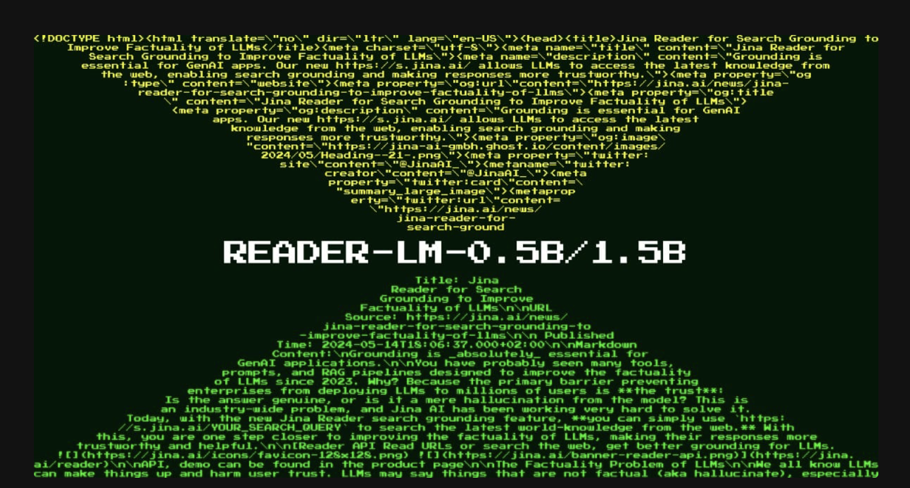

# Jina AI Released Reader-LM-0.5B and Reader-LM-1.5B: Revolutionizing HTML-to-Markdown Conversion with Multilingual, Long-Context, and Highly Efficient Small Language Models for Web Data Processing

> The release of Reader-LM-0.5B and Reader-LM-1.5B by Jina AI marks a significant milestone in small language model (SLM) technology. These models are designed to solve a unique and specific challenge: converting raw, noisy HTML from the open web into clean markdown format. While seemingly straightforward, this task poses complex challenges, particularly in handling the vast […]

The release of [**Reader-LM-0.5B**](https://huggingface.co/jinaai/reader-lm-0.5b) and [**Reader-LM-1.5B**](https://huggingface.co/jinaai/reader-lm-1.5b) by Jina AI marks a significant milestone in [small language model](https://www.marktechpost.com/2025/01/12/what-are-small-language-models-slms/) (SLM) technology. These models are designed to solve a unique and specific challenge: converting raw, noisy HTML from the open web into clean markdown format. While seemingly straightforward, this task poses complex challenges, particularly in handling the vast noise in modern web content such as headers, footers, and sidebars. The Reader-LM series aims to address this challenge efficiently, focusing on cost-effectiveness and performance.

**Background and Purpose**

In April 2024, Jina AI introduced Jina Reader, an API that converts any URL into a markdown suitable for [large language models](https://www.marktechpost.com/2025/01/11/what-are-large-language-model-llms/) (LLMs). This API relies on tools like Mozilla’s Readability package to extract the main content from a webpage, followed by regex and the Turndown library to convert cleaned HTML into markdown. However, this method faced issues, such as incorrect content filtering and difficulties in converting complex HTML structures. As user feedback poured in, Jina AI realized that patching the existing pipeline with more regex patterns and heuristics was not a sustainable solution.

To overcome these limitations, Jina AI asked an important question: Could this problem be solved end-to-end using a language model? Instead of relying on manually curated rules, a language model could handle the task of HTML-to-markdown conversion more efficiently, especially with fewer than a billion parameters, making it feasible to run on the edge.

*[**Image Source**](https://jina.ai/news/reader-lm-small-language-models-for-cleaning-and-converting-html-to-markdown/)*

**Introduction of Reader-LM Models**

Jina AI released two small language models: [**Reader-LM-0.5B**](https://huggingface.co/jinaai/reader-lm-0.5b) and [**Reader-LM-1.5B**](https://huggingface.co/jinaai/reader-lm-1.5b). These models are trained specifically to convert raw HTML into markdown, and both are multilingual with support for up to 256K tokens of context length. This ability to handle large contexts is critical, as HTML content from modern websites often contains more noise than ever before, with inline CSS, JavaScript, and other elements inflating the token count significantly.

While large language models are known for their high computational requirements, small language models like Reader-LM are designed to offer efficient performance without expensive infrastructure. Reader-LM-0.5B and Reader-LM-1.5B outperform many larger models in the specific task of HTML-to-markdown conversion while being just a fraction of their size.

*[**Image Source**](https://jina.ai/news/reader-lm-small-language-models-for-cleaning-and-converting-html-to-markdown/)*

**Architecture and Specifications**

The Reader-LM models are designed to handle long-context inputs and perform selective copying from HTML to markdown. This task is simpler than typical LLM functions such as text generation or code writing. This selective-copy behavior focuses primarily on identifying relevant content, skipping over unnecessary elements like sidebars and headers, and formatting the remaining content in markdown syntax.

**Model Specifications**

- [**Reader-LM-0.5B**](https://huggingface.co/jinaai/reader-lm-0.5b)**: **With 494 million parameters, this model features 24 layers, 896 hidden sizes, and 14 query heads. It is compact yet capable of efficiently handling the selective-copy task.

- [**Reader-LM-1.5B**](https://huggingface.co/jinaai/reader-lm-1.5b)**:** This larger model has 1.54 billion parameters, 28 layers, 1536 hidden sizes, and 12 query heads. It performs better than the smaller model, especially when dealing with more complex HTML structures.

*[**Image Source**](https://jina.ai/news/reader-lm-small-language-models-for-cleaning-and-converting-html-to-markdown/)*

Both models support a context length of up to 256K tokens, which is crucial for processing the often lengthy and noisy HTML content found on the web. Their ability to handle multilingual content makes them versatile global application tools.

**Performance and Benchmarking**

The performance of Reader-LM-0.5B and Reader-LM-1.5B has been rigorously evaluated against several large language models, including GPT-4o, Gemini-1.5-Flash, LLaMA-3.1-70B, and Qwen2-7BInstruct. The models were tested using metrics like ROUGE-L (for summarization and question-answering tasks), Token Error Rate (TER, which measures the rate of hallucinated content), and Word Error Rate (WER, which assesses mismatches between generated markdown and the original HTML).

In these evaluations, Reader-LM models outperformed many larger models in terms of generating clean, accurate markdowns from HTML. For example, Reader-LM-1.5B achieved a ROUGE-L score of 0.72, a WER of 1.87, and a TER of 0.19, significantly better than GPT-4o and other models tested. Reader-LM-0.5B, while smaller, also delivered competitive results, especially in the task of structure preservation, which is vital for converting HTML into markdown.

**Training and Development**

Training Reader-LM models required preparing high-quality data pairs of raw HTML and corresponding markdown. Jina AI generated this data using its existing Jina Reader API, supplemented by synthetic HTML generated by GPT-4o for training purposes. The final training dataset contained approximately 2.5 billion tokens.

The models were trained in two stages:

- **Short-and-simple HTML: **This stage involved up to 32K tokens and 1.5 billion training tokens.

- **Long-and-hard HTML:** In this stage, sequences extended to 128K tokens with 1.2 billion training tokens. A key innovation during this stage was using the “zigzag-ring-attention mechanism,” which improved long-context processing.

Despite the complexity of HTML-to-markdown conversion, the models were optimized to handle this task effectively without unnecessary computational overhead. They leverage techniques like contrastive search to prevent token degeneration and repetitive loops during markdown generation.

**Real-World Applications**

Reader-LM is designed for practical use in both individual and enterprise environments. The models can be easily tested using Google Colab, and production environments can leverage platforms like Azure and AWS, where the models will soon be available. Reader-LM is licensed under CC BY-NC 4.0, with commercial usage options available for companies seeking on-premises solutions.

The models are ideal for automating data extraction and cleaning from the open web in production environments. By converting raw HTML into clean markdown, Reader-LM enables efficient data processing, making it easier for downstream LLMs to summarize, reason, and generate insights from web content. Additionally, its multilingual capabilities broaden its applicability to various industries and regions.

**Conclusion**

The release of Reader-LM-0.5B and Reader-LM-1.5B represents a leap forward in small language model technology, specifically tailored for HTML-to-markdown conversion. These models address a critical need for efficient, cost-effective data extraction from the noisy and often overwhelming web content that characterizes the modern internet. With their compact size, long-context support, and multilingual capabilities, Reader-LM models offer a powerful tool for developers and enterprises looking to optimize their data workflows.

---

Check out the **[𝐑𝐞𝐚𝐝𝐞𝐫-𝐋𝐌-𝟎.𝟓𝐁](https://huggingface.co/jinaai/reader-lm-0.5b), [𝐑𝐞𝐚𝐝𝐞𝐫-𝐋𝐌-1.𝟓𝐁](https://huggingface.co/jinaai/reader-lm-1.5b)** and **[Colab Notebook](https://colab.research.google.com/drive/1wXWyj5hOxEHY6WeHbOwEzYAC0WB1I5uA)**. All credit for this research goes to the researchers of this project. Also, don’t forget to follow us on **[Twitter](https://twitter.com/Marktechpost)** and join our **[Telegram Channel](https://pxl.to/at72b5j)** and [**LinkedIn Gr**](https://www.linkedin.com/groups/13668564/)[**oup**](https://www.linkedin.com/groups/13668564/). **If you like our work, you will love our**[** newsletter..**](https://marktechpost-newsletter.beehiiv.com/subscribe)

Don’t Forget to join our **[50k+ ML SubReddit](https://www.reddit.com/r/machinelearningnews/)**

**[⏩ ⏩ FREE AI WEBINAR: ‘SAM 2 for Video: How to Fine-tune On Your Data’ (Wed, Sep 25, 4:00 AM – 4:45 AM EST)](https://encord.com/webinar/sam2-for-video/?utm_medium=affiliate&utm_source=newsletter&utm_campaign=marktechpost&utm_content=sam2video)**
