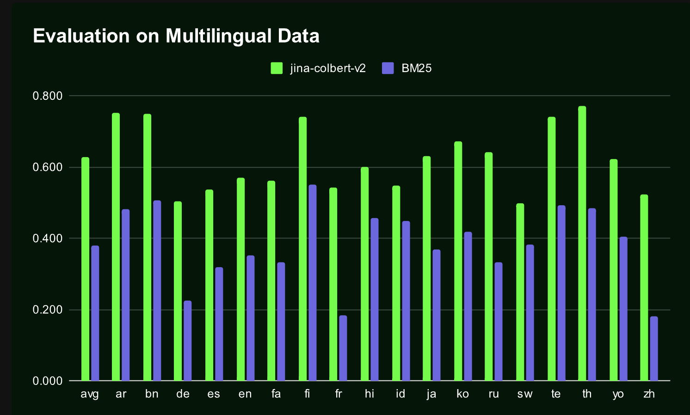

# Jina-ColBERT-v2 Released: A Groundbreaking Multilingual Retrieval Model Achieving 6.6% Performance Boost and 50% Storage Reduction Across Diverse Benchmarks

> The field of information retrieval (IR) has rapidly evolved, especially with the integration of neural networks, which have transformed how data is retrieved and processed. Neural retrieval systems have become increasingly important, particularly those using dense and multi-vector models. These models encode queries and documents as high-dimensional vectors and capture relevance signals beyond keyword matching, […]

The field of information retrieval (IR) has rapidly evolved, especially with the integration of neural networks, which have transformed how data is retrieved and processed. Neural retrieval systems have become increasingly important, particularly those using dense and multi-vector models. These models encode queries and documents as high-dimensional vectors and capture relevance signals beyond keyword matching, allowing for more nuanced retrieval processes. However, as the demand for multilingual applications grows, the challenge of maintaining performance and efficiency across different languages becomes more pronounced. This shift has made it essential to develop models that are not only robust & accurate but also efficient in handling large-scale, diverse datasets without requiring extensive computational resources.

A significant problem in the current landscape of IR is the balancing act between model performance and resource efficiency, particularly in multilingual settings. While efficient in terms of storage and computation, traditional single-vector models often need more ability to generalize across different languages. This limitation is especially problematic as more applications require cross-lingual retrieval capabilities. Multi-vector models, like ColBERT, offer a solution by allowing for more granular token-level interactions, which can improve retrieval accuracy. However, these models come with the drawback of increased storage requirements and computational overhead, making them less practical for large-scale, multilingual applications.

Single-vector models have been widely used due to their simplicity and efficiency. They encode a query or document as a single vector, which is then used to measure relevance through cosine similarity. However, these models often need to catch up in multilingual contexts where more complex linguistic nuances must be captured. Multi-vector models, such as the original ColBERT, provide an alternative by representing queries and documents as collections of smaller token embeddings. This approach allows for more detailed interactions between tokens, improving the model’s ability to capture relevance in multilingual settings. Despite their advantages, these models require significantly more storage and computational power, limiting their applicability in large-scale, real-world scenarios.

Researchers from the University of Texas at Austin and Jina AI GmbH have introduced [**Jina-ColBERT-v2**](https://jina.ai/news/jina-colbert-v2-multilingual-late-interaction-retriever-for-embedding-and-reranking/), an advanced version of the ColBERT model designed specifically to address the shortcomings of current methods. This new model incorporates several significant improvements, particularly in effectively handling multilingual data. The research team has focused on enhancing the architecture and training pipeline of the ColBERT model. To improve inference efficiency, their approach includes using a modified version of the XLM-RoBERTa backbone, optimized with flash attention and rotary positional embeddings. The training process is divided into two stages: an initial large-scale contrastive tuning phase and a more targeted fine-tuning phase with supervised distillation. These improvements allow Jina-ColBERT-v2 to reduce storage requirements by up to 50% compared to its predecessors while still delivering strong performance across various English and multilingual retrieval tasks.

*[**Image Source**](https://arxiv.org/pdf/2408.16672)*

The technology behind [**Jina-ColBERT-v2**](https://jina.ai/news/jina-colbert-v2-multilingual-late-interaction-retriever-for-embedding-and-reranking/) is a blend of several cutting-edge techniques to enhance efficiency and effectiveness in information retrieval. One key innovation is using multiple linear projection heads during training, allowing the model to choose different token embedding sizes at inference time with minimal performance loss. This flexibility is achieved through Matryoshka Representation Loss, which enables the model to maintain performance even when reducing the dimensionality of the token embeddings. The model’s backbone, Jina-XLM-RoBERTa, incorporates flash attention mechanisms and rotary positional embeddings, enhancing its performance during inference. These technological advancements improve the model’s ability to handle multilingual data and make it more efficient in storage and computation.

*[**Image Source**](https://arxiv.org/pdf/2408.16672)*

The performance of [**Jina-ColBERT-v2**](https://jina.ai/news/jina-colbert-v2-multilingual-late-interaction-retriever-for-embedding-and-reranking/) has been rigorously tested across multiple benchmarks, demonstrating its effectiveness in both English and multilingual contexts. On the BEIR benchmark, Jina-ColBERT-v2 showed an average improvement of 6.6% over ColBERTv2, highlighting its superior retrieval capabilities. The model also performed well on the LoTTE benchmark, which focuses on long-tail queries, with a 6.1% improvement over its predecessor. In multilingual retrieval tasks, Jina-ColBERT-v2 outperformed existing models like mDPR and ColBERT-XM in several languages, including Arabic, Chinese, and Spanish. The model’s ability to deliver high retrieval accuracy while reducing storage needs by up to 50% makes it a significant advancement in information retrieval. These results underscore the model’s potential for real-world applications where performance and efficiency are critical.

In conclusion, the [**Jina-ColBERT-v2**](https://jina.ai/news/jina-colbert-v2-multilingual-late-interaction-retriever-for-embedding-and-reranking/) model addresses the dual challenges of maintaining high retrieval accuracy while significantly reducing storage and computational requirements. The research team has created a powerful and efficient model incorporating advanced techniques such as flash attention, rotary positional embeddings, and Matryoshka Representation Loss. The performance improvements demonstrated across various benchmarks validate the model’s potential for widespread adoption in academic and industrial settings. Jina-ColBERT-v2 stands as a testament to the ongoing innovation in the field of information retrieval, offering a promising solution for the future of multilingual data processing.

---

Check out the **[Paper](https://arxiv.org/abs/2408.16672)** and **[API](https://jina.ai/).** All credit for this research goes to the researchers of this project. Also, don’t forget to follow us on **[Twitter](https://twitter.com/Marktechpost)** and join our **[Telegram Channel](https://www.zyphra.com/post/zamba2-mini)** and [**LinkedIn Gr**](https://www.linkedin.com/groups/13668564/)[**oup**](https://www.linkedin.com/groups/13668564/). **If you like our work, you will love our**[** newsletter..**](https://marktechpost-newsletter.beehiiv.com/subscribe)

Don’t Forget to join our **[50k+ ML SubReddit](https://www.reddit.com/r/machinelearningnews/)**

Here is a highly recommended webinar from our sponsor: **[‘Building Performant AI Applications with NVIDIA NIMs and Haystack’](https://landing.deepset.ai/webinar-nvidia-nims-and-haystack?utm_campaign=2409-campaign-nvidia-nims-and-haystack-&utm_source=marktechpost&utm_medium=banner-ad-desktop)**
