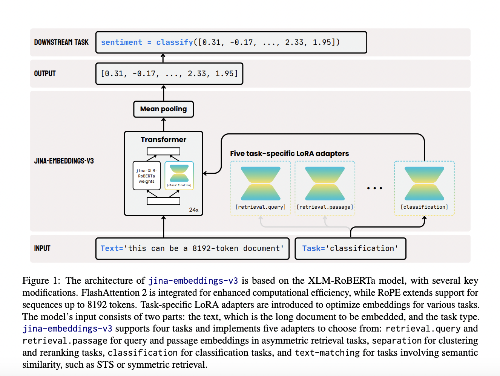

# Jina-Embeddings-v3 Released: A Multilingual Multi-Task Text Embedding Model Designed for a Variety of NLP Applications

> Text embedding models have become foundational in natural language processing (NLP). These models convert text into high-dimensional vectors that capture semantic relationships, enabling tasks like document retrieval, classification, clustering, and more. Embeddings are especially critical in advanced systems such as Retrieval-Augmented Generation (RAG) models, where the embeddings support retrieving relevant documents. With the increasing need […]

Text embedding models have become foundational in natural language processing (NLP). These models convert text into high-dimensional vectors that capture semantic relationships, enabling tasks like document retrieval, classification, clustering, and more. Embeddings are especially critical in advanced systems such as Retrieval-Augmented Generation (RAG) models, where the embeddings support retrieving relevant documents. With the increasing need for models that can handle multiple languages and long text sequences, transformer-based models have revolutionized how embeddings are generated. However, while these models have advanced capabilities, they face limitations in real-world applications, particularly in handling extensive multilingual data and long-context documents.

Text embedding models have faced several challenges in recent years. While advertised as general-purpose, a key issue is that many models often require specific tuning to perform well across various tasks. These models frequently struggle to balance performance across languages and handle long text sequences. In multilingual applications, embedding models must deal with the complexity of encoding relationships across different languages, each with unique linguistic structures. The difficulty increases with tasks that require the processing of extended text sequences, which often exceeds the capacity of most current models. Moreover, deploying such large-scale models, often with billions of parameters, presents significant computational cost and scalability challenges, especially when marginal improvements do not justify resource consumption.

Previous attempts to solve these challenges have largely relied on large language models (LLMs), which can exceed 7 billion parameters. These models have shown proficiency in handling various tasks in different languages, from text classification to document retrieval. However, despite their vast parameter size, performance gains are minimal compared to encoder-only models, such as XLM-RoBERTa and mBERT. The complexity of these models also makes them impractical for many real-world applications where resources are limited. Efforts to make embeddings more efficient have included innovations like instruction tuning and positional encoding methods, such as Rotary Position Embeddings (RoPE), which help models process longer text sequences. Nevertheless, even with these advancements, the models often fail to meet the demands of real-world, multilingual retrieval tasks with the desired efficiency.

Researchers from Jina AI GmbH have introduced a new model, [**Jina-embeddings-v3**](https://huggingface.co/jinaai/jina-embeddings-v3), specifically designed to address the inefficiencies of previous embedding models. This model, which includes 570 million parameters, offers optimized performance across multiple tasks while supporting longer-context documents of up to 8192 tokens. The model incorporates a key innovation: task-specific Low-Rank Adaptation (LoRA) adapters. These adapters allow the model to efficiently generate high-quality embeddings for various tasks, including query-document retrieval, classification, clustering, and text matching. Jina-embeddings-v3’s ability to provide specific optimizations for these tasks ensures more effective handling of multilingual data, long documents, and complex retrieval scenarios, balancing performance and scalability.

The architecture of the Jina-embeddings-v3 model builds upon the widely recognized XLM-RoBERTa model but with several critical enhancements. It uses FlashAttention 2 to improve computational efficiency and integrates RoPE positional embeddings to handle long-context tasks up to 8192 tokens. One of the model’s most innovative features is Matryoshka Representation Learning, which allows users to truncate embeddings without compromising performance. This method provides flexibility in choosing different embedding sizes, such as reducing a 1024-dimensional embedding to just 16 or 32 dimensions, optimizing the trade-off between space efficiency and task performance. With the addition of task-specific LoRA adapters, which account for less than 3% of the total parameters, the model can dynamically adapt to different tasks such as classification and retrieval. By freezing the original model weights, the researchers have ensured that training these adapters remains highly efficient, using only a fraction of the memory required by traditional models. This efficiency makes it practical for deployment in real-world settings.

The Jina-embeddings-v3 model has shown remarkable performance improvements across several benchmark tests. The model outperformed competitors like OpenAI’s proprietary models and Cohere’s multilingual embeddings in multilingual evaluations, particularly in English tasks. The jina-embeddings-v3 model demonstrated superior results in classification accuracy (82.58%) and sentence similarity (85.8%) on the MTEB benchmark, outperforming much larger models such as e5-mistral-7b-instruct, which has over 7 billion parameters but only shows a marginal 1% improvement on certain tasks. Jina-embeddings-v3 achieved excellent results in multilingual tasks, surpassing multilingual-e5-large-instruct across all tasks despite its significantly smaller size. Its ability to perform well in multilingual and long-context retrieval tasks while requiring fewer computational resources makes it highly efficient and cost-effective, especially for fast, on-edge computing applications.

In conclusion, Jina-embeddings-v3 offers a scalable and efficient solution to the long-standing challenges text embedding models face in multilingual and long-context tasks. Integrating LoRA adapters, Matryoshka Representation Learning, and other advanced techniques ensures that the model can handle various functions without the excessive computational burden seen in models with billions of parameters. The researchers have created a practical and high-performing model that outperforms many larger models and sets a new standard for embedding efficiency. Introducing these innovations provides a clear path forward for further advancements in multilingual and long-text retrieval, making jina-embeddings-v3 a valuable tool in NLP.

---

Check out the **[Paper](https://arxiv.org/abs/2409.10173)** and **[Model Card on HF](https://huggingface.co/jinaai/jina-embeddings-v3)**. All credit for this research goes to the researchers of this project. Also, don’t forget to follow us on **[Twitter](https://twitter.com/Marktechpost)** and join our **[Telegram Channel](https://pxl.to/at72b5j)** and [**LinkedIn Gr**](https://www.linkedin.com/groups/13668564/)[**oup**](https://www.linkedin.com/groups/13668564/). **If you like our work, you will love our**[** newsletter..**](https://marktechpost-newsletter.beehiiv.com/subscribe)

Don’t Forget to join our **[50k+ ML SubReddit](https://www.reddit.com/r/machinelearningnews/)**

**[⏩ ⏩ FREE AI WEBINAR: ‘SAM 2 for Video: How to Fine-tune On Your Data’ (Wed, Sep 25, 4:00 AM – 4:45 AM EST)](https://encord.com/webinar/sam2-for-video/?utm_medium=affiliate&utm_source=newsletter&utm_campaign=marktechpost&utm_content=sam2video)**
