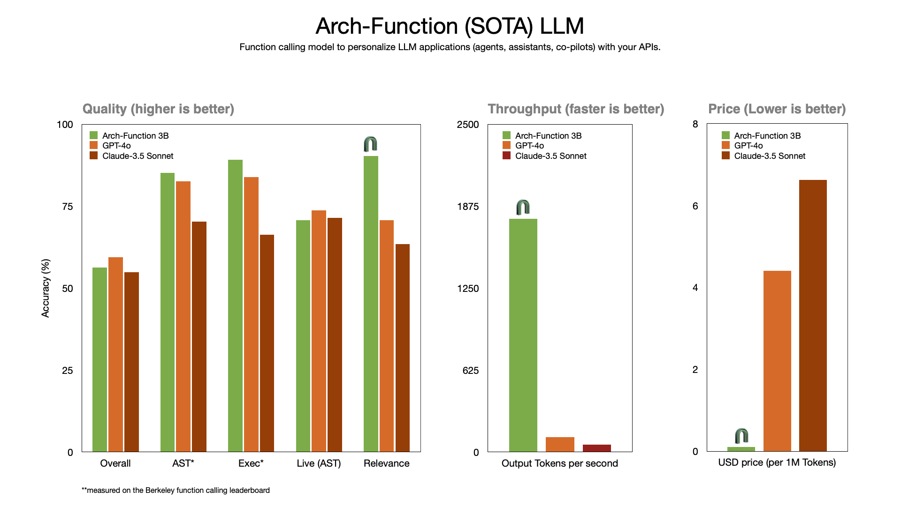

# Katanemo Open Sources Arch-Function: A Set of Large Language Models (LLMs) Promising Ultra-Fast Speeds at Function-Calling Tasks for Agentic Workflows

> One of the biggest hurdles organizations face is implementing Large Language Models (LLMs) to handle intricate workflows effectively. Issues of speed, flexibility, and scalability often hinder the automation of complex workflows requiring coordination across multiple systems. Enterprises struggle with the cumbersome nature of configuring LLMs for seamless collaboration across data sources, making it challenging to […]

One of the biggest hurdles organizations face is implementing Large Language Models (LLMs) to handle intricate workflows effectively. Issues of speed, flexibility, and scalability often hinder the automation of complex workflows requiring coordination across multiple systems. Enterprises struggle with the cumbersome nature of configuring LLMs for seamless collaboration across data sources, making it challenging to adopt them for operational efficiency.

Katanemo has open-sourced [Arch-Function](https://huggingface.co/katanemo/Arch-Function-3B), making scalable agentic AI accessible to developers, data scientists, and enterprises. By open-sourcing this tool, Katanemo enables the global AI community to contribute and adopt its capabilities. Arch-Function empowers industries like finance and healthcare to build intelligent agents that automate complex workflows, transforming operations into streamlined processes.

The Katanemo Arch-Function collection of LLMs is specifically designed for function-calling tasks. These models understand complex function signatures, identify required parameters, and produce accurate function calls from natural language prompts. Achieving performance comparable to GPT-4, Arch-Function sets a new benchmark for automated API interactions. Built around a 3-billion parameter model and hosted on Hugging Face, it supports flexible APIs, ensuring seamless integration into enterprise software. Arch-Function is optimized for speed and precision, completing tasks in minutes that previously took hours while effectively adapting to dynamic requirements.

Katanemo’s Arch-Function transforms workflow automation by simplifying LLM deployment and reducing engineering overhead, making it accessible even for smaller enterprises. It delivers state-of-the-art performance in function calling, accurately identifying parameters and generalizing across multiple use cases, from API interactions to backend tasks. Early adopters have reported a high reduction in manual processing times, highlighting its efficiency and suitability for real-time production environments.

Katanemo’s open sourcing of Arch-Function makes advanced AI tools accessible to a broader audience. By addressing challenges in implementing AI for complex workflows, Arch-Function opens new possibilities for intelligent automation. Its ability to enable faster, reliable, and adaptive workflows promises significant value for businesses. Open-sourcing fosters community-driven development and diverse use cases, making Arch-Function a crucial addition to enterprise AI.

> Another exciting day here Katanemo as we open source some of the "intelligence" behind Arch ([https://t.co/9nwakOGPp0](https://t.co/9nwakOGPp0)).  Meet Katanemo Arch-Function, a collection of state-of-the-art (SOTA) LLMs designed for function calling tasks – that meet/beat frontier LLM performance, but… [pic.twitter.com/IajF8w3syz](https://t.co/IajF8w3syz)— Salman Paracha (Building Intelligent Infra) (@salman_paracha) [October 15, 2024](https://twitter.com/salman_paracha/status/1846180933206266082?ref_src=twsrc%5Etfw)

---

Check out the**[Hugging Face Model Card](https://huggingface.co/katanemo/Arch-Function-3B)**. All credit for this research goes to the researchers of this project. Also, don’t forget to follow us on **[Twitter](https://twitter.com/Marktechpost)** and join our **[Telegram Channel](https://pxl.to/at72b5j)** and [**LinkedIn Gr**](https://www.linkedin.com/groups/13668564/)[**oup**](https://www.linkedin.com/groups/13668564/). **If you like our work, you will love our**[** newsletter..**](https://marktechpost-newsletter.beehiiv.com/subscribe) Don’t Forget to join our **[50k+ ML SubReddit](https://www.reddit.com/r/machinelearningnews/)**.

**[[Upcoming Live Webinar- Oct 29, 2024] ](https://go.predibase.com/predibase-inference-engine-102924-lp?utm_medium=3rdparty&utm_source=marktechpost)****[The Best Platform for Serving Fine-Tuned Models: Predibase Inference Engine (Promoted)](https://go.predibase.com/predibase-inference-engine-102924-lp?utm_medium=3rdparty&utm_source=marktechpost)**
