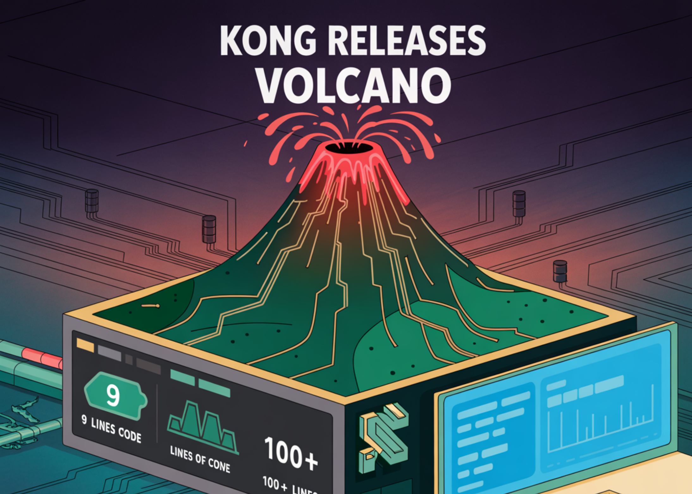

# Kong Releases Volcano: A TypeScript, MCP-native SDK for Building Production Ready AI Agents with LLM Reasoning and Real-World actions

> Kong has open-sourced Volcano, a TypeScript SDK that composes multi-step agent workflows across multiple LLM providers with native Model Context Protocol (MCP) tool use. The release coincides with broader MCP capabilities in Kong AI Gateway and Konnect, positioning Volcano as the developer SDK in an MCP-governed control plane. What Volcano provides? Volcano exposes a compact, […]

Kong has open-sourced [**Volcano**,](https://github.com/Kong/volcano-sdk?tab=readme-ov-file) a TypeScript SDK that composes multi-step agent workflows across multiple LLM providers with native **Model Context Protocol (MCP)** tool use. The release coincides with broader MCP capabilities in **Kong AI Gateway** and **Konnect**, positioning Volcano as the developer SDK in an MCP-governed control plane.

- **Why Volcano SDK?** **because 9 lines of code are faster to write and easier to manage than 100+.**

- **Without Volcano SDK?** You’d need 100+ lines handling tool schemas, context management, provider switching, error handling, and HTTP clients.

- With Volcano SDK: **9 lines**.

Copy CodeCopiedUse a different Browser
```
import { agent, llmOpenAI, llmAnthropic, mcp } from "volcano-ai";

// Setup: two LLMs, two MCP servers
const planner = llmOpenAI({ model: "gpt-5-mini", apiKey: process.env.OPENAI_API_KEY! });
const executor = llmAnthropic({ model: "claude-4.5-sonnet", apiKey: process.env.ANTHROPIC_API_KEY! });
const database = mcp("https://api.company.com/database/mcp");
const slack = mcp("https://api.company.com/slack/mcp");

// One workflow
await agent({ llm: planner })
 .then({
   prompt: "Analyze last week's sales data",
   mcps: [database]  // Auto-discovers and calls the right tools
 })
 .then({
   llm: executor,  // Switch to Claude
   prompt: "Write an executive summary"
 })
 .then({
   prompt: "Post the summary to #executives",
   mcps: [slack]
 })
 .run();
```

### What Volcano provides?

Volcano exposes a compact, **chainable API**—`.then(...).run()`—that passes intermediate context between steps while switching LLMs per step (e.g., plan with one model, execute with another). It treats MCP as a first-class interface: developers hand Volcano a list of MCP servers, and the SDK performs **tool discovery and invocation** automatically. Production features include **automatic retries**, **per-step timeouts**, **connection pooling** for MCP servers, **OAuth 2.1** authentication, and **OpenTelemetry** traces/metrics for distributed observability. The project is released under **Apache-2.0**.

Here are the **Key Features** of the Volcano SDK:

- **Chainable API**: Build multi-step workflows with a concise `.then(...).run()` pattern; context flows between steps

- **MCP-native tool use**: Pass MCP servers; the SDK auto-discovers and invokes the right tools in each step.

- **Multi-provider LLM support**: Mix models (e.g., planning with one, execution with another) inside one workflow.

- **Streaming** of intermediate and final results for responsive agent interactions.

- **Retries & timeouts** configurable per step for reliability under real-world failures.

- **Hooks** (before/after step) to customize behavior and instrumentation.

- **Typed error handling** to surface actionable failures during agent execution.

- **Parallel execution, branching, and loops** to express complex control flow.

- **Observability via OpenTelemetry** for tracing and metrics across steps and tool calls.

- **OAuth support & connection pooling** for secure, efficient access to MCP servers.

### Where it fits in Kong’s MCP architecture?

Kong’s **Konnect** platform adds multiple MCP governance and access layers that complement Volcano’s SDK surface:

- **AI Gateway** gains MCP gateway features such as **server autogeneration** from Kong-managed APIs, **centralized OAuth 2.1** for MCP servers, and observability over **tools, workflows, and prompts** in Konnect dashboards. These provide uniform policy and analytics for MCP analytics.

- The **Konnect Developer Portal** can be turned into an **MCP server** so AI coding tools and agents can **discover APIs, request access, and consume endpoints** programmatically—reducing manual credential workflows and making API catalogs accessible through MCP.

- Kong’s team also previewed **MCP Composer** and **MCP Runner** to design, generate, and operate MCP servers and integrations.

### Key Takeaways

- Volcano is an open-source **TypeScript** SDK that builds multi-step AI agents with **first-class MCP tool use**.

- The SDK provides production features—**retries, timeouts, connection pooling, OAuth**, and **OpenTelemetry** tracing/metrics—for MCP workflows.

- Volcano composes **multi-LLM** plans/executions and auto-discovers/invokes **MCP servers/tools**, minimizing custom glue code.

- Kong paired the SDK with platform controls: **AI Gateway/Konnect** add **MCP server autogeneration, centralized OAuth 2.1, and observability**.


### Editorial Comments

Kong’s Volcano SDK is a pragmatic addition to the MCP ecosystem: a TypeScript-first agent framework that aligns developer workflow with enterprise controls (OAuth 2.1, OpenTelemetry) delivered via AI Gateway and Konnect. The pairing closes a common gap in agent stacks—tool discovery, auth, and observability—without inventing new interfaces beyond MCP. This design prioritizes protocol-native MCP integration over bespoke glue, cutting operational drift and closing auditing gaps as internal agents scale.

---

Check out the **[GitHub Repo](https://github.com/Kong/volcano-sdk?tab=readme-ov-file)** and **[Technical details](https://konghq.com/blog/product-releases/volcano?)**. Feel free to check out our **[GitHub Page for Tutorials, Codes and Notebooks](https://github.com/Marktechpost/AI-Tutorial-Codes-Included)**. Also, feel free to follow us on **[Twitter](https://x.com/intent/follow?screen_name=marktechpost)** and don’t forget to join our **[100k+ ML SubReddit](https://www.reddit.com/r/machinelearningnews/)** and Subscribe to **[our Newsletter](https://www.aidevsignals.com/)**. Wait! are you on telegram? **[now you can join us on telegram as well.](https://t.me/machinelearningresearchnews)**
