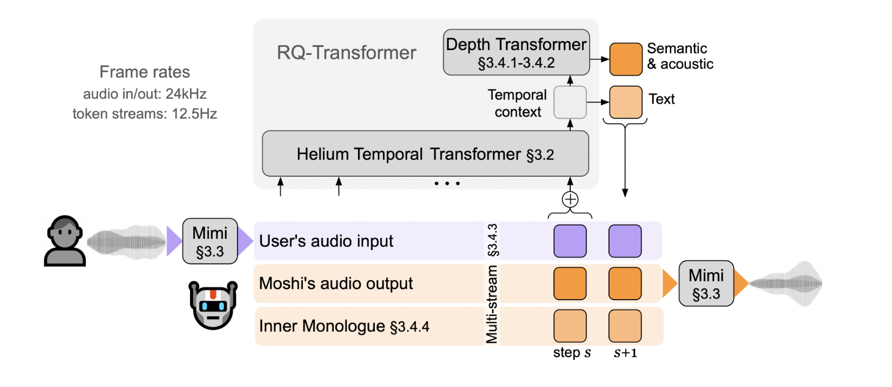

# Kyutai Open Sources Moshi: A Breakthrough Full-Duplex Real-Time Dialogue System that Revolutionizes Human-like Conversations with Unmatched Latency and Speech Quality

> The field of spoken dialogue systems has evolved significantly over the years, moving beyond simple voice-based interfaces to complex models capable of sustaining real-time conversations. Early systems such as Siri, Alexa, and Google Assistant pioneered voice-activated interactions, allowing users to trigger specific actions through voice commands. These systems, while groundbreaking, were limited to basic tasks […]

The field of spoken dialogue systems has evolved significantly over the years, moving beyond simple voice-based interfaces to complex models capable of sustaining real-time conversations. Early systems such as Siri, Alexa, and Google Assistant pioneered voice-activated interactions, allowing users to trigger specific actions through voice commands. These systems, while groundbreaking, were limited to basic tasks like fact retrieval or controlling devices. However, the emergence of large language models (LLMs) such as GPT and Gemini has expanded the role of spoken dialogue systems to handle multi-turn, open-ended conversations. Yet, replicating human-like dialogues, which are typically fast-paced and include overlapping speech, remains a challenge in current voice-based technology.

A critical problem in spoken dialogue systems is the delay caused by the sequential processing of multiple components. Current systems rely on stages such as speech recognition, text processing, natural language generation, and finally, speech synthesis. Each stage introduces a certain amount of latency, resulting in response times stretching up to several seconds, far from the rapid exchanges typical in human conversations. Current systems process conversations turn-by-turn, meaning one speaker must finish before the other can respond, which fails to capture the fluidity of real-life dialogues. Non-verbal cues such as emotion, intonation, and overlapping speech are often ignored, diminishing the conversational quality and the overall user experience.

Existing tools in the spoken dialogue space predominantly follow a pipeline model. In this framework, speech is first converted into text using automatic speech recognition (ASR), & then the system uses natural language understanding (NLU) to derive the meaning of the text. Based on this understanding, a response is generated through natural language generation (NLG), which is then converted back into speech via a text-to-speech (TTS) engine. These systems work well for simple, one-turn interactions like querying the weather or setting a timer. However, the cumulative latency across these steps leads to long delays. Because these systems operate within the text domain, non-verbal aspects such as emotion or contextual audio cues are lost, limiting the richness of the interaction.

Researchers at Kyutai Labs have introduced [**Moshi**](https://github.com/kyutai-labs/moshi), a cutting-edge real-time spoken dialogue system that offers full-duplex communication. Unlike traditional systems that enforce a turn-based structure, Moshi allows for continuous, uninterrupted conversations where both the user and the system can speak and listen simultaneously. Moshi builds on a foundational text language model called Helium, which contains 7 billion parameters and is trained on over 2.1 trillion tokens of public English data. The Helium backbone provides the reasoning capabilities, while the system is enhanced with a smaller audio model called Mimi. Mimi encodes audio tokens using a neural audio codec, capturing semantic and acoustic speech features in real-time. This dual-stream approach eliminates the need for strict turn-taking, making interactions with Moshi more natural and human-like.

The architecture of Moshi includes several innovative features designed to optimize performance and conversational fluidity. One of the key technologies introduced is the “Inner Monologue” method, which aligns text tokens with audio tokens in a hierarchical structure. This allows the system to generate coherent and contextually accurate speech while maintaining a real-time response rate. Moshi achieves a theoretical latency of just 160 milliseconds, with practical latency measured at 200 milliseconds, significantly lower than the several-second delays observed in existing systems. Moshi’s multi-stream model processes the system’s and user’s speech concurrently, capturing complex conversational dynamics, such as overlapping speech and interruptions, common in natural dialogues.

*[**Image Source**](https://kyutai.org/Moshi.pdf)*

The results of testing Moshi demonstrate its superior performance across multiple metrics. Regarding speech quality, Moshi produces clear, intelligible speech even in noisy or overlapping scenarios. The system can maintain long conversations, with context spans exceeding five minutes, and performs exceptionally well in spoken question-answering tasks. Compared to previous models, which often require a sequence of well-defined speaker turns, Moshi adapts to various conversational dynamics. Notably, the model’s latency is comparable to the 230 milliseconds measured in human-to-human interactions, making Moshi the first dialogue model capable of near-instantaneous responses. This advancement places Moshi at the forefront of real-time, full-duplex spoken language models.

*[**Image Source**](https://kyutai.org/Moshi.pdf)*

Moshi’s architecture is supported by rigorous testing, which shows its effectiveness in handling a range of spoken dialogue tasks. The model was evaluated on text understanding, speech intelligibility, and consistency across several test cases. Ablation studies, where specific model components were removed or altered, further reinforced the importance of Moshi’s hierarchical token generation and Inner Monologue features. In a particularly challenging test of spoken question-answering, Moshi outperformed existing models, demonstrating its linguistic depth and ability to handle real-time audio streams without sacrificing performance.

In conclusion, Moshi represents a significant leap forward in spoken dialogue systems. Addressing the major challenges of latency, turn-taking, and non-verbal communication provides a more dynamic and natural conversational experience. The combination of Helium’s vast linguistic knowledge and Mimi’s real-time audio processing capabilities enables Moshi to generate speech that mirrors the complexities of human conversation. This model reduces response times to near-human levels and incorporates emotional and contextual cues that elevate the quality of the interaction. With its groundbreaking real-time performance and capacity to handle extended, multi-turn dialogues, Moshi sets a new standard for spoken dialogue systems.

---

Check out the **[HF Page with Models](https://huggingface.co/collections/kyutai/moshi-v01-release-66eaeaf3302bef6bd9ad7acd) and [GitHub Page](https://github.com/kyutai-labs/moshi?tab=readme-ov-file)**. All credit for this research goes to the researchers of this project. Also, don’t forget to follow us on **[Twitter](https://twitter.com/Marktechpost)** and join our **[Telegram Channel](https://pxl.to/at72b5j)** and [**LinkedIn Gr**](https://www.linkedin.com/groups/13668564/)[**oup**](https://www.linkedin.com/groups/13668564/). **If you like our work, you will love our**[** newsletter..**](https://marktechpost-newsletter.beehiiv.com/subscribe)

Don’t Forget to join our **[50k+ ML SubReddit](https://www.reddit.com/r/machinelearningnews/)**

**[⏩ ⏩ FREE AI WEBINAR: ‘SAM 2 for Video: How to Fine-tune On Your Data’ (Wed, Sep 25, 4:00 AM – 4:45 AM EST)](https://encord.com/webinar/sam2-for-video/?utm_medium=affiliate&utm_source=newsletter&utm_campaign=marktechpost&utm_content=sam2video)**
