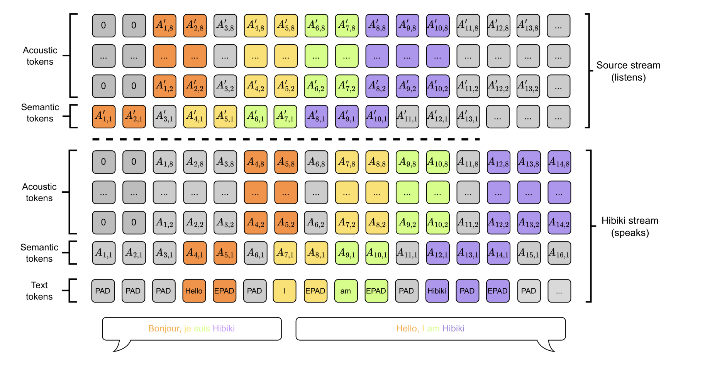

# Kyutai Releases Hibiki: A 2.7B Real-Time Speech-to-Speech and Speech-to-Text Translation with Near-Human Quality and Voice Transfer

> Real-time speech translation presents a complex challenge, requiring seamless integration of speech recognition, machine translation, and text-to-speech synthesis. Traditional cascaded approaches often introduce compounding errors, fail to retain speaker identity, and suffer from slow processing, making them less suitable for real-time applications like live interpretation. Additionally, existing simultaneous translation models struggle to balance accuracy and […]

Real-time speech translation presents a complex challenge, requiring seamless integration of speech recognition, machine translation, and text-to-speech synthesis. Traditional cascaded approaches often introduce compounding errors, fail to retain speaker identity, and suffer from slow processing, making them less suitable for real-time applications like live interpretation. Additionally, existing simultaneous translation models struggle to balance accuracy and latency, relying on complex inference mechanisms that are difficult to scale. A significant barrier remains the lack of large-scale, well-aligned speech datasets, limiting the ability to train models that can generate contextually accurate and natural translations with minimal delay.

Kyutai has developed **Hibiki**, a 2.7 billion-parameter decoder-only model designed for real-time speech-to-speech (S2ST) and speech-to-text (S2TT) translation. Operating at **12.5Hz framerate with a 2.2kbps bitrate**, Hibiki currently supports **French-to-English translation** and is designed to preserve voice characteristics in the translated output. A distilled version, **Hibiki-M (1.7B parameters),** is optimized for real-time performance on smartphones, making it more accessible for on-device translation.

### Technical Approach and Benefits

Hibiki’s **decoder-only architecture** enables simultaneous speech processing using a multistream language model that predicts both **text and audio tokens**. It employs a **neural audio codec (Mimi)** to compress audio while maintaining fidelity, ensuring efficient translation generation. A key aspect of its design is **contextual alignment**, a method that leverages a text translation model’s perplexity to determine optimal timing for generating speech, allowing Hibiki to **adjust translation delays dynamically** while maintaining coherence. Additionally, Hibiki supports **batch inference**, processing up to **320 sequences in parallel on H100 GPUs**, making it viable for large-scale applications. The model is trained on **7M hours of English audio, 450K hours of French, and 40K hours of synthetic parallel data**, contributing to its robustness across varied speech patterns.

### Performance and Evaluation

Hibiki has demonstrated strong performance in translation quality and speaker fidelity. It achieves an **ASR-BLEU score of 30.5**, surpassing existing baselines, including offline models. Human evaluations rate its **naturalness at 3.73/5**, approaching the **4.12/5 score of professional human interpreters**. The model also performs well in **speaker similarity**, with a **0.52 similarity score** compared to **0.43 for Seamless**. Compared to **Seamless and StreamSpeech**, Hibiki consistently delivers **higher translation quality** and **better voice transfer**, while maintaining a **competitive latency**. The distilled **Hibiki-M** variant, though slightly lower in speaker similarity, remains effective for real-time on-device use.

### Conclusion

Hibiki provides a practical approach to real-time speech translation, integrating **contextual alignment, efficient compression, and real-time inference** to improve translation quality while preserving natural speech characteristics. By offering an **open-source release under a permissive CC-BY license**, Hibiki has the potential to contribute significantly to advancements in multilingual communication.

- Hibiki 2B for PyTorch (bf16): [kyutai/hibiki-2b-pytorch-bf16](https://huggingface.co/kyutai/hibiki-2b-pytorch-bf16)

- Hibiki 1B for PyTorch (bf16): [kyutai/hibiki-1b-pytorch-bf16](https://huggingface.co/kyutai/hibiki-1b-pytorch-bf16)

- Hibiki 2B for MLX (bf16): [kyutai/hibiki-2b-mlx-bf16](https://huggingface.co/kyutai/hibiki-2b-mlx-bf16)

- Hibiki 1B for MLX (bf16): [kyutai/hibiki-1b-mlx-bf16](https://huggingface.co/kyutai/hibiki-1b-mlx-bf16)

---

Check out **_the [Paper](https://arxiv.org/abs/2502.03382), [Models on Hugging Face](https://huggingface.co/collections/kyutai/hibiki-fr-en-67a48835a3d50ee55d37c2b5), [GitHub Page](https://github.com/kyutai-labs/hibiki?tab=readme-ov-file) and [Colab Notebook](https://colab.research.google.com/drive/1as2BL2M54ZCYJkSdVYIuRLSW_K305Fye?usp=sharing)._** All credit for this research goes to the researchers of this project. Also, don’t forget to follow us on **[Twitter](https://x.com/intent/follow?screen_name=marktechpost)** and join our **[Telegram Channel](https://arxiv.org/abs/2406.09406)** and [**LinkedIn Gr**](https://www.linkedin.com/groups/13668564/)[**oup**](https://www.linkedin.com/groups/13668564/). Don’t Forget to join our **[75k+ ML SubReddit](https://www.reddit.com/r/machinelearningnews/)**.

**[🚨 ](https://pxl.to/82homag)[Join our machine learning community on Twitter/](https://x.com/i/communities/1670488129348960258)****[X](https://x.com/i/communities/1670488129348960258)**
