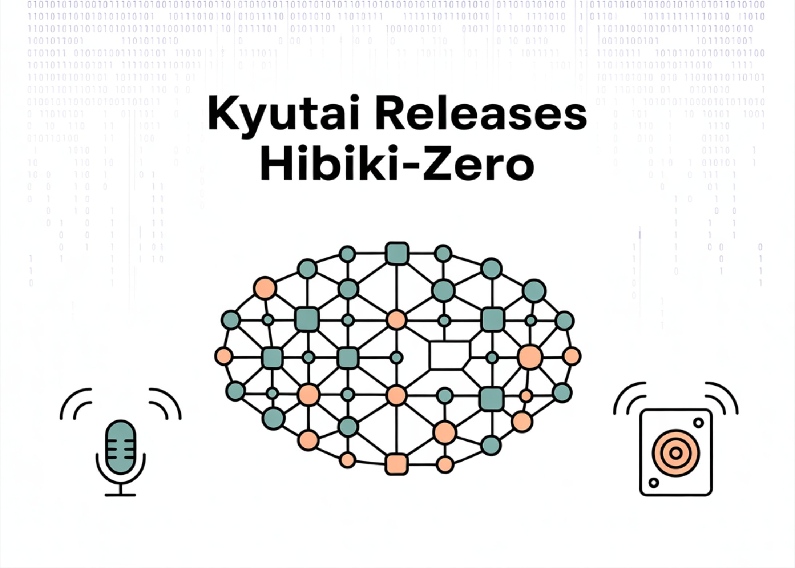

# Kyutai Releases Hibiki-Zero: A3B Parameter Simultaneous Speech-to-Speech Translation Model Using GRPO Reinforcement Learning Without Any Word-Level Aligned Data

> Kyutai has released Hibiki-Zero, a new model for simultaneous speech-to-speech translation (S2ST) and speech-to-text translation (S2TT). The system translates source speech into a target language in real-time. It handles non-monotonic word dependencies during the process. Unlike previous models, Hibiki-Zero does not require word-level aligned data for training. This eliminates a major bottleneck in scaling AI […]

Kyutai has released **Hibiki-Zero**, a new model for simultaneous speech-to-speech translation (S2ST) and speech-to-text translation (S2TT). The system translates source speech into a target language in real-time. It handles non-monotonic word dependencies during the process. Unlike previous models, Hibiki-Zero does not require word-level aligned data for training. This eliminates a major bottleneck in scaling AI translation to more languages.

Traditional approaches rely on supervised training with word-level alignments. These alignments are difficult to collect at scale. Developers usually depend on synthetic alignments and language-specific heuristics. Hibiki-Zero removes this complexity by using a novel reinforcement learning (RL) strategy to optimize latency.

*https://kyutai.org/blog/2026-02-12-hibiki-zero*

### A Multistream Architecture

Hibiki-Zero is a decoder-only model. It uses a multistream architecture to model sequences of tokens jointly. **The model handles 3 specific streams:**

- **Source Stream**: Audio tokens from the input speech.

- **Target Stream**: Generated audio tokens for the translated speech.

- **Inner Monologue**: A stream of padded text tokens that match the target audio.

The system uses the **Mimi** neural audio codec. Mimi is a causal and streaming codec that encodes waveforms into discrete tokens. It operates at a framerate of **12.5 Hz**. The model uses an **RQ-Transformer** to model these audio streams.

**The architectural specs include:**

- **Total Parameters**: 3B.

- **Temporal Transformer**: 28 layers with a latent dimension of 2048.

- **Depth Transformer**: 6 layers per codebook with a latent dimension of 1024.

- **Context Window**: 4min.

- **Audio Codebooks**: 16 levels for high-quality speech.

### Training Without Human Interpretation Data

**Hibiki-Zero is trained in 2 main stages:**

- **Coarse Alignment Training**: The model first trains on sentence-level aligned data. This data ensures that the ith sentence in the target is a translation of the ith sentence in the source. The research team use a technique to insert artificial silence in the target speech to delay its content relative to the source.

- **Reinforcement Learning (RL)**: The model uses **Group Relative Policy Optimization (GRPO)** to refine its policy. This stage reduces translation latency while preserving quality.

The RL process uses **process rewards** based only on the **BLEU score**. It computes intermediate rewards at multiple points during translation. A hyperparameter ⍺ balances the trade-off between speed and accuracy. A lower ⍺ reduces latency but may slightly decrease quality.

### Scaling to Italian in Record Time

The researchers demonstrated how easily Hibiki-Zero adapts to new languages. They added Italian as an input language using less than **1000h** of speech data.

- They performed supervised fine-tuning followed by the GRPO process.

- The model reached a quality and latency trade-off similar to Meta’s **Seamless** model.

- It surpassed Seamless in speaker similarity by over **30 points**.

### Performance and Results

Hibiki-Zero achieves state-of-the-art results across 5 X-to-English tasks. It was tested on the **Audio-NTREX-4L** long-form benchmark, which includes 15h of speech per TTS system.

**Metric****Hibiki-Zero (French)****Seamless (French)****ASR-BLEU (↑)**28.7 23.9 **Speaker Similarity (↑)**61.3 44.4 **Average Lag (LAAL) (↓)**2.3 6.2 

In short-form tasks (Europarl-ST), Hibiki-Zero reached an ASR-BLEU of **34.6** with a lag of **2.8 seconds**. Human raters also scored the model significantly higher than baselines for speech naturalness and voice transfer.

*https://kyutai.org/blog/2026-02-12-hibiki-zero*

### Key Takeaways

- **Zero Aligned Data Requirement**: Hibiki-Zero eliminates the need for expensive, hand-crafted word-level alignments between source and target speech, which were previously the biggest bottleneck in scaling simultaneous translation to new languages.

- **GRPO-Driven Latency Optimization**: The model uses Group Relative Policy Optimization (GRPO) and a simple reward system based only on BLEU scores to automatically learn an efficient translation policy, balancing high translation quality with low latency.

- **Coarse-to-Fine Training Strategy**: The training pipeline starts with sentence-level aligned data to teach the model base translation at high latency, followed by a reinforcement learning phase that “teaches” the model when to speak and when to listen.

- **Superior Voice and Naturalness**: In benchmarking against previous state-of-the-art systems like Seamless, Hibiki-Zero achieved a 30-point lead in speaker similarity and significantly higher scores in speech naturalness and audio quality across five language tasks.

- **Rapid New Language Adaptation**: The architecture is highly portable; researchers demonstrated that Hibiki-Zero could be adapted to a new input language (Italian) with less than 1,000 hours of speech data while maintaining its original performance on other languages.

---

Check out the **[Paper](https://arxiv.org/pdf/2602.11072), [Technical details](https://kyutai.org/blog/2026-02-12-hibiki-zero), [Repo](https://github.com/kyutai-labs/hibiki-zero) and [Samples](https://huggingface.co/spaces/kyutai/hibiki-zero-samples). **Also, feel free to follow us on **[Twitter](https://x.com/intent/follow?screen_name=marktechpost)** and don’t forget to join our **[100k+ ML SubReddit](https://www.reddit.com/r/machinelearningnews/)** and Subscribe to **[our Newsletter](https://www.aidevsignals.com/)**. Wait! are you on telegram? **[now you can join us on telegram as well.](https://t.me/machinelearningresearchnews)**
