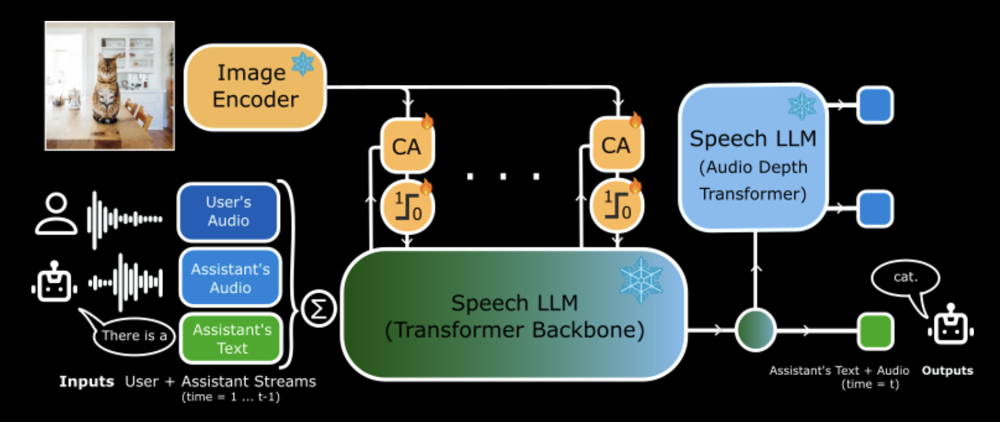

# Kyutai Releases MoshiVis: The First Open-Source Real-Time Speech Model that can Talk About Images

> ​Artificial intelligence has made significant strides in recent years, yet integrating real-time speech interaction with visual content remains a complex challenge. Traditional systems often rely on separate components for voice activity detection, speech recognition, textual dialogue, and text-to-speech synthesis. This segmented approach can introduce delays and may not capture the nuances of human conversation, such […]

​Artificial intelligence has made significant strides in recent years, yet integrating real-time speech interaction with visual content remains a complex challenge. Traditional systems often rely on separate components for voice activity detection, speech recognition, textual dialogue, and text-to-speech synthesis. This segmented approach can introduce delays and may not capture the nuances of human conversation, such as emotions or non-speech sounds. These limitations are particularly evident in applications designed to assist visually impaired individuals, where timely and accurate descriptions of visual scenes are essential.​

Addressing these challenges, **Kyutai has introduced MoshiVis, an open-source Vision Speech Model (VSM) that enables natural, real-time speech interactions about images**. Building upon their earlier work with Moshi—a speech-text foundation model designed for real-time dialogue—MoshiVis extends these capabilities to include visual inputs. This enhancement allows users to engage in fluid conversations about visual content, marking a noteworthy advancement in AI development.

Technically, MoshiVis augments Moshi by integrating lightweight cross-attention modules that infuse visual information from an existing visual encoder into Moshi’s speech token stream. This design ensures that Moshi’s original conversational abilities remain intact while introducing the capacity to process and discuss visual inputs. A gating mechanism within the cross-attention modules enables the model to selectively engage with visual data, maintaining efficiency and responsiveness. Notably, MoshiVis adds approximately 7 milliseconds of latency per inference step on consumer-grade devices, such as a Mac Mini with an M4 Pro Chip, resulting in a total of 55 milliseconds per inference step. This performance stays well below the 80-millisecond threshold for real-time latency, ensuring smooth and natural interactions.

In practical applications, MoshiVis demonstrates its ability to provide detailed descriptions of visual scenes through natural speech. For instance, when presented with an image depicting green metal structures surrounded by trees and a building with a light brown exterior, MoshiVis articulates:​

“I see two green metal structures with a mesh top, and they’re surrounded by large trees. In the background, you can see a building with a light brown exterior and a black roof, which appears to be made of stone.”

This capability opens new avenues for applications such as providing audio descriptions for the visually impaired, enhancing accessibility, and enabling more natural interactions with visual information. By releasing MoshiVis as an open-source project, Kyutai invites the research community and developers to explore and expand upon this technology, fostering innovation in vision-speech models. The availability of the model weights, inference code, and visual speech benchmarks further supports collaborative efforts to refine and diversify the applications of MoshiVis.

In conclusion, MoshiVis represents a significant advancement in AI, merging visual understanding with real-time speech interaction. Its open-source nature encourages widespread adoption and development, paving the way for more accessible and natural interactions with technology. As AI continues to evolve, innovations like MoshiVis bring us closer to seamless integration of multimodal understanding, enhancing user experiences across various domains.

---

Check out **_the [Technical details](https://kyutai.org/moshivis) and [Try it here](https://vis.moshi.chat/)._** All credit for this research goes to the researchers of this project. Also, feel free to follow us on **[Twitter](https://x.com/intent/follow?screen_name=marktechpost)** and don’t forget to join our **[80k+ ML SubReddit](https://www.reddit.com/r/machinelearningnews/)**.
