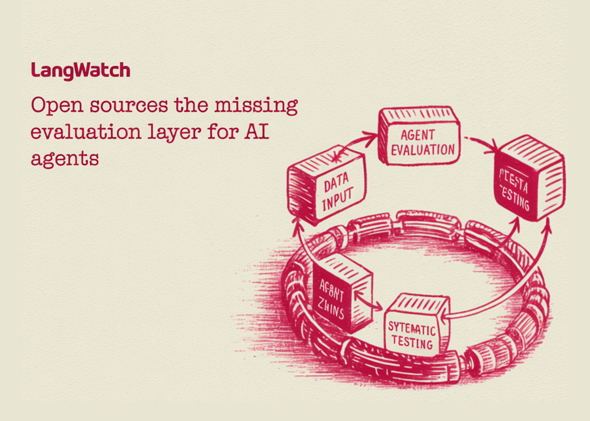

# LangWatch Open Sources the Missing Evaluation Layer for AI Agents to Enable End-to-End Tracing, Simulation, and Systematic Testing

> As AI development shifts from simple chat interfaces to complex, multi-step autonomous agents, the industry has encountered a significant bottleneck: non-determinism. Unlike traditional software where code follows a predictable path, agents built on LLMs introduce a high degree of variance. LangWatch is an open-source platform designed to address this by providing a standardized layer for […]

As AI development shifts from simple chat interfaces to complex, multi-step autonomous agents, the industry has encountered a significant bottleneck: **non-determinism**. Unlike traditional software where code follows a predictable path, agents built on LLMs introduce a high degree of variance.

**LangWatch** is an open-source platform designed to address this by providing a standardized layer for **evaluation, tracing, simulation, and monitoring**. It moves AI engineering away from anecdotal testing toward a systematic, data-driven development lifecycle.

### The Simulation-First Approach to Agent Reliability

For software developers working with frameworks like **LangGraph** or **CrewAI**, the primary challenge is identifying where an agent’s reasoning fails. LangWatch introduces **end-to-end simulations** that go beyond simple input-output checks.

**By running full-stack scenarios, the platform allows developers to observe the interaction between several critical components:**

- **The Agent:** The core logic and tool-calling capabilities.

- **The User Simulator:** An automated persona that tests various intents and edge cases.

- **The Judge:** An LLM-based evaluator that monitors the agent’s decisions against predefined rubrics.

This setup enables devs to pinpoint exactly which ‘turn’ in a conversation or which specific tool call led to a failure, allowing for granular debugging before production deployment.

### Closing the Evaluation Loop

A recurring friction point in AI workflows is the ‘glue code’ required to move data between observability tools and fine-tuning datasets. LangWatch consolidates this into a single **Optimization Studio**.

#### The Iterative Lifecycle

**The platform automates the transition from raw execution to optimized prompts through a structured loop:**

**Stage****Action****Trace**Capture the complete execution path, including state changes and tool outputs.**Dataset**Convert specific traces (especially failures) into permanent test cases.**Evaluate**Run automated benchmarks against the dataset to measure accuracy and safety.**Optimize**Use the Optimization Studio to iterate on prompts and model parameters.**Re-test**Verify that changes resolve the issue without introducing regressions.

This process ensures that every prompt modification is backed by comparative data rather than subjective assessment.

### Infrastructure: OpenTelemetry-Native and Framework-Agnostic

To avoid vendor lock-in, LangWatch is built as an **OpenTelemetry-native (OTel)** platform. By utilizing the OTLP standard, it integrates into existing enterprise observability stacks without requiring proprietary SDKs.

**The platform is designed to be compatible with the current leading AI stack:**

- **Orchestration Frameworks:** LangChain, LangGraph, CrewAI, Vercel AI SDK, Mastra, and Google AI SDK.

- **Model Providers:** OpenAI, Anthropic, Azure, AWS, Groq, and Ollama.

By remaining agnostic, LangWatch allows teams to swap underlying models (e.g., moving from GPT-4o to a locally hosted Llama 3 via Ollama) while maintaining a consistent evaluation infrastructure.

### GitOps and Version Control for Prompts

One of the more practical features for devs is the direct **GitHub integration**. In many workflows, prompts are treated as ‘configuration’ rather than ‘code,’ leading to versioning issues. LangWatch links prompt versions directly to the traces they generate.

This enables a **GitOps workflow** where:

- Prompts are version-controlled in the repository.

- Traces in LangWatch are tagged with the specific Git commit hash.

- Engineers can audit the performance impact of a code change by comparing traces across different versions.

### Enterprise Readiness: Deployment and Compliance

For organizations with strict data residency requirements, LangWatch supports **self-hosting** via a single Docker Compose command. This ensures that sensitive agent traces and proprietary datasets remain within the organization’s virtual private cloud (VPC).

**Key enterprise specifications include:**

- **ISO 27001 Certification:** Providing the security baseline required for regulated sectors.

- **Model Context Protocol (MCP) Support:** Allowing full integration with Claude Desktop for advanced context handling.

- **Annotations & Queues:** A dedicated interface for domain experts to manually label edge cases, bridging the gap between automated evals and human oversight.

### Conclusion

The transition from ‘experimental AI’ to ‘production AI’ requires the same level of rigor applied to traditional software engineering. By providing a unified platform for tracing and simulation, LangWatch offers the infrastructure necessary to validate agentic workflows at scale.

---

Check out the **[GitHub Repo here](https://github.com/langwatch/langwatch). **Also, feel free to follow us on **[Twitter](https://x.com/intent/follow?screen_name=marktechpost)** and don’t forget to join our **[120k+ ML SubReddit](https://www.reddit.com/r/machinelearningnews/)** and Subscribe to **[our Newsletter](https://www.aidevsignals.com/)**. Wait! are you on telegram? **[now you can join us on telegram as well.](https://t.me/machinelearningresearchnews)**
