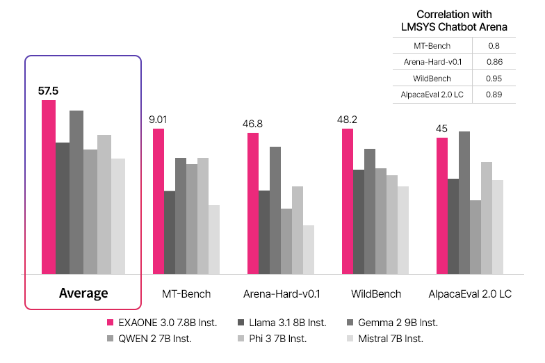

# LG AI Research Open-Sources EXAONE 3.0: A 7.8B Bilingual Language Model Excelling in English and Korean with Top Performance in Real-World Applications and Complex Reasoning

> Introduction to EXAONE 3.0: The Vision and Objectives EXAONE 3.0 represents a significant milestone in the evolution of language models developed by LG AI Research, particularly within Expert AI. The name “EXAONE” derives from “EXpert AI for EveryONE,” encapsulating LG AI Research‘s commitment to democratizing access to expert-level artificial intelligence capabilities. This vision aligns with […]

**Introduction to EXAONE 3.0: The Vision and Objectives**

[**EXAONE 3.0**](https://huggingface.co/LGAI-EXAONE/EXAONE-3.0-7.8B-Instruct) represents a significant milestone in the evolution of language models developed by [**LG AI Research**](https://pxl.to/terjqm7c), particularly within Expert AI. The name “[**EXAONE**](https://pxl.to/z8r3ks)” derives from “**EX**pert **A**I for Every**ONE**,” encapsulating [**LG AI Research**](https://pxl.to/terjqm7c)‘s commitment to democratizing access to expert-level artificial intelligence capabilities. This vision aligns with a broader objective of enabling the general public and experts to achieve new heights of proficiency in various fields through advanced AI.  The release of [**EXAONE 3.0**](https://pxl.to/z8r3ks) was a landmark event, marked by the introduction of the [**EXAONE 3.0**](https://huggingface.co/LGAI-EXAONE/EXAONE-3.0-7.8B-Instruct) models with enhanced performance metrics. The 7.8 billion parameter [**EXAONE-3.0-7.8B-Instruct model**](https://huggingface.co/LGAI-EXAONE/EXAONE-3.0-7.8B-Instruct), instruction-tuned for superior performance, was made publicly available among these. This decision to open-source one of its most advanced models underscores LG’s dedication to fostering innovation and collaboration within the global AI community.

**Evolution of Efficiency: Advancements from EXAONE 1.0 to 3.0**

The journey from EXAONE 1.0 to [**EXAONE 3.0**](https://pxl.to/z8r3ks) marks an interesting development in [**LG AI Research**](https://pxl.to/terjqm7c)‘s development of large language models, reflecting substantial technical advancements and efficiency improvements. EXAONE 1.0, launched in 2021, laid the groundwork for LG’s ambitious AI goals, but it was in EXAONE 2.0 that critical enhancements were introduced, including improved performance metrics and cost efficiencies. The most notable leap occurred with the release of [**EXAONE 3.0**](https://pxl.to/z8r3ks), where a three-year focus on AI model compression technologies resulted in a dramatic 56% reduction in inference processing time and a 72% reduction in cost compared to EXAONE 2.0. This culminated in a model operating at just 6% of the initially released EXAONE 1.0 cost. These improvements have increased the model’s applicability in real-world scenarios and made advanced AI more accessible and economically feasible for broader deployment across various industries.

**The Architecture of EXAONE 3.0: A Technical Marvel**

[**EXAONE 3.0**](https://pxl.to/z8r3ks) is based on a state-of-the-art decoder-only transformer architecture. The model supports a maximum context length of 4,096 tokens and utilizes Rotary Position Embeddings (RoPE) and Grouped Query Attention (GQA) mechanisms. These architectural choices enhance the model’s ability to process and generate text in English and Korean, reflecting LG’s emphasis on bilingual support.

The [**EXAONE-3.0-7.8B-Instruct model**](https://pxl.to/z8r3ks)‘s architecture, which includes 32 layers with a feedforward dimension of 14,336 and 32 heads, is designed to balance the need for computational efficiency with the ability to handle complex linguistic tasks. The incorporation of the SwiGLU non-linearity and a vocabulary size of 102,400 ensures that the model can handle the intricate nuances of both languages it supports. This bilingual proficiency is further supported by a tokenizer that effectively pre-processes English and Korean text, optimizing the model’s performance in these languages.

**Training the Model: A Focus on Quality and Compliance**

The training of [**EXAONE 3.0**](https://pxl.to/z8r3ks) involved several critical stages, beginning with extensive pre-training on a diverse dataset. This dataset was carefully curated to include web-crawled data, publicly available resources, and internally constructed corpora. The emphasis was on maintaining high data quality while adhering to strict data compliance standards, a necessity in today’s legal and ethical landscape. The model was trained using 8 trillion tokens, divided into two distinct phases. The first phase focused on general domain knowledge. In contrast, the second phase honed the model’s expertise in specific domains by rebalancing the data distribution to favor high-quality expert domain data. This approach ensured that [**EXAONE 3.0**](https://pxl.to/z8r3ks) was proficient in general tasks and excelled in specialized areas, making it a versatile tool for various applications.

**Post-Training Enhancements: Fine-Tuning and Optimization**

[**LG AI Research**](https://pxl.to/terjqm7c) employed a two-stage post-training process to further enhance the model’s instruction-following capabilities. The first stage involved supervised fine-tuning (SFT), which was crucial for helping the model generalize to new tasks. This stage focused on creating a broad spectrum of instruction types to enhance the model’s ability to handle diverse user interactions. The second stage, Direct Preference Optimization (DPO), aligned the model’s outputs with human preferences using feedback loops. This stage involved offline and online DPO methods, ensuring the model could generate responses that met user expectations while minimizing the likelihood of inappropriate or biased outputs.

**EXAONE 3.0’s Outstanding Performance on Rigorous English and Korean Benchmarks and Standing on the Open LLM Leaderboard 2**

[**EXAONE 3.0 7.8B**](https://pxl.to/z8r3ks) emerged as a top-tier language model, ranking first in several critical benchmarks. Specifically, the model secured the highest average score across tasks such as MT-Bench, Arena-Hard-v0.1, WildBench, and AlpacaEval 2.0 LC in real-world use cases in English. The model’s MT-Bench score of 9.01, the highest among models of similar size, underscores its exceptional capability in handling complex user interactions and real-world scenarios.

Also, in math capabilities, [**EXAONE 3.0**](https://pxl.to/z8r3ks) ranked second in the GSM8K benchmark and first in the MATH Level 5 benchmark, showcasing its proficiency in solving basic and advanced mathematical problems. The model also excelled in coding tasks, ranking first on the HumanEval benchmark, demonstrating its robust performance in synthesizing Python programs. Overall, [**EXAONE 3.0 7.8B**](https://pxl.to/z8r3ks) consistently delivered high-quality results, outperforming other state-of-the-art models in most categories, solidifying its reputation as a reliable and versatile language model in English.

[**EXAONE 3.0 7.8B**](https://pxl.to/z8r3ks) has demonstrated remarkable performance on the Open LLM Leaderboard 2, a comprehensive evaluation framework focusing on English capabilities. This rigorous leaderboard includes a variety of benchmarks such as IFEval (Instruction Following Evaluation), BBH (Big-Bench Hard), MATH Level 5, GPQA (Google-Proof QA), MuSR (Multistep Soft Reasoning), and MMLU-Pro. These benchmarks are meticulously designed to assess models on complex reasoning, long-range context parsing, and instruction-following abilities, all crucial for real-world applications.

Regarding Korean performance, [**EXAONE 3.0 7.8B**](https://pxl.to/z8r3ks) stands out as a leader, particularly in handling complex linguistic tasks. The model was evaluated using several specialized benchmarks, including KMMLU, KoBEST, and the Korean subset of the Belebele benchmark, a multilingual machine reading comprehension test. Across these benchmarks, [**EXAONE 3.0**](https://pxl.to/z8r3ks) consistently outperformed other models of similar size, particularly excelling in tasks that demand nuanced understanding and contextual reasoning in Korean.  **[[Check out the LG AI Research’s LinkedIn Page for their research updates]](https://pxl.to/terjqm7c)**

For instance, the model achieved first place in KoBEST categories such as BoolQ, COPA, WiC, HellaSwag, and SentiNeg, with an average score of 74.1, the highest among all evaluated models. Also, in the LogicKor benchmark, designed to test multi-turn reasoning and comprehension in Korean, [**EXAONE 3.0**](https://pxl.to/z8r3ks) once again demonstrated its superiority, securing the top position with a score of 8.77. These results highlight the model’s exceptional capability in processing and understanding the Korean language, making it an invaluable tool for general and domain-specific applications within the Korean-speaking community.

By excelling across both English and Korean benchmarks, [**EXAONE 3.0 7.8B**](https://pxl.to/z8r3ks) underscores its bilingual proficiency and establishes itself as a leading AI model capable of addressing various linguistic and computational challenges.

**The Open-Sourcing of EXAONE 3.0: A Bold Step Towards Collaboration**

One of the most significant aspects of the [**EXAONE 3.0**](https://pxl.to/z8r3ks) journey is its open sourcing. [**LG AI Research**](https://pxl.to/terjqm7c)‘s decision to release the 7.8B instruction-tuned model to the public is a great showcase of its commitment to advancing the field of AI. By making this model available for non-commercial and research purposes, LG aims to empower the AI community to explore new applications, drive innovation, and collaborate on solving complex challenges. [**EXAONE 3.0**](https://pxl.to/z8r3ks)‘s accessibility allows researchers and developers from diverse backgrounds to experiment, innovate, and contribute to the ongoing evolution of AI. This move is expected to lead to a proliferation of new applications, particularly in areas where bilingual capabilities are crucial. **[[Check out the LG AI Research’s LinkedIn Page for their research updates]](https://pxl.to/terjqm7c)**

**Applications Across Multiple Industries**

[**EXAONE 3.0**](https://pxl.to/z8r3ks) is designed to be versatile, with applications spanning various industries. AI’s enhanced data processing capabilities can be leveraged in the healthcare sector for more accurate diagnostic tools, predictive analytics, and personalized medicine. The ability to process and analyze large volumes of medical data quickly and accurately could revolutionize patient care.

AI’s advanced analytics can be applied to risk assessment, fraud detection, and market analysis in the financial industry. The AI’s ability to identify patterns and trends in large datasets can provide financial institutions with deeper insights. The AI’s improved NLP features also significantly affect the media and entertainment industries. AI can automate content creation, generate realistic simulations, and enhance user experiences in gaming and virtual environments. These capabilities open up new possibilities for creative professionals. **[[Check out the LG AI Research’s LinkedIn Page for their research updates]](https://pxl.to/terjqm7c)**

**The Impact and Ethical Considerations of EXAONE 3.0**

While the open-sourcing of [**EXAONE 3.0**](https://pxl.to/z8r3ks) brings numerous benefits, it also comes with responsibilities. [**LG AI Research**](https://pxl.to/terjqm7c) has proactively addressed the ethical and social implications of releasing such a powerful model to the public. The model has undergone extensive testing to ensure it adheres to LG AI’s ethical principles, including preventing misuse, mitigating biases, and safeguarding user privacy. LG’s commitment to responsible AI development is reflected in the rigorous compliance processes integrated into every stage of the model’s development. From data collection to model deployment, [**LG AI Research**](https://kr.linkedin.com/company/lgairesearch) has implemented safeguards to minimize the risk of malicious use and ensure that the model’s outputs align with ethical standards.

**Explore the Power of EXAONE 3.0: A Global-Standard Bilingual LLM**

[**LG AI Research**](https://pxl.to/terjqm7c)** **proudly introduced [**EXAONE 3.0**](https://pxl.to/z8r3ks), their latest bilingual Large Language Model (LLM), designed to deliver global-level performance in English and Korean. This month, they have open-sourced the [**EXAONE 3.0 7.8B instruction-tuned model on Hugging Face**](https://pxl.to/z8r3ks), making it accessible to researchers, developers, and AI enthusiasts worldwide. EXAONE 3.0 not only sets new benchmarks in real-world applications but also opens the door for innovative solutions across various industries. They invite users to explore the capabilities of this cutting-edge model and see firsthand how it can enhance projects. Users can stay connected by following [**LG AI Research’s LinkedIn page**](https://pxl.to/terjqm7c) and [**LG AI Research Site**](https://www.lgresearch.ai/) for the latest updates, insights, and opportunities to engage with their latest advancements.

**Conclusion: A Milestone in AI Development**

The release of [**EXAONE 3.0**](https://pxl.to/z8r3ks), with its advanced architecture, bilingual capabilities, and robust performance across various tasks, makes it a powerful and valuable tool for researchers and developers. LG AI Research’s decision to open-source this model is a bold step that underscores its commitment to fostering innovation & collaboration within the global AI community. As [**EXAONE 3.0**](https://huggingface.co/LGAI-EXAONE/EXAONE-3.0-7.8B-Instruct) begins its journey in the open-source world, it is expected to inspire new developments and applications across various industries. LG AI Research’s vision of democratizing access to expert AI is a reality that is now accessible to everyone. 

**I hope you enjoyed reading the 1st article of this series from LG AI Research. You should continue reading the [2nd article (EXAONEPath) here](https://www.marktechpost.com/2024/09/09/lg-ai-research-open-sources-exaonepath-transforming-histopathology-image-analysis-with-a-285m-patch-level-pre-trained-model-for-variety-of-medical-prediction-reducing-genetic-testing-time-and-costs/)**

---

**Sources**

- [LG AI Research LinkedIn Page](https://pxl.to/terjqm7c)

- [EXAONE 3.0 Blog](https://www.lgresearch.ai/blog/view?seq=460)

- [EXAONE 3.0 Technical Report](https://arxiv.org/abs/2408.03541)

- [EXAONE 3.0 on Hugging Face](https://pxl.to/z8r3ks)

- [EXAONE 3.0 on GitHub](https://github.com/LG-AI-EXAONE/EXAONE-3.0)

---

_Thanks to the [LG AI Research team ](https://kr.linkedin.com/company/lgairesearch)for the thought leadership/ Resources for this article.[ LG AI Research ](https://kr.linkedin.com/company/lgairesearch)team has supported us in this content/article._
