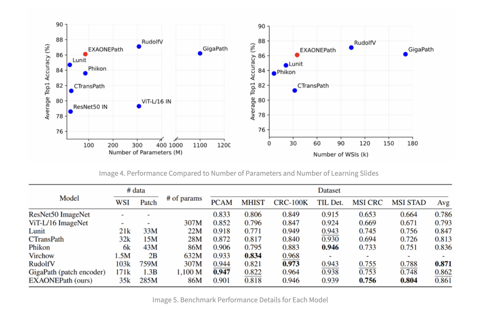

# LG AI Research Open-Sources EXAONEPath: Transforming Histopathology Image Analysis with a 285M Patch-level Pre-Trained Model for Variety of Medical Prediction, Reducing Genetic Testing Time and Costs

> Building on LG AI Research’s remarkable achievements in AI language models, especially with the launch of EXAONE 3.0, the development of EXAONEPath represents another significant milestone. This new chapter in EXAONE’s journey focuses on transforming digital histopathology, a critical area in medical diagnostics, by addressing the complex challenges of Whole Slide Images (WSIs) in histopathology […]

Building on [**LG AI Research**](https://pxl.to/terjqm7c)’s remarkable achievements in AI language models, especially with the launch of [**EXAONE** **3.0**](https://pxl.to/80saubl), the development of [**EXAONEPath**](https://pxl.to/80saubl)** **represents another significant milestone. This new chapter in [**EXAONE**](https://www.lgresearch.ai/blog/view?seq=460)’s journey focuses on transforming digital histopathology, a critical area in medical diagnostics, by addressing the complex challenges of Whole Slide Images (WSIs) in histopathology and by enabling the efficient processing of histopathology images, [**EXAONEPath**](https://pxl.to/80saubl) is well-utilized for various medical tasks including prediction of genetic mutations and/or recommendation of the most suitable treatment methods and medications. This innovation reduces the time required for genetic testing, which traditionally took up to two weeks, thereby saving time and money and enhancing patient care. The introduction of [**EXAONEPath**](https://pxl.to/80saubl) highlights [**LG AI Research**](https://kr.linkedin.com/company/lgairesearch)’s commitment to advancing AI technologies in specialized and challenging domains, reinforcing its vision of democratizing access to expert AI.

**Introduction to EXAONEPath: A New Frontier in Digital Histopathology**

[**EXAONEPath**](https://pxl.to/80saubl) is designed as a patch-level foundational model that operates on WSIs, which are high-resolution images of tissue slides used in histopathology. Often containing over the billions of pixels, these images are crucial for cancer subtyping, prognosis prediction, and tissue microenvironment analysis. However, the traditional models trained on these images often suffer from a phenomenon known as WSI-specific feature collapse, where the features extracted by the model tend to cluster based on the individual WSI rather than the pathological characteristics of the tissue. This clustering can significantly limit the model’s ability to generalize across different WSIs and, consequently, its effectiveness in real-world applications.

**Technical Innovations in EXAONEPath: Overcoming WSI-Specific Feature Collapse**

At the core of [**EXAONEPath**](https://pxl.to/80saubl)’s innovation is its approach to overcoming the WSI-specific feature collapse. This model employs self-supervised learning and stain normalization techniques, specifically Macenko normalization, to standardize the color characteristics of WSIs before feature extraction. This process reduces the variability introduced by different staining protocols across laboratories, which is a primary cause of feature collapse. By applying this normalization, [**EXAONEPath**](https://pxl.to/80saubl) ensures that the features it learns are more focused on the pathologically significant aspects of the tissue, such as nuclear size and shape, cell density, and structural changes, rather than superficial color variations.

There are a few unique challenges addressed by [**EXAONEPath**](https://pxl.to/80saubl) as follows:

- **Multi-Instance Learning (MIL) Framework: A Cornerstone in Histopathology Image Processing**: One of the critical challenges in processing histopathology images, particularly WSIs, is their immense size and the intricate details they contain. Traditional image processing methods often need help to handle these high-resolution images effectively. This is where the MIL framework comes into play, becoming a cornerstone in histopathology image analysis. A WSI is divided into smaller patches or tiles in the MIL framework. Each tile is then processed through a pre-trained image encoder, converting it into a latent vector. These vectors, which encapsulate the morphological characteristics of the cells within each tile, are then integrated to form a comprehensive latent vector representing the entire slide. This approach ensures that the intricate details of cell structures and surrounding tissues are preserved, even as the data is processed at a manageable scale. [**EXAONEPath**](https://pxl.to/80saubl) leverages this MIL framework to excel in processing gigapixel-scale histopathology images. By employing self-supervised learning methods, such as DINO, and combining them with stain normalization techniques, [**EXAONEPath**](https://pxl.to/80saubl) can mitigate the challenges posed by WSI-specific feature collapse. This capability enhances the model’s performance and makes it a vital tool in digital histopathology, where accurate and detailed image analysis is crucial for diagnosis and treatment planning.

- **Advancing Self-Supervised Learning: Overcoming Color-Based Feature Collapse**: Histopathology images are unique in composition, often containing subtle yet significant variations in cell structure and tissue organization. However, a common issue in training models on these images is the phenomenon of color-based feature collapse, particularly when using self-supervised learning methods like DINO. This occurs when the model, instead of learning the critical features related to cell morphology and tissue structure, primarily focuses on color variations across different slides. [**EXAONEPath**](https://pxl.to/80saubl) employs a sophisticated technique known as stain normalization to address this. This process involves selecting a high-quality, well-stained image as a reference and transforming other images to match its color profile. By doing so, the model can focus on learning the essential pathological features rather than getting biased by color discrepancies. The effectiveness of this approach is evident in the model’s performance, where post-normalization, the patches are no longer clustered based on color but are instead evenly distributed based on their latent features. This advancement improves the quality of the model’s outputs and sets a new standard in the training of histopathology image encoders.

**Training EXAONEPath: A Rigorous and Ethical Approach**

The development of [**EXAONEPath**](https://pxl.to/80saubl) involved a comprehensive and ethically responsible training process. The model was trained on 285,153,903 patches extracted from 34,795 WSIs, ensuring a diverse and representative dataset. The training was conducted using DINO (self-Distillation with NO labels), a self-supervised learning method that enhances the model’s ability to generalize from large amounts of unlabeled data. This approach allowed the model to learn robust features critical for downstream tasks such as cancer classification and survival analysis.

A key aspect of this training process was the strict adherence to data quality and compliance standards. [**LG AI Research**](https://pxl.to/terjqm7c) carefully curated the training data to include pathological cases, ensuring the model would apply to various medical conditions. Moreover, by incorporating ethical considerations throughout the model’s development, [**LG AI Research**](https://pxl.to/terjqm7c) ensured that [**EXAONEPath**](https://pxl.to/80saubl) would be a reliable and trustworthy tool for pathologists.

**Performance Evaluation: Benchmarking EXAONEPath Against the State-of-the-Art**

[**EXAONEPath**](https://pxl.to/80saubl)’s performance was rigorously evaluated across six diverse patch-level tasks, including PCAM (Pathology Classification using Attention Models), MHIST (Micro-Histology Image Segmentation Task), and CRC-100K (Colorectal Cancer Patch Classification). The model was benchmarked against state-of-the-art models, and the results were impressive.

The performance of the [**EXAONEPath**](https://pxl.to/80saubl) model stands out in a comparison across several benchmarks against other state-of-the-art models. Specifically, [**EXAONEPath**](https://pxl.to/80saubl) demonstrates competitive results with an average score of 0.861, surpassing many other models, such as ViT-L/16 ImageNet and Phikon, and its accuracy is comparable to competing models, such as GigaPath. Notably, [**EXAONEPath**](https://pxl.to/80saubl) excels in the MSI CRC and MSI STAD tasks, achieving scores of 0.756 and 0.804, respectively, which are the highest in these categories. While it slightly trails in some tasks like PCAM and CRC-100K, the model still performs robustly across the board, showcasing its efficiency and capability in handling complex histopathology image analysis. This performance highlights [**EXAONEPath**](https://pxl.to/80saubl)’s strong potential as a versatile and effective tool in digital histopathology, especially considering its relatively smaller size and the efficiency of its training process.

**New Horizons: Potential Applications and Future Directions**

The success of [**EXAONEPath**](https://pxl.to/80saubl) opens up new possibilities for applying AI in histopathology. By providing a reliable and efficient model for WSI analysis, [**EXAONEPath**](https://pxl.to/80saubl) has the potential to revolutionize several aspects of medical diagnostics, from cancer detection to personalized medicine. The model’s ability to handle large and complex datasets makes it a valuable tool for pathologists, who can improve diagnostic accuracy and reduce the time required for analysis. Going forward, there are several exciting directions for future research. One area of focus could be the development of more advanced stain normalization techniques that are computationally efficient and can be smoothly integrated into existing workflows. Also, exploring new model architectures that can further reduce feature collapse and enhance the generalization capabilities of AI models in histopathology will be crucial.

**Ethical Considerations: Ensuring Responsible Use of AI in Histopathology**

As with any powerful AI technology, the deployment of [**EXAONEPath**](https://pxl.to/80saubl) comes with significant ethical responsibilities. [**LG AI Research**](https://pxl.to/terjqm7c) has taken proactive steps to address these concerns, implementing strict guidelines to ensure the model is used ethically and responsibly. This includes measures to prevent the misuse of the model, such as prohibiting its use for commercial purposes without explicit consent and ensuring that it is not used to generate harmful or misleading information. The model has been thoroughly tested to align with ethical standards, particularly in bias mitigation and user privacy. By embedding these ethical considerations into the development and deployment of [**EXAONEPath**](https://pxl.to/80saubl), [**LG AI Research**](https://pxl.to/terjqm7c) is setting a standard for the responsible use of AI in medical applications.

**Explore the Innovation of EXAONEPath: A Breakthrough in Digital Histopathology  **

[**LG AI Research**](https://kr.linkedin.com/company/lgairesearch) proudly presents [**EXAONEPath**](https://pxl.to/80saubl), their groundbreaking patch-level foundation model for histopathology image analysis. Designed to excel in processing gigapixel-scale images, [**EXAONEPath **](https://pxl.to/80saubl)leverages advanced self-supervised learning and stain normalization techniques to deliver unparalleled accuracy in medical diagnostics. This pioneering model has been released as open-source on the Hugging Face platform, making it accessible to researchers, healthcare professionals, and AI developers globally for research purposes. [**EXAONEPath**](https://pxl.to/80saubl) not only sets new standards in the field of digital histopathology but also unlocks transformative possibilities for AI-driven healthcare innovations. [**LG AI Research**](https://pxl.to/terjqm7c) invites the global community to explore the powerful capabilities of [**EXAONEPath**](https://pxl.to/80saubl) and to stay engaged through their [**LinkedIn page**](https://pxl.to/terjqm7c) for the latest research, updates, and collaborative opportunities. Also, users, researchers, and professionals can follow the latest updates on the [**LG AI Research Site**](https://www.lgresearch.ai/), as many new releases are in the line for the [**EXAONE**](https://www.lgresearch.ai/blog/view?seq=460) series.

**Conclusion: A New Era in Digital Histopathology**

[**EXAONEPath**](https://pxl.to/80saubl) is a remarkable feat in digital histopathology and another great addition to EXAONE research pursued by the [**LG AI Research**](https://pxl.to/terjqm7c) team. It builds on the foundational work of [**EXAONE** **3.0**](https://huggingface.co/LGAI-EXAONE/EXAONE-3.0-7.8B-Instruct) and pushes the limits of what AI can achieve in medical diagnostics. By addressing the challenges of WSI-specific feature collapse and improving the generalization capabilities of AI models, [**EXAONEPath**](https://pxl.to/80saubl) will become a valuable tool for pathologists worldwide. As this journey continues, the lessons learned from [**EXAONEPath**](https://pxl.to/80saubl) will undoubtedly inform the next generation of AI models, paving the way for more accurate, efficient, and ethical diagnostic tools. With this new addition, [**LG AI Research**](https://pxl.to/terjqm7c)’s vision of democratizing access to expert-level AI extends into the medical field.

**I hope you enjoyed reading the 2nd article of this series from LG AI Research. If you have not read the 1st article (EXAONE 3.0), You should continue reading the [1st article (EXAONE 3.0) here…](https://www.marktechpost.com/2024/09/08/lg-ai-research-open-sources-exaone-3-0-a-7-8b-bilingual-language-model-excelling-in-english-and-korean-with-top-performance-in-real-world-applications-and-complex-reasoning/)**

---

**Sources**

- [LG AI Research LinkedIn Page](https://pxl.to/terjqm7c)

- [EXAONEPath Blog](https://www.lgresearch.ai/blog/view?seq=470)

- [EXAONEPath Technical Report](https://arxiv.org/abs/2408.00380)

- [EXAONEPath on Hugging Face](https://pxl.to/80saubl)

- [EXAONEPath on GitHub ](https://github.com/LG-AI-EXAONE/EXAONEPath)

---

_Thanks to the [LG AI Research team ](https://pxl.to/terjqm7c)for the thought leadership/ Resources for this article.[ LG AI Research ](https://pxl.to/terjqm7c)team has supported us in this content/article._
