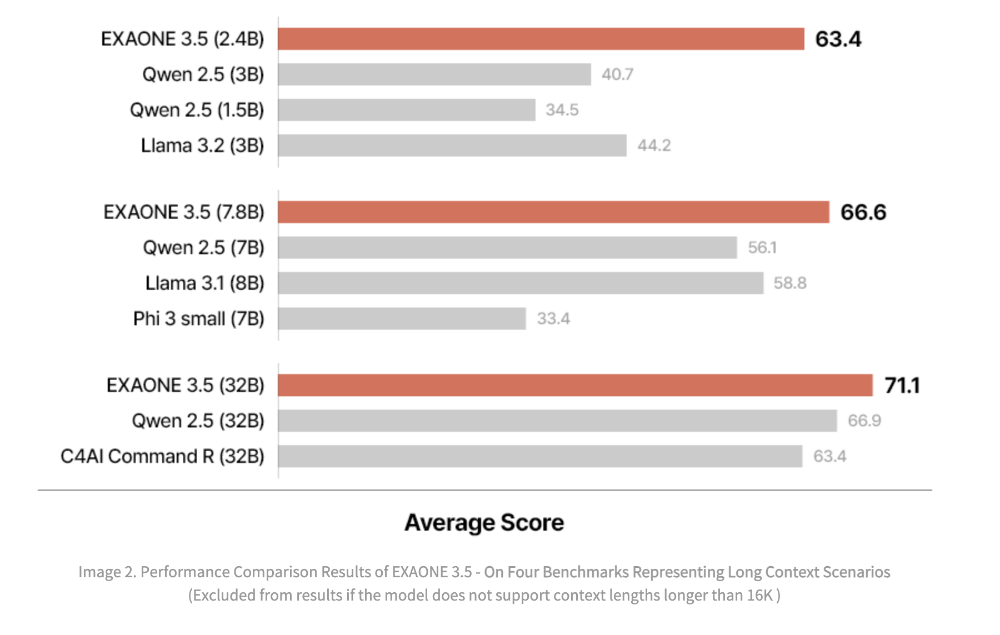

# LG AI Research Releases EXAONE 3.5: Three Open-Source Bilingual Frontier AI-level Models Delivering Unmatched Instruction Following and Long Context Understanding for Global Leadership in Generative AI Excellence

> LG AI Research has released bilingual models expertizing in English and Korean based on EXAONE 3.5 as open source following the success of its predecessor, EXAONE 3.0. The research team has expanded the EXAONE 3.5 models, including three types designed for specific use cases: The EXAONE 3.5 models demonstrate exceptional performance and cost-efficiency, achieved through […]

[**LG AI Research**](https://pxl.to/terjqm7c) has released bilingual models expertizing in English and Korean based on [EXAONE 3.5](https://pxl.to/t8f63or) as open source following the success of its predecessor, EXAONE 3.0. The research team has expanded the EXAONE 3.5 models, including three types designed for specific use cases:

- The 2.4B model is an ultra-lightweight version optimized for on-device use. It can operate on low-spec GPUs and in environments with limited infrastructure.

- A lightweight 7.8B model offers improved performance over its predecessor, the [EXAONE-3.0-7.8B-Instruct model](https://pxl.to/z8r3ks) while maintaining versatility for general-purpose use.

- The 32B model represents a frontier-level high-performance option for demanding applications, catering to users who prioritize computational power.

The EXAONE 3.5 models demonstrate exceptional performance and cost-efficiency, achieved through [**LG AI Research**](https://pxl.to/terjqm7c)’s innovative R&D methodologies. The hallmark feature of EXAONE 3.5 is its support for long-context processing, allowing the handling of up to 32,768 tokens. This capability makes it effective in addressing the demands of real-world use cases and Retrieval-Augmented Generation (RAG) scenarios, where extended textual inputs are common. Each model in the EXAONE 3.5 series has demonstrated state-of-the-art performance in real-world applications and tasks requiring long-context understanding.

### Training Methodologies and Architectural Innovations of EXAONE 3.5

Training EXAONE 3.5 language models involves a blend of advanced configurations, pre-training strategies, and post-training refinements to maximize performance and usability. The models are built on a state-of-the-art decoder-only Transformer architecture, with configurations varying based on model size. While structurally similar to [EXAONE 3.0 7.8B](https://pxl.to/z8r3ks), the EXAONE 3.5 models introduce improvements such as extended context length, _supporting up to 32,768 tokens, a significant increase from the previous 4,096 tokens_. The architecture incorporates advanced features like SwiGLU non-linearities, Grouped Query Attention (GQA), and Rotary Position Embeddings (RoPE), ensuring efficient processing and enhanced bilingual support for English and Korean. All models share a vocabulary of 102,400 tokens, evenly divided between the two languages.

The pre-training phase of [EXAONE 3.5](https://pxl.to/t8f63or) was conducted in two stages. The first stage focused on diverse data sources to enhance general domain performance, while the second stage targeted specific domains requiring improved capabilities, such as long-context understanding. During the second stage, a replay-based method was employed to address catastrophic forgetting, allowing the model to retain knowledge from the initial training phase. Computational resources were optimized during pre-training; for example, the 32B model achieved high performance with significantly lower computation requirements than other models of similar size. A rigorous decontamination process was applied to eliminate contaminated examples in the training data, ensuring the reliability of benchmark evaluations.

Post-training, the models underwent supervised fine-tuning (SFT) to enhance their ability to respond effectively to varied instructions. This involved creating an instruction-response dataset from a taxonomy of knowledge derived from web corpora. The dataset was designed to include a range of complexities, enabling the model to generalize well across tasks. Preference optimization was then employed using Direct Preference Optimization (DPO) and other algorithms to align the models with human preferences. This process included multiple training stages to prevent over-optimization and improve output alignment with user expectations. [**LG AI Research**](https://pxl.to/terjqm7c) conducted extensive reviews to address potential legal risks like copyright infringement and personal information protection to ensure data compliance. Steps were taken to de-identify sensitive data and ensure that all datasets met strict ethical and legal standards.

### Benchmark Evaluations: Unparalleled Performance of EXAONE 3.5 Bilingual Models

The evaluation benchmarks of [EXAONE 3.5](https://pxl.to/t8f63or) Models were categorized into three groups: real-world use cases, long-context processing, and general domain tasks. Real-world benchmarks evaluated the models’ ability to understand and respond to user queries in practical scenarios. Long-context benchmarks assessed the models’ capability to process and retrieve information from extended textual inputs, which is critical for RAG applications. General domain benchmarks tested the models’ proficiency in mathematics, coding, and knowledge-based tasks. EXAONE 3.5 models consistently performed well across all benchmark categories. The 32B and 7.8B models excelled in real-world use cases and long-context scenarios, often surpassing baseline models of similar size. For example, the 32B model achieved an average score of 74.3 in real-world use cases, significantly outperforming competitors like Qwen 2.5 32B and Gemma 2 27B.

*Image. Performance Comparison Results of EXAONE 3.5 – On Four Benchmarks Representing Long Context Scenarios. (Excluded from results if the model does not support context lengths longer than 16K) | Image Source: LG AI Research Blog (https://www.lgresearch.ai/blog/view?seq=507)*

Similarly, in long-context benchmarks, the models demonstrated a superior ability to process and understand extended contexts in both English and Korean. On tests like Needle-in-a-Haystack (NIAH), all three models achieved near-perfect retrieval accuracy, showcasing their robust performance in tasks requiring detailed context comprehension. The 2.4B model was an efficient option for resource-constrained environments, outperforming baseline models of similar size in all categories. Despite its smaller size, it delivered competitive results in general domain tasks, such as solving mathematical problems and writing source code. For example, the 2.4B model scored an average of 63.3 across nine benchmarks in general scenarios, surpassing larger models like Gemma 2 9B in multiple metrics. Real-world use case evaluations incorporated benchmarks like MT-Bench, KoMT-Bench, and LogicKor, where EXAONE 3.5 models were judged on multi-turn responses. They achieved high scores in both English and Korean, highlighting their bilingual proficiency. For instance, the 32B model achieved top-tier results in MT-Bench with a score of 8.51, generating accurate and contextually relevant responses.

*이미지 3. Performance Comparison Results of EXAONE 3.5 – **On Seven Benchmarks Representing Real-world Use Case Scenarios** | Image Source: LG AI Research Blog (https://www.lgresearch.ai/blog/view?seq=507)*

In the long-context category, EXAONE 3.5 models were evaluated using benchmarks like LongBench and LongRAG and in-house tests like Ko-WebRAG. The models demonstrated exceptional long-context processing capabilities, consistently outperforming baselines in retrieving and reasoning over extended texts. The 32B model, for example, scored 71.1 on average across long-context benchmarks, cementing its status as a leader in this domain. General domain evaluations included benchmarks for mathematics, coding, and parametric knowledge. The EXAONE 3.5 models delivered competitive performance compared to peers. The 32B model achieved an average score of 74.8 across nine benchmarks, while the 7.8B model scored 70.2.

*Image Source : LG AI Research Blog (https://www.lgresearch.ai/blog/view?seq=507)*

### Responsible AI Development: Ethical and Transparent Practices

The development of EXAONE 3.5 models adhered to [**LG AI Research**](https://pxl.to/terjqm7c)’s Responsible AI Development Framework, prioritizing data governance, ethical considerations, and risk management. Recognizing these models’ open nature and potential for widespread use across various domains, the framework aims to maximize social benefits while maintaining fairness, safety, accountability, and transparency. This commitment aligns with the LG AI Ethics Principles, which guide AI technologies’ ethical use and deployment. EXAONE 3.5 models benefit the AI community by addressing feedback from the EXAONE 3.0 release.

However, releasing open models like EXAONE 3.5 also entails potential risks, including inequality, misuse, and the unintended generation of harmful content. [**LG AI Research**](https://pxl.to/terjqm7c) conducted an AI ethical impact assessment to mitigate these risks, identifying challenges such as bias, privacy violations, and regulatory compliance. Legal risk assessments were performed on all datasets, and sensitive information was removed through de-identification processes. Bias in training data was addressed through pre-processing documentation and evaluation, ensuring high data quality and fairness. To ensure safe and responsible use of the models, [**LG AI Research**](https://pxl.to/terjqm7c) verified the open-source libraries employed and committed to monitoring AI regulations across different jurisdictions. Efforts to enhance the explainability of AI inferences were also prioritized to build trust among users and stakeholders. While fully explaining AI reasoning remains challenging, ongoing research aims to improve transparency and accountability. The safety of EXAONE 3.5 models was assessed using a third-party dataset provided by the Ministry of Science and ICT of the Republic of Korea. This evaluation tested the models’ ability to filter out harmful content, with results showing some effectiveness but highlighting the need for further improvement.

### Key Takeaways, Real-World Applications, and Business Partnerships of EXAONE 3.5

- **Exceptional Long Context Understanding: **EXAONE 3.5 models stand out for their robust long-context processing capabilities, achieved through RAG technology. Each model can effectively handle 32K tokens. Unlike models claiming theoretical long-context capacities, EXAONE 3.5 has an “Effective Context Length” of 32K, making it highly functional for practical applications. Its bilingual proficiency ensures top-tier performance in processing complex English and Korean contexts.

- **Superior Instruction Following Capabilities: **EXAONE 3.5 excels in usability-focused tasks, delivering the highest average scores across seven benchmarks representing real-world use cases. This demonstrates its ability to enhance productivity and efficiency in industrial applications. All three models performed significantly better than global models of similar sizes in English and Korean.

- **Strong General Domain Performance: **EXAONE 3.5 models deliver excellent results across nine benchmarks in general domains, particularly in mathematics and programming. The 2.4B model ranks first in average scores among models of similar size, showcasing its efficiency for resource-constrained environments. Meanwhile, the 7.8B and 32B models achieve competitive scores, demonstrating EXAONE 3.5’s versatility in handling various tasks.

- **Commitment to Responsible AI Development:** [**LG AI Research**](https://pxl.to/terjqm7c) has prioritized ethical considerations and transparency in the development of EXAONE 3.5. An AI ethical impact assessment identified and addressed potential risks such as inequality, harmful content, and misuse. The models excel at filtering out hate speech and illegal content, although the 2.4B model requires improvement in addressing regional and occupational biases. Transparent disclosure of evaluation results underscores [**LG AI Research**](https://pxl.to/terjqm7c)’s commitment to fostering ethical AI development and encouraging further research into responsible AI.

- **Practical Applications and Business Partnerships:** EXAONE 3.5 is being integrated into real-world applications through partnerships with companies like Polaris Office and Hancom. These collaborations aim to incorporate EXAONE 3.5 into software solutions, enhancing efficiency and productivity for both corporate and public sectors. A Proof of Concept (PoC) project with the Hancom highlights the potential for AI-driven innovations to transform government and public institution workflows, showcasing the model’s practical business value.

### Conclusion: A New Standard in Open-Source AI

In conclusion, [**LG AI Research**](https://pxl.to/terjqm7c) has set a new benchmark with the release of EXAONE 3.5, a 3-model series of open-source LLMs. Combining advanced instruction-following capabilities and unparalleled long-context understanding, EXAONE 3.5 is designed to meet the diverse needs of researchers, businesses, and industries. Its versatile range of models, 2.4B, 7.8B, and 32B, offers tailored solutions for resource-constrained environments and high-performance applications. These open-sourced 3-model series can be accessed on Hugging Face. Users can stay connected by following [**LG AI Research’s LinkedIn page**](https://pxl.to/terjqm7c) and [**LG AI Research Website**](https://www.lgresearch.ai/) for the latest updates, insights, and opportunities to engage with their latest advancements. 

**Sources**

- [**LG AI Research LinkedIn Page**](https://pxl.to/terjqm7c)

- [**EXAONE 3.5 Blog**](https://www.lgresearch.ai/blog/view?seq=507)

- [**EXAONE 3.5 Technical Report**](https://arxiv.org/abs/2412.04862)

- [**EXAONE 3.5 on Hugging Face**](https://pxl.to/t8f63or)

- [**EXAONE 3.5 on GitHub**](https://github.com/LG-AI-EXAONE)

---

_Thanks to the [LG AI Research team ](https://kr.linkedin.com/company/lgairesearch)for the thought leadership/ Resources for this article.[ LG AI Research ](https://kr.linkedin.com/company/lgairesearch)team has supported us in this content/article._
