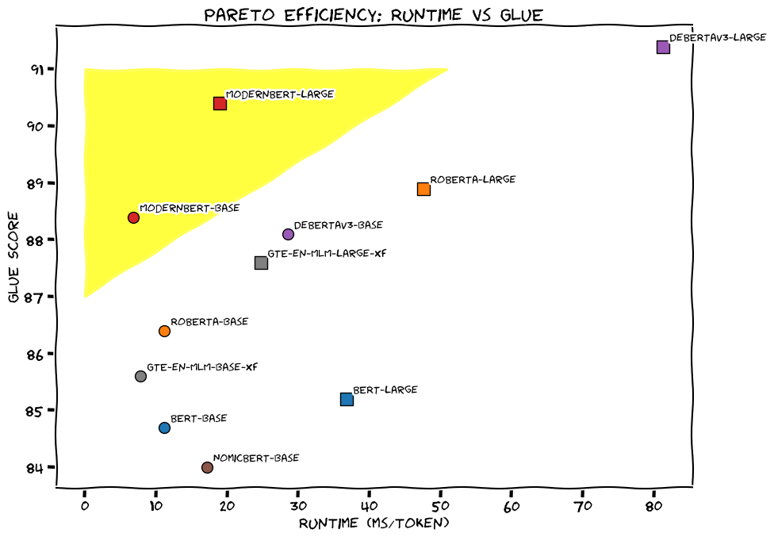

# LightOn and Answer.ai Releases ModernBERT: A New Model Series that is a Pareto Improvement over BERT with both Speed and Accuracy

> Since the release of BERT in 2018, encoder-only transformer models have been widely used in natural language processing (NLP) applications due to their efficiency in retrieval and classification tasks. However, these models face notable limitations in contemporary applications. Their sequence length, capped at 512 tokens, hampers their ability to handle long-context tasks effectively. Furthermore, their […]

Since the release of BERT in 2018, encoder-only transformer models have been widely used in natural language processing (NLP) applications due to their efficiency in retrieval and classification tasks. However, these models face notable limitations in contemporary applications. Their sequence length, capped at 512 tokens, hampers their ability to handle long-context tasks effectively. Furthermore, their architecture, vocabulary, and computational efficiency have not kept pace with advancements in hardware and training methodologies. These shortcomings become especially apparent in retrieval-augmented generation (RAG) pipelines, where encoder-based models provide context for large language models (LLMs). Despite their critical role, these models often rely on outdated designs, limiting their capacity to meet evolving demands.

**[A team of researchers from LightOn, Answer.ai, Johns Hopkins University, NVIDIA, and Hugging Face have sought to address these challenges with the introduction of ModernBERT](https://arxiv.org/abs/2412.13663)**, an open family of encoder-only models. ModernBERT brings several architectural enhancements, extending the context length to 8,192 tokens—a significant improvement over the original BERT. This increase enables it to perform well on long-context tasks. The integration of Flash Attention 2 and rotary positional embeddings (RoPE) enhances computational efficiency and positional understanding. Trained on 2 trillion tokens from diverse domains, including code, ModernBERT demonstrates improved performance across multiple tasks. It is available in two configurations: base (139M parameters) and large (395M parameters), offering options tailored to different needs while consistently outperforming models like RoBERTa and DeBERTa.

### Technical Details and Benefits

ModernBERT incorporates several advancements in transformer design. Flash Attention enhances memory and computational efficiency, while alternating global-local attention mechanisms optimize long-context processing. RoPE embeddings improve positional understanding, ensuring effective performance across varied sequence lengths. The model also employs GeGLU activation functions and a deep, narrow architecture for a balanced trade-off between efficiency and capability. Stability during training is further ensured through pre-normalization blocks and the use of the StableAdamW optimizer with a trapezoidal learning rate schedule. These refinements make ModernBERT not only faster but also more resource-efficient, particularly for inference tasks on common GPUs.

### Results and Insights

ModernBERT demonstrates strong performance across benchmarks. On the General Language Understanding Evaluation (GLUE) benchmark, it surpasses existing base models, including DeBERTaV3. In retrieval tasks like Dense Passage Retrieval (DPR) and ColBERT multi-vector retrieval, it achieves higher nDCG@10 scores compared to its peers. The model’s capabilities in long-context tasks are evident in the MLDR benchmark, where it outperforms older models and specialized long-context models such as GTE-en-MLM and NomicBERT. ModernBERT also excels in code-related tasks, including CodeSearchNet and StackOverflow-QA, benefiting from its code-aware tokenizer and diverse training data. Additionally, it processes significantly larger batch sizes than its predecessors, making it suitable for large-scale applications while maintaining memory efficiency.

### Conclusion

ModernBERT represents a thoughtful evolution of encoder-only transformer models, integrating modern architectural improvements with robust training methodologies. Its extended context length and enhanced efficiency address the limitations of earlier models, making it a versatile tool for a variety of NLP applications, including semantic search, classification, and code retrieval. By modernizing the foundational BERT architecture, ModernBERT meets the demands of contemporary NLP tasks. Released under the Apache 2.0 license and hosted on Hugging Face, it provides an accessible and efficient solution for researchers and practitioners seeking to advance the state of the art in NLP.

---

Check out the **_[Paper,](https://arxiv.org/abs/2412.13663)_** **_[Blog](https://huggingface.co/blog/modernbert)_**, and **_[Model on Hugging Face](https://huggingface.co/collections/answerdotai/modernbert-67627ad707a4acbf33c41deb)_**. All credit for this research goes to the researchers of this project. Also, don’t forget to follow us on **[Twitter](https://twitter.com/Marktechpost)** and join our **[Telegram Channel](https://github.com/XGenerationLab/XiYan-SQL)** and [**LinkedIn Gr**](https://www.linkedin.com/groups/13668564/)[**oup**](https://www.linkedin.com/groups/13668564/). Don’t Forget to join our **[60k+ ML SubReddit](https://www.reddit.com/r/machinelearningnews/)**.

**[🚨 Trending: LG AI Research Releases EXAONE 3.5: Three Open-Source Bilingual Frontier AI-level Models Delivering Unmatched Instruction Following and Long Context Understanding for Global Leadership in Generative AI Excellence….](https://www.marktechpost.com/2024/12/11/lg-ai-research-releases-exaone-3-5-three-open-source-bilingual-frontier-ai-level-models-delivering-unmatched-instruction-following-and-long-context-understanding-for-global-leadership-in-generative-a/)**
