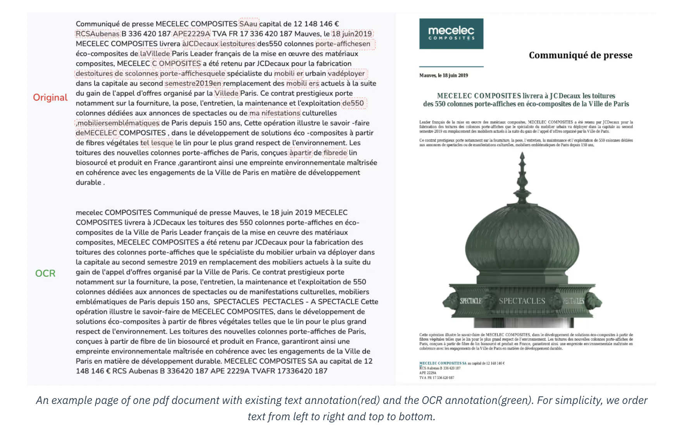

# LightOn Released FC-AMF-OCR Dataset: A 9.3 Million Images Dataset of Financial Documents with Full OCR Annotations

> The release of the FC-AMF-OCR Dataset by LightOn marks a significant milestone in optical character recognition (OCR) and machine learning. This dataset is a technical achievement and a cornerstone for future research in artificial intelligence (AI) and computer vision. Introducing such a dataset opens up new possibilities for researchers and developers, allowing them to improve […]

The release of the [**FC-AMF-OCR Dataset**](https://huggingface.co/datasets/lightonai/fc-amf-ocr) by LightOn marks a significant milestone in optical character recognition (OCR) and machine learning. This dataset is a technical achievement and a cornerstone for future research in artificial intelligence (AI) and computer vision. Introducing such a dataset opens up new possibilities for researchers and developers, allowing them to improve OCR models, which are essential in converting images of text into machine-readable text formats.

**Background of LightOn and FC-AMF-OCR Dataset**

LightOn, a company recognized for its pioneering contributions to AI and machine learning, has continuously pushed the boundaries of technology. The FC-AMF-OCR Dataset is one of their latest projects, designed to facilitate more accurate and efficient OCR tasks. It is well-known that OCR technology has a wide range of applications, from digitizing printed books to enabling real-time text recognition in everyday devices. Despite many advancements, OCR remains challenging, particularly in handling complex fonts, noisy images, and diverse languages. 

The FC-AMF-OCR Dataset aims to bridge these gaps by providing a large and diverse set of training data. This data helps AI models learn and adapt to various challenges associated with text recognition. By including a wide array of fonts, textures, and image conditions, LightOn ensures that the dataset is comprehensive enough to address many of OCR technology’s current limitations.

**Significance of the Dataset**

The release of the FC-AMF-OCR Dataset is especially important due to its focus on AMF or Amorphous Meta-Fonts. These meta-fonts are characterized by their abstract and fluid shapes, which can pose significant challenges for traditional OCR models. By incorporating these unique fonts into the dataset, LightOn encourages the development of AI models that can handle even the most difficult text recognition tasks.

OCR technology plays a major role in various sectors. For example, OCR digitizes and organizes vast amounts of printed documents in the legal and medical industries. In the publishing industry, it enables the conversion of physical books into digital formats, making literature more accessible to a global audience. The accuracy of OCR technology can directly impact productivity and accessibility in these fields. The FC-AMF-OCR Dataset allows developers to create more robust and versatile OCR models, which could significantly improve these sectors.

**Technical Features of the Dataset**

The technical aspects of the FC-AMF-OCR Dataset demonstrate its versatility and utility for researchers. The dataset comprises thousands of images, each containing various forms, ranging from clean and crisp digital text to more challenging handwritten and artistic fonts. LightOn has designed the dataset to be adaptable to a wide range of use cases, including text recognition in noisy environments, distorted images, and documents with multiple languages.

One of the dataset’s most critical components is its inclusion of Amorphous Meta-Fonts (AMF), which provide a high degree of variability in text styles. These fonts are not typically found in conventional datasets, making the FC-AMF-OCR Dataset unique in its capacity to train OCR models to recognize less structured, more fluid text forms. This is particularly beneficial for AI applications in creative industries, where text often takes on a more artistic or non-standard form.

The dataset is designed to be highly accessible and easily integrated into existing machine-learning workflows. Researchers can download and implement the dataset in their projects with minimal friction, allowing them to focus on improving their OCR models. The dataset is compatible with many popular machine-learning frameworks, including TensorFlow and PyTorch.

**Potential Applications**

The release of the FC-AMF-OCR Dataset has the potential to impact several industries and applications. For example, OCR recognizes road signs and other text-based indicators in autonomous driving systems. By adding more complex fonts and conditions to the FC-AMF-OCR Dataset, developers could improve text recognition accuracy in these environments, making autonomous vehicles safer and more reliable. Another area where the dataset could significantly impact digital content accessibility is OCR technology. OCR technology makes printed materials accessible to individuals with visual impairments. By improving OCR models with the FC-AMF-OCR Dataset, developers can create more accurate text-to-speech systems that convert printed text into audible speech.

The dataset also promises to improve text recognition accuracy in augmented reality (AR) applications. AR relies heavily on OCR technology to overlay digital information onto real-world objects. For instance, AR applications often display translations or additional context for text that appears in the user’s environment. The FC-AMF-OCR Dataset’s ability to handle various fonts and text styles could significantly improve the accuracy and reliability of these AR applications, leading to a more seamless user experience.

**Challenges and Opportunities**

While the FC-AMF-OCR Dataset represents a significant leap forward, it also highlights the ongoing challenges in the field of OCR. One of the main challenges that researchers face is ensuring that OCR models can generalize across a wide range of text styles and environments. Although the FC-AMF-OCR Dataset includes many fonts and conditions, new challenges will always arise as text styles and formats evolve. Researchers must continuously adapt their models to handle new and emerging text styles effectively.

In addition, the complexity of AMF fonts presents a challenge regarding computational resources. Training AI models on such a diverse and complex dataset requires significant processing power and memory. However, this challenge also presents an opportunity for AI hardware and infrastructure advancements. LightOn’s release of the FC-AMF-OCR Dataset also opens the door to collaboration and innovation. By making the dataset freely available to researchers and developers, LightOn encourages the wider AI community to contribute to advancing OCR technology.

**Conclusion**

The release of the FC-AMF-OCR Dataset by LightOn is a milestone in developing OCR and AI technology. By providing a comprehensive and diverse dataset that includes challenging text forms such as Amorphous Meta-Fonts, LightOn enables researchers to create more accurate and versatile OCR models. The dataset’s potential applications span multiple industries, from autonomous vehicles to digital accessibility, making it a valuable resource for future AI research.

---

Check out the **[Dataset](https://huggingface.co/datasets/lightonai/fc-amf-ocr) and [Details](https://www.lighton.ai/lighton-blogs/fc-amf-ocr-dataset)**. All credit for this research goes to the researchers of this project. Also, don’t forget to follow us on **[Twitter](https://twitter.com/Marktechpost)** and join our **[Telegram Channel](https://pxl.to/at72b5j)** and [**LinkedIn Gr**](https://www.linkedin.com/groups/13668564/)[**oup**](https://www.linkedin.com/groups/13668564/). **If you like our work, you will love our**[** newsletter..**](https://marktechpost-newsletter.beehiiv.com/subscribe)

Don’t Forget to join our **[50k+ ML SubReddit](https://www.reddit.com/r/machinelearningnews/)**

**[⏩ ⏩ FREE AI WEBINAR: ‘SAM 2 for Video: How to Fine-tune On Your Data’ (Wed, Sep 25, 4:00 AM – 4:45 AM EST)](https://encord.com/webinar/sam2-for-video/?utm_medium=affiliate&utm_source=newsletter&utm_campaign=marktechpost&utm_content=sam2video)**
