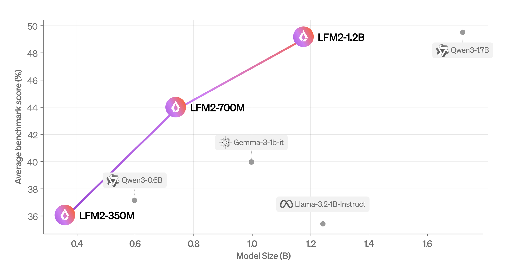

# Liquid AI Open-Sources LFM2: A New Generation of Edge LLMs

> What is included in this article: Performance breakthroughs – 2x faster inference and 3x faster trainingTechnical architecture – Hybrid design with convolution and attention blocksModel specifications – Three size variants (350M, 700M, 1.2B parameters)Benchmark results – Superior performance compared to similar-sized modelsDeployment optimization – Edge-focused design for various hardwareOpen-source accessibility – Apache 2.0-based licensingMarket implications […]

**What is included in this article:****Performance breakthroughs** – 2x faster inference and 3x faster training
**Technical architecture** – Hybrid design with convolution and attention blocks
**Model specifications** – Three size variants (350M, 700M, 1.2B parameters)
**Benchmark results** – Superior performance compared to similar-sized models
**Deployment optimization** – Edge-focused design for various hardware
**Open-source accessibility** – Apache 2.0-based licensing
**Market implications** – Impact on edge AI adoption

The landscape of on-device artificial intelligence has taken a significant leap forward with Liquid AI’s release of LFM2, their second-generation Liquid Foundation Models. This new series of generative AI models represents a paradigm shift in edge computing, delivering unprecedented performance optimizations specifically designed for on-device deployment while maintaining competitive quality standards.

### Revolutionary Performance Gains

LFM2 establishes new benchmarks in the edge AI space by achieving remarkable efficiency improvements across multiple dimensions. The models deliver 2x faster decode and prefill performance compared to Qwen3 on CPU architectures, a critical advancement for real-time applications. Perhaps more impressively, the training process itself has been optimized to achieve 3x faster training compared to the previous LFM generation, making LFM2 the most cost-effective path to building capable, general-purpose AI systems.

These performance improvements are not merely incremental but represent a fundamental breakthrough in making powerful AI accessible on resource-constrained devices. The models are specifically engineered to unlock millisecond latency, offline resilience, and data-sovereign privacy – capabilities essential for phones, laptops, cars, robots, wearables, satellites, and other endpoints that must reason in real time.

### Hybrid Architecture Innovation

The technical foundation of LFM2 lies in its novel hybrid architecture that combines the best aspects of convolution and attention mechanisms. The model employs a sophisticated 16-block structure consisting of 10 double-gated short-range convolution blocks and 6 blocks of grouped query attention (GQA). This hybrid approach draws from Liquid AI’s pioneering work on Liquid Time-constant Networks (LTCs), which introduced continuous-time recurrent neural networks with linear dynamical systems modulated by nonlinear input interlinked gates.

At the core of this architecture is the Linear Input-Varying (LIV) operator framework, which enables weights to be generated on-the-fly from the input they are acting on. This allows convolutions, recurrences, attention, and other structured layers to fall under one unified, input-aware framework. The LFM2 convolution blocks implement multiplicative gates and short convolutions, creating linear first-order systems that converge to zero after a finite time.

The architecture selection process utilized STAR, Liquid AI’s neural architecture search engine, which was modified to evaluate language modeling capabilities beyond traditional validation loss and perplexity metrics. Instead, it employs a comprehensive suite of over 50 internal evaluations that assess diverse capabilities including knowledge recall, multi-hop reasoning, understanding of low-resource languages, instruction following, and tool use.

### Comprehensive Model Lineup

LFM2 is available in three strategically sized configurations: 350M, 700M, and 1.2B parameters, each optimized for different deployment scenarios while maintaining the core efficiency benefits. All models were trained on 10 trillion tokens drawn from a carefully curated pre-training corpus comprising approximately 75% English, 20% multilingual content, and 5% code data sourced from web and licensed materials.

The training methodology incorporates knowledge distillation using the existing LFM1-7B as a teacher model, with cross-entropy between LFM2’s student outputs and the teacher outputs serving as the primary training signal throughout the entire 10T token training process. The context length was extended to 32k during pretraining, enabling the models to handle longer sequences effectively.

### Superior Benchmark Performance

Evaluation results demonstrate that LFM2 significantly outperforms similarly-sized models across multiple benchmark categories. The LFM2-1.2B model performs competitively with Qwen3-1.7B despite having 47% fewer parameters. Similarly, LFM2-700M outperforms Gemma 3 1B IT, while the smallest LFM2-350M checkpoint remains competitive with Qwen3-0.6B and Llama 3.2 1B Instruct.

Beyond automated benchmarks, LFM2 demonstrates superior conversational capabilities in multi-turn dialogues. Using the WildChat dataset and LLM-as-a-Judge evaluation framework, LFM2-1.2B showed significant preference advantages over Llama 3.2 1B Instruct and Gemma 3 1B IT while matching Qwen3-1.7B performance despite being substantially smaller and faster.

### Edge-Optimized Deployment

The models excel in real-world deployment scenarios, having been exported to multiple inference frameworks including PyTorch’s ExecuTorch and the open-source llama.cpp library. Testing on target hardware including Samsung Galaxy S24 Ultra and AMD Ryzen platforms demonstrates that LFM2 dominates the Pareto frontier for both prefill and decode inference speed relative to model size.

The strong CPU performance translates effectively to accelerators such as GPU and NPU after kernel optimization, making LFM2 suitable for a wide range of hardware configurations. This flexibility is crucial for the diverse ecosystem of edge devices that require on-device AI capabilities.

### Conclusion

The release of LFM2 addresses a critical gap in the AI deployment landscape where the shift from cloud-based to edge-based inference is accelerating. By enabling millisecond latency, offline operation, and data-sovereign privacy, LFM2 unlocks new possibilities for AI integration across consumer electronics, robotics, smart appliances, finance, e-commerce, and education sectors.

The technical achievements represented in LFM2 signal a maturation of edge AI technology, where the trade-offs between model capability and deployment efficiency are being successfully optimized. As enterprises pivot from cloud LLMs to cost-efficient, fast, private, and on-premises intelligence, LFM2 positions itself as a foundational technology for the next generation of AI-powered devices and applications.

Check out the **[Technical Details](https://www.liquid.ai/blog/liquid-foundation-models-v2-our-second-series-of-generative-ai-models) and [Model on Hugging Face](https://huggingface.co/collections/LiquidAI/lfm2-686d721927015b2ad73eaa38)**. All credit for this research goes to the researchers of this project. **‘Your AI deserves a smarter stage. Ours reaches 1M minds a month.**‘ 👉 [Put it on Marktechpost](https://promotion.marktechpost.com)
