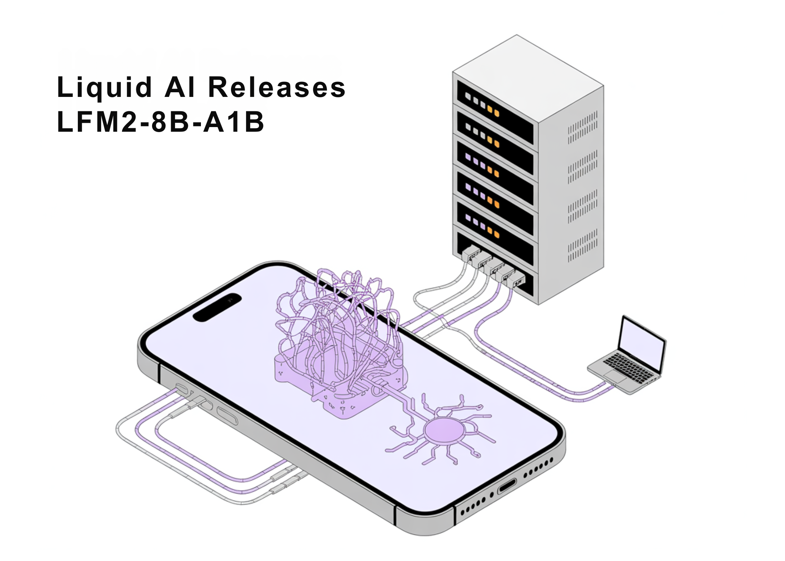

# Liquid AI Releases LFM2-8B-A1B: An On-Device Mixture-of-Experts with 8.3B Params and a 1.5B Active Params per Token

> How much capability can a sparse 8.3B-parameter MoE with a ~1.5B active path deliver on your phone without blowing latency or memory? Liquid AI has released LFM2-8B-A1B, a small-scale Mixture-of-Experts (MoE) model built for on-device execution under tight memory, latency, and energy budgets. Unlike most MoE work optimized for cloud batch serving, LFM2-8B-A1B targets phones, […]

How much capability can a sparse **8.3B-parameter** MoE with a **~1.5B active path** deliver on your phone without blowing latency or memory? **Liquid AI has released **[**LFM2-8B-A1B**,](https://www.liquid.ai/blog/lfm2-8b-a1b-an-efficient-on-device-mixture-of-experts) a small-scale Mixture-of-Experts (MoE) model built for on-device execution under tight memory, latency, and energy budgets. Unlike most MoE work optimized for cloud batch serving, LFM2-8B-A1B targets phones, laptops, and embedded systems. It showcases **8.3B total parameters** but activates only **~1.5B parameters per token**, using sparse expert routing to preserve a small compute path while increasing representational capacity. The model is released under the **LFM Open License v1.0 (lfm1.0)**

### Understanding the Architecture

LFM2-8B-A1B retains the LFM2 ‘fast backbone’ and inserts sparse-MoE feed-forward blocks to lift capacity without materially increasing the active compute. The backbone uses **18 gated short-convolution blocks** and **6 grouped-query attention (GQA) blocks**. All layers **except the first two** include an MoE block; the first two remain dense for stability. Each MoE block defines **32 experts**; the router selects **top-4 experts per token** with a **normalized-sigmoid gate** and **adaptive routing bias** to balance load and stabilize training. Context length is **32,768 tokens**; vocabulary size **65,536**; reported pre-training budget **~12T tokens**.

This approach keeps per-token FLOPs and cache growth bounded by the active path (attention + four expert MLPs), while total capacity allows specialization across domains such as multilingual knowledge, math, and code—use cases that often regress on very small dense models.

*https://www.liquid.ai/blog/lfm2-8b-a1b-an-efficient-on-device-mixture-of-experts*

### Performance signals

Liquid AI reports that LFM2-8B-A1B **runs significantly faster than Qwen3-1.7B** under CPU tests using an internal XNNPACK-based stack and a custom CPU MoE kernel. The public plots cover **int4 quantization with int8 dynamic activations** on **AMD Ryzen AI 9 HX370** and **Samsung Galaxy S24 Ultra**. The Liquid AI team positions quality as comparable to **3–4B dense models**, while keeping the active compute near **1.5B**. No cross-vendor “×-faster” headline multipliers are published; the claims are framed as per-device comparisons versus similarly active models.

On accuracy, the model card lists results across 16 benchmarks, including MMLU/MMLU-Pro/GPQA (knowledge), IFEval/IFBench/Multi-IF (instruction following), GSM8K/GSMPlus/MATH500/MATH-Lvl-5 (math), and MGSM/MMMLU (multilingual). The numbers indicate competitive instruction-following and math performance within the small-model band, and improved knowledge capacity relative to LFM2-2.6B, consistent with the larger total parameter budget.

*https://www.liquid.ai/blog/lfm2-8b-a1b-an-efficient-on-device-mixture-of-experts*

*https://www.liquid.ai/blog/lfm2-8b-a1b-an-efficient-on-device-mixture-of-experts*

### Deployment and tooling

LFM2-8B-A1B ships with Transformers/vLLM for GPU inference and GGUF builds for llama.cpp; the official GGUF repo lists common quants from **Q4_0 ≈4.7 GB** up to **F16 ≈16.7 GB** for local runs, while **llama.cpp** requires a recent build with `lfm2moe` support (**b6709+**) to avoid “unknown model architecture” errors. Liquid’s CPU validation uses **Q4_0** with **int8 dynamic activations** on **AMD Ryzen AI 9 HX370** and **Samsung Galaxy S24 Ultra**, where LFM2-8B-A1B shows higher decode throughput than **Qwen3-1.7B** at a similar active-parameter class; **ExecuTorch** is referenced for mobile/embedded CPU deployment.

*https://www.liquid.ai/blog/lfm2-8b-a1b-an-efficient-on-device-mixture-of-experts*

*https://www.liquid.ai/blog/lfm2-8b-a1b-an-efficient-on-device-mixture-of-experts*

### Key Takeaways

- **Architecture & routing**: LFM2-8B-A1B pairs an LFM2 fast backbone (18 gated short-conv blocks + 6 GQA blocks) with per-layer sparse-MoE FFNs (all layers except the first two), using 32 experts with top-4 routing via normalized-sigmoid gating and adaptive biases; **8.3B total params, ~1.5B active per token**.

- **On-device target**: Designed for phones, laptops, and embedded CPUs/GPUs; quantized variants “fit comfortably” on high-end consumer hardware for private, low-latency use.

- **Performance positioning.** Liquid reports LFM2-8B-A1B is **significantly faster than Qwen3-1.7B** in CPU tests and aims for **3–4B dense-class quality** while keeping an ~1.5B active path.

### Editorial Comments

LFM2-8B-A1B demonstrates that sparse MoE can be practical below the usual [server](https://www.marktechpost.com/2025/08/08/proxy-servers-explained-types-use-cases-trends-in-2025-technical-deep-dive/)-scale regime. The model combines an LFM2 conv-attention backbone with per-layer expert MLPs (except the first two layers) to keep token compute near 1.5B while lifting quality toward 3–4B dense classes. With standard and GGUF weights, llama.cpp/ExecuTorch/vLLM paths, and a permissive on-device posture, LFM2-8B-A1B is a concrete option for building low-latency, private assistants and application-embedded copilots on consumer and edge hardware.

---

Check out the **[Model on Hugging Face ](https://huggingface.co/LiquidAI/LFM2-8B-A1B)**and** [Technical details](https://www.liquid.ai/blog/lfm2-8b-a1b-an-efficient-on-device-mixture-of-experts)**. Feel free to check out our **[GitHub Page for Tutorials, Codes and Notebooks](https://github.com/Marktechpost/AI-Tutorial-Codes-Included)**. Also, feel free to follow us on **[Twitter](https://x.com/intent/follow?screen_name=marktechpost)** and don’t forget to join our **[100k+ ML SubReddit](https://www.reddit.com/r/machinelearningnews/)** and Subscribe to **[our Newsletter](https://www.aidevsignals.com/)**. Wait! are you on telegram? **[now you can join us on telegram as well.](https://t.me/machinelearningresearchnews)**
