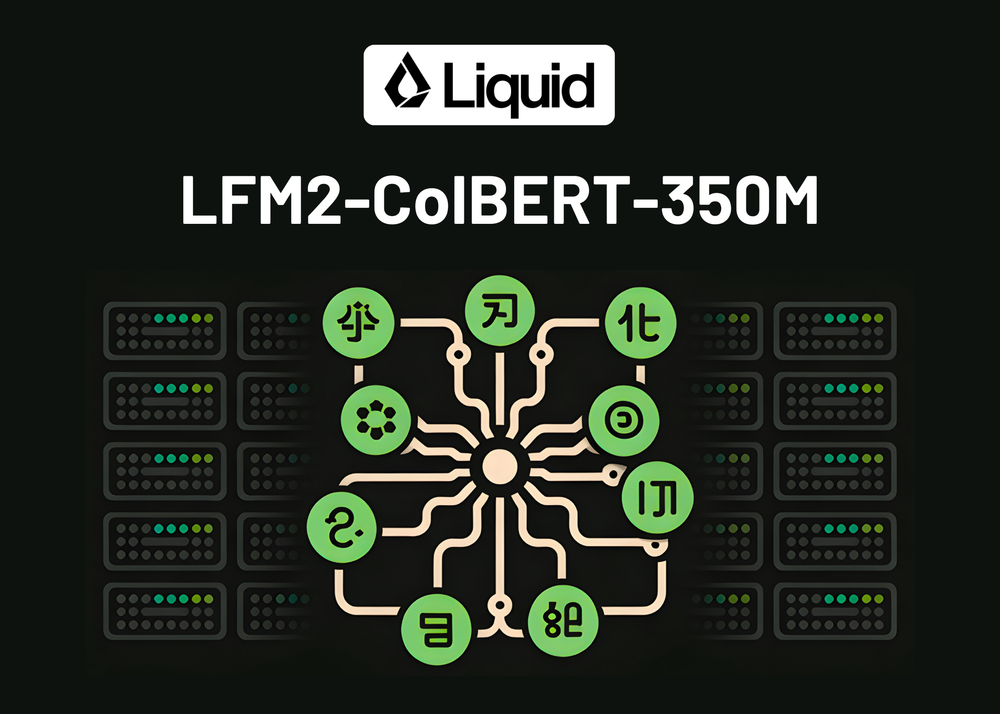

# Liquid AI Releases LFM2-ColBERT-350M: A New Small Model that brings Late Interaction Retrieval to Multilingual and Cross-Lingual RAG

> Can a compact late interaction retriever index once and deliver accurate cross lingual search with fast inference? Liquid AI released LFM2-ColBERT-350M, a compact late interaction retriever for multilingual and cross-lingual search. Documents can be indexed in one language, queries can be written in many languages, and the system retrieves with high accuracy. The Liquid AI […]

Can a compact late interaction retriever index once and deliver accurate cross lingual search with fast inference? **Liquid AI released [LFM2-ColBERT-350M](https://huggingface.co/LiquidAI/LFM2-ColBERT-350M)**, a compact late interaction retriever for multilingual and cross-lingual search. Documents can be indexed in one language, queries can be written in many languages, and the system retrieves with high accuracy. The Liquid AI team reports inference speed on par with models that are 2.3 times smaller, which is attributed to the LFM2 backbone. The model is available with a Hugging Face demo and a detailed model card for integration in retrieval augmented generation systems.

*https://www.liquid.ai/blog/lfm2-colbert-350m-one-model-to-embed-them-all*

### What late interaction means and why it matters?

Most production systems use bi-encoders for speed or cross encoders for accuracy. Late interaction aims to combine both advantages. Queries and documents are encoded separately at the token level. The system compares token vectors at query time using operations such as MaxSim. This preserves fine grained token interactions without the full cost of joint cross attention. It allows pre-computation for documents and improves precision at ranking time. It can serve as a first stage retriever and also as a ranker in one pass.

### Model specification

LFM2-ColBERT-350M has 350 million total parameters. There are 25 layers, with 18 convolution blocks, 6 attention blocks, and 1 dense layer. The context length is 32k tokens. The vocabulary size is 65,536. The similarity function is MaxSim. The output dimensionality is 128. Training precision is BF16. The license is LFM Open License v1.0.

*https://huggingface.co/LiquidAI/LFM2-ColBERT-350M*

### Languages, supported and evaluated

The model supports 8 languages. These are English, Arabic, Chinese, French, German, Japanese, Korean, and Spanish. The evaluation adds Italian and Portuguese, which brings the matrix to 9 languages for cross comparisons of document and query languages. This distinction is relevant when planning deployments that must cover specific customer markets.

*https://www.liquid.ai/blog/lfm2-colbert-350m-one-model-to-embed-them-all*

### Evaluation setup and key results

Liquid AI extends the NanoBEIR benchmark with Japanese and Korean and publishes the extension for reproducibility. On this setup, LFM2-ColBERT-350M shows stronger multilingual capability than the baseline late interaction model in this class, which is GTE-ModernColBERT-v1 at 150M parameters. The largest gains appear in German, Arabic, Korean, and Japanese, while English performance is maintained.

### Key Takeaways

- Token-level scoring with MaxSim preserves fine-grained interactions while keeping separate encoders, so document embeddings can be precomputed and queried efficiently.

- Documents can be indexed in one language and retrieved in many. The model card lists 8 supported languages, while evaluations span 9 languages for cross-lingual pairs.

- On the NanoBEIR multilingual extension, LFM2-ColBERT-350M outperforms the prior late-interaction baseline (GTE-ModernColBERT-v1 at 150M) and maintains English performance.

- Inference speed is reported on par with models 2.3× smaller across batch sizes, attributed to the LFM2 backbone.

### Editorial Notes

Liquid AI’s LFM2-ColBERT-350M applies late interaction ColBERT with MaxSim, it encodes queries and documents separately, then scores token vectors at query time, which preserves token level interactions and enables precomputed document embeddings for scale. It targets multilingual and cross lingual retrieval, index once and query in many languages, with evaluations described on a NanoBEIR multilingual extension. Liquid AI team reports inference speed on par with models 2.3 times smaller, attributed to the LFM2 backbone. Overall, late interaction at the nano scale looks production ready for multilingual RAG trials.

---

Check out the **[Model Weights,](https://huggingface.co/LiquidAI/LFM2-ColBERT-350M) [Demo](https://huggingface.co/spaces/LiquidAI/LFM2-ColBERT) **and** [Technical details](https://www.liquid.ai/blog/lfm2-colbert-350m-one-model-to-embed-them-all)**. Feel free to check out our **[GitHub Page for Tutorials, Codes and Notebooks](https://github.com/Marktechpost/AI-Tutorial-Codes-Included)**. Also, feel free to follow us on **[Twitter](https://x.com/intent/follow?screen_name=marktechpost)** and don’t forget to join our **[100k+ ML SubReddit](https://www.reddit.com/r/machinelearningnews/)** and Subscribe to **[our Newsletter](https://www.aidevsignals.com/)**. Wait! are you on telegram? **[now you can join us on telegram as well.](https://t.me/machinelearningresearchnews)**
