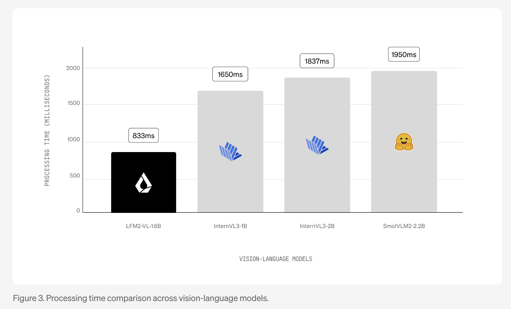

# Liquid AI Releases LFM2-VL: Super-Fast, Open-Weight Vision-Language Models Designed for Low-Latency and Device-Aware Deployment

> Liquid AI has officially released LFM2-VL, a new family of vision-language foundation models optimized for low-latency, on-device deployment. With two highly efficient variants—LFM2-VL-450M and LFM2-VL-1.6B—this launch marks a significant leap in bringing multimodal AI to smartphones, laptops, wearables, and embedded systems without compromising speed or accuracy. Unprecedented Speed and Efficiency LFM2-VL models are engineered to […]

Liquid AI has officially released **LFM2-VL**, a new family of vision-language foundation models optimized for low-latency, on-device deployment. With two highly efficient variants—**LFM2-VL-450M** and **LFM2-VL-1.6B**—this launch marks a significant leap in bringing multimodal AI to smartphones, laptops, wearables, and embedded systems without compromising speed or accuracy.

### Unprecedented Speed and Efficiency

LFM2-VL models are engineered to deliver **up to 2× faster GPU inference** compared to existing vision-language models, while maintaining competitive benchmark performance on tasks like image description, visual question answering, and multimodal reasoning. The 450M-parameter variant is tailored for highly resource-constrained environments, while the 1.6B-parameter version offers greater capability while still remaining lightweight enough for single-GPU or high-end mobile use.

*https://www.liquid.ai/blog/lfm2-vl-efficient-vision-language-models*

### Technical Innovations

- **Modular Architecture**: LFM2-VL combines a language model backbone (LFM2-1.2B or LFM2-350M), a SigLIP2 NaFlex vision encoder (400M or 86M parameters), and a multimodal projector with a “pixel unshuffle” technique that dynamically reduces image token counts for faster processing.

- **Native Resolution Handling**: Images are processed at their **native resolution up to 512×512 pixels** without distortion from upscaling. Larger images are split into non-overlapping 512×512 patches, preserving detail and aspect ratio. The 1.6B model also encodes a downscaled thumbnail of the full image for global context understanding.

- **Flexible Inference**: Users can **tune the speed-quality tradeoff at inference time** by adjusting maximum image tokens and patch count, allowing real-time adaptation to device capabilities and application needs.

- **Training**: The models were first pre-trained on the LFM2 backbone, then jointly mid-trained to fuse vision and language capabilities using a progressive adjustment of text-to-image data ratios, and finally fine-tuned for image understanding on approximately 100 billion multimodal tokens.

### Benchmark Performance

LFM2-VL delivers **competitive results** on public benchmarks such as RealWorldQA, MM-IFEval, and OCRBench, rivaling larger models like InternVL3 and SmolVLM2, but with a **smaller memory footprint** and much faster processing—making it ideal for edge and mobile applications.

Both model sizes are **open-weight and downloadable ** on Hugging Face under an **Apache 2.0-based license**, permitting free use for research and commercial use by companies. Larger enterprises must contact Liquid AI for a commercial license. The models integrate seamlessly with Hugging Face Transformers and support quantization for further efficiency gains on edge hardware.

*https://www.liquid.ai/blog/lfm2-vl-efficient-vision-language-models*

### Use Cases and Integration

LFM2-VL is designed for developers and enterprises seeking to deploy **fast, accurate, and efficient multimodal AI** directly on devices—reducing cloud dependency and enabling new applications in robotics, IoT, smart cameras, mobile assistants, and more. Example applications include real-time image captioning, visual search, and interactive multimodal chatbots.

### Getting Started

- **Download**: Both models are available now on the Liquid AI Hugging Face collection.

- **Run**: Example inference code is provided for platforms like llama.cpp, supporting various quantization levels for optimal performance on different hardware.

- **Customize**: The architecture supports integration with Liquid AI’s LEAP platform for further customization and multi-platform edge deployment.

**In summary**, Liquid AI’s LFM2-VL sets a new standard for efficient, open-weight vision-language models on the edge. With native resolution support, tunable speed-quality tradeoffs, and a focus on real-world deployment, it empowers developers to build the next generation of AI-powered applications—anywhere, on any device.

---

Check out the **[Technical Details](https://www.liquid.ai/blog/lfm2-vl-efficient-vision-language-models)** and **[Models on Hugging Face](https://huggingface.co/collections/LiquidAI/lfm2-vl-68963bbc84a610f7638d5ffa)**. Feel free to check out our **[GitHub Page for Tutorials, Codes and Notebooks](https://github.com/Marktechpost/AI-Tutorial-Codes-Included)**. Also, feel free to follow us on **[Twitter](https://x.com/intent/follow?screen_name=marktechpost)** and don’t forget to join our **[100k+ ML SubReddit](https://www.reddit.com/r/machinelearningnews/)** and Subscribe to **[our Newsletter](https://www.aidevsignals.com/)**.
