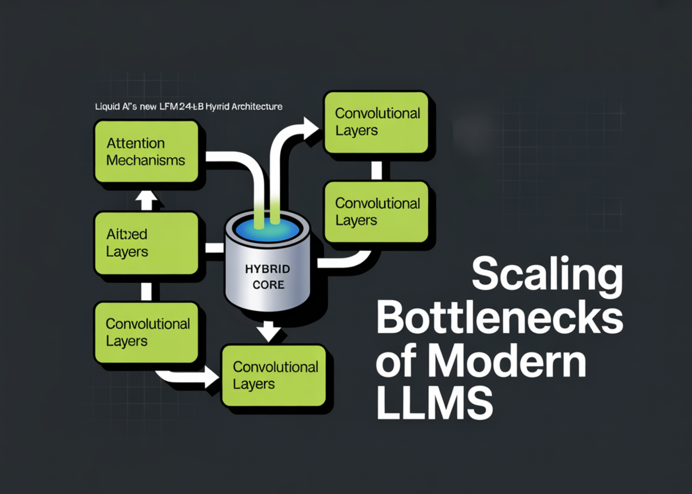

# Liquid AI’s New LFM2-24B-A2B Hybrid Architecture Blends Attention with Convolutions to Solve the Scaling Bottlenecks of Modern LLMs

> The generative AI race has long been a game of ‘bigger is better.’ But as the industry hits the limits of power consumption and memory bottlenecks, the conversation is shifting from raw parameter counts to architectural efficiency. Liquid AI team is leading this charge with the release of LFM2-24B-A2B, a 24-billion parameter model that redefines […]

The generative AI race has long been a game of ‘bigger is better.’ But as the industry hits the limits of power consumption and memory bottlenecks, the conversation is shifting from raw parameter counts to architectural efficiency. Liquid AI team is leading this charge with the release of **LFM2-24B-A2B**, a 24-billion parameter model that redefines what we should expect from edge-capable AI.

*https://www.liquid.ai/blog/lfm2-24b-a2b*

### The ‘A2B’ Architecture: A 1:3 Ratio for Efficiency

The ‘A2B’ in the model’s name stands for **Attention-to-Base**. In a traditional Transformer, every layer uses Softmax Attention, which scales quadratically (O(N2)) with sequence length. This leads to massive KV (Key-Value) caches that devour VRAM.

Liquid AI team bypasses this by using a hybrid structure. The **‘Base**‘ layers are efficient **gated short convolution blocks**, while the **‘Attention**‘ layers utilize **Grouped Query Attention (GQA)**.

**In the LFM2-24B-A2B configuration, the model uses a 1:3 ratio:**

- **Total Layers:** 40

- **Convolution Blocks:** 30

- **Attention Blocks:** 10

By interspersing a small number of GQA blocks with a majority of gated convolution layers, the model retains the high-resolution retrieval and reasoning of a Transformer while maintaining the fast prefill and low memory footprint of a linear-complexity model.

### Sparse MoE: 24B Intelligence on a 2B Budget

The most important thing of LFM2-24B-A2B is its **Mixture of Experts (MoE)** design. While the model contains 24 billion parameters, it only activates **2.3 billion parameters** per token.

This is a game-changer for deployment. Because the active parameter path is so lean, the model can fit into **32GB of RAM**. This means it can run locally on high-end consumer laptops, desktops with integrated GPUs (iGPUs), and dedicated NPUs without needing a data-center-grade A100. It effectively provides the knowledge density of a 24B model with the inference speed and energy efficiency of a 2B model.

*https://www.liquid.ai/blog/lfm2-24b-a2b*

### Benchmarks: Punching Up

Liquid AI team reports that the LFM2 family follows a predictable, log-linear scaling behavior. Despite its smaller active parameter count, the 24B-A2B model consistently outperforms larger rivals.

- **Logic and Reasoning:** In tests like **GSM8K** and **MATH-500**, it rivals dense models twice its size.

- **Throughput:** When benchmarked on a single NVIDIA H100 using _vLLM_, it reached **26.8K total tokens per second** at 1,024 concurrent requests, significantly outpacing Snowflake’s _gpt-oss-20b_ and _Qwen3-30B-A3B_.

- **Long Context:** The model features a **32k** token context window, optimized for privacy-sensitive RAG (Retrieval-Augmented Generation) pipelines and local document analysis.

### Technical Cheat Sheet

**Property****Specification****Total Parameters**24 Billion**Active Parameters**2.3 Billion**Architecture**Hybrid (Gated Conv + GQA)**Layers**40 (30 Base / 10 Attention)**Context Length**32,768 Tokens**Training Data**17 Trillion Tokens**License**LFM Open License v1.0**Native Support**llama.cpp, vLLM, SGLang, MLX

### Key Takeaways

- **Hybrid ‘A2B’ Architecture:** The model uses a 1:3 ratio of **Grouped Query Attention (GQA)** to **Gated Short Convolutions**. By utilizing linear-complexity ‘Base’ layers for 30 out of 40 layers, the model achieves much faster prefill and decode speeds with a significantly reduced memory footprint compared to traditional all-attention Transformers.

- **Sparse MoE Efficiency:** Despite having **24 billion total parameters**, the model only activates **2.3 billion parameters** per token. This ‘Sparse Mixture of Experts’ design allows it to deliver the reasoning depth of a large model while maintaining the inference latency and energy efficiency of a 2B-parameter model.

- **True Edge Capability:** Optimized via hardware-in-the-loop architecture search, the model is designed to fit in **32GB of RAM**. This makes it fully deployable on consumer-grade hardware, including laptops with integrated GPUs and NPUs, without requiring expensive data-center infrastructure.

- **State-of-the-Art Performance:** LFM2-24B-A2B outperforms larger competitors like **Qwen3-30B-A3B** and **Snowflake gpt-oss-20b** in throughput. Benchmarks show it hits approximately **26.8K tokens per second** on a single H100, showing near-linear scaling and high efficiency in long-context tasks up to its **32k token window**.

---

Check out the **[Technical details](https://www.liquid.ai/blog/lfm2-24b-a2b)** and **[Model weights](https://huggingface.co/LiquidAI/LFM2-24B-A2B). **Also, feel free to follow us on **[Twitter](https://x.com/intent/follow?screen_name=marktechpost)** and don’t forget to join our **[120k+ ML SubReddit](https://www.reddit.com/r/machinelearningnews/)** and Subscribe to **[our Newsletter](https://www.aidevsignals.com/)**. Wait! are you on telegram? **[now you can join us on telegram as well.](https://t.me/machinelearningresearchnews)**
