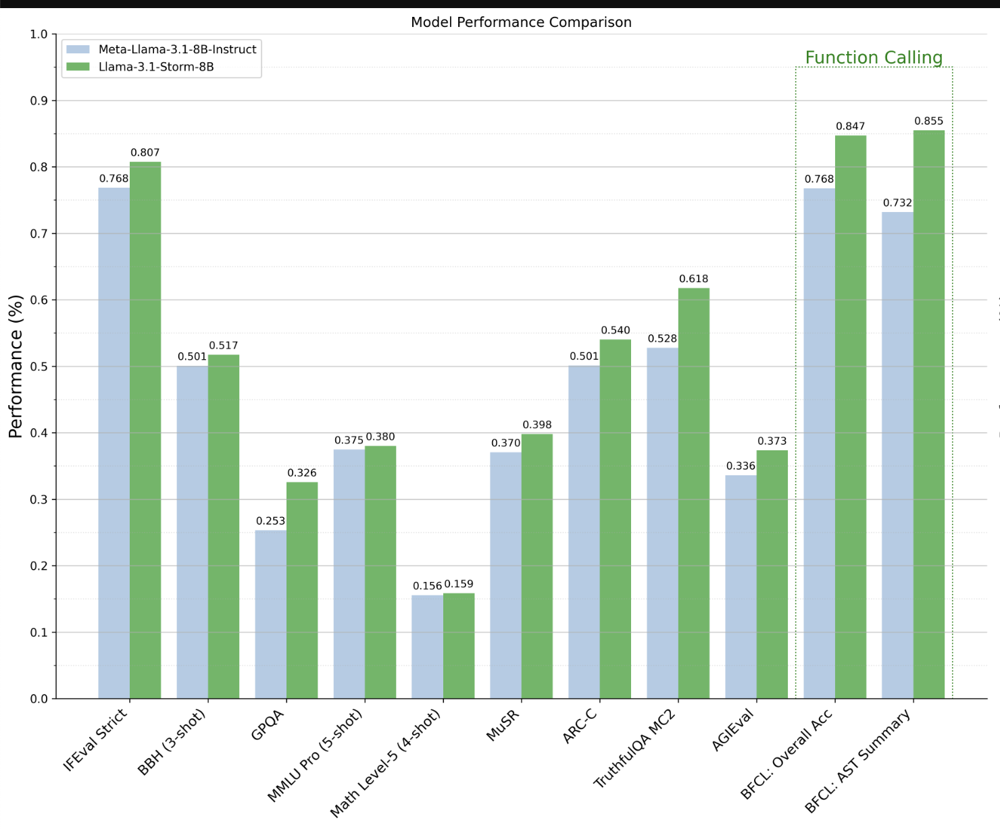

# Llama-3.1-Storm-8B: A Groundbreaking AI Model that Outperforms Meta AI’s Llama-3.1-8B-Instruct and Hermes-3-Llama-3.1-8B Models on Diverse Benchmarks

> Artificial intelligence (AI) has witnessed rapid advancements over the past decade, with significant strides in NLP, machine learning, and deep learning. Among the latest and most notable developments is the release of Llama-3.1-Storm-8B by Ashvini Kumar Jindal and team. This new AI model represents a considerable leap forward in language model capabilities, setting new benchmarks […]

Artificial intelligence (AI) has witnessed rapid advancements over the past decade, with significant strides in NLP, machine learning, and deep learning. Among the latest and most notable developments is the release of [**Llama-3.1-Storm-8B**](https://huggingface.co/akjindal53244/Llama-3.1-Storm-8B) by [**Ashvini Kumar Jindal**](https://huggingface.co/akjindal53244) and team. This new AI model represents a considerable leap forward in language model capabilities, setting new benchmarks in performance, efficiency, and applicability across various industries.

**Background and Development**

Ashvini Kumar Jindal’s previous works laid the foundation for more sophisticated and nuanced AI systems, but Llama-3.1-Storm-8B is arguably the most ambitious project by him and his team. The model is part of the Llama series, a lineup known for its robust architecture and adaptability in handling complex language tasks.

Llama-3.1-Storm-8B was designed to address some of the limitations observed in its predecessors, particularly in context understanding, natural language generation, and real-time data processing. The model incorporates advanced algorithms and an extensive training dataset, enhancing its ability to understand and generate human-like text. This makes it useful in applications requiring high accuracy and context awareness levels, such as customer service automation, content creation, and real-time language translation.

**Technical Specifications**

One of the standout features of Llama-3.1-Storm-8B is its scale. With 8 billion parameters, the model is significantly more powerful than many competitors. This massive scale allows the model to capture subtle nuances in language, making it capable of generating text that is not only contextually relevant but also grammatically coherent and stylistically appropriate. The model’s architecture is based on a transformer design, which has become the standard in modern NLP due to its ability to handle long-range dependencies in text data.

Llama-3.1-Storm-8B has been optimized for performance, balancing the trade-off between computational efficiency and output quality. This optimization is particularly important in scenarios requiring real-time processing, such as live chatbots or automated transcription services. The model’s ability to generate high-quality text in real-time without significant latency makes it an ideal choice for businesses looking to implement AI-driven solutions that require quick and accurate responses.

*[**Image Source**](https://huggingface.co/blog/akjindal53244/llama31-storm8b)*

**Llama-3.1-Storm-8B Performance **

The performance of the Llama-3.1-Storm-8B model showcases significant improvements across various benchmarks. The model was refined through self-curation, targeted fine-tuning, and model merging. Specifically, the Llama-3.1-Storm-8B curated approximately 1 million high-quality examples from a pool of 2.8 million, enhancing its instruction-following capabilities by 3.93% (IFEval Strict). It also showed a 7.21% improvement in knowledge-driven question answering (GPQA), a 9% reduction in hallucinations (TruthfulQA), and a 7.92% boost in function-calling capabilities (BFCL: Overall Acc). These numerical gains reflect the model’s advanced ability to outperform its predecessors and competitors across critical AI benchmarks.

*[**Image Source**](https://huggingface.co/blog/akjindal53244/llama31-storm8b)*

**Applications and Use Cases**

The release of Llama-3.1-Storm-8B opens up many possibilities for its application across different industries. In customer service, for instance, the model can automate interactions with customers, providing them with timely & accurate responses to their queries. This improves customer satisfaction and allows businesses or organizations to handle more inquiries without additional human resources.

Llama-3.1-Storm-8B can assist writers by generating drafts, suggesting edits, or even creating entire articles based on a brief outline in the content creation industry. The model’s ability to produce text that closely mimics human writing styles makes it a valuable tool for journalists, marketers, and bloggers. Its application in language translation services could revolutionize how users approach multilingual communication, offering real-time, accurate, contextually aware, and culturally sensitive translations.

Another promising application of Llama-3.1-Storm-8B is in the healthcare sector. With its advanced language processing capabilities, the model could analyze patient records, suggest diagnoses, and even help generate personalized treatment plans. By integrating this AI model into existing healthcare systems, medical professionals could improve the accuracy of diagnoses and the efficiency of treatment planning, ultimately leading to better patient outcomes.

**Challenges and Ethical Considerations**

Despite its many advantages, the release of Llama-3.1-Storm-8B also raises important ethical and practical considerations. The sheer power of the model, while beneficial in many respects, also poses risks if misused. For instance, the ability to generate highly convincing text could be exploited for malicious purposes, such as creating deepfake news or sophisticated phishing scams. As with any advanced technology, it is crucial to implement safeguards to prevent misuse and ensure that the model is used responsibly.

One more challenge lies in the potential for bias in the model’s outputs. Although Llama-3.1-Storm-8B has been trained on a diverse dataset, there is always a risk that it could reflect or even amplify biases in the data. This could lead to unintended consequences, particularly in sensitive applications like hiring processes or legal decision-making. Addressing these concerns will require ongoing research and development to refine the model and minimize bias.

**Conclusion**

In conclusion, Llama-3.1-Storm-8B’s powerful architecture, versatility, and efficiency make it a valuable tool for various applications. However, as with any technology, it is important to approach its use cautiously, ensuring that it is deployed responsibly and ethically. Ashvini Kumar Jindal’s work in developing this model has set a new standard for AI and paved the way for future innovations that could transform how users interact with technology.

---

Check out the **[Model here](https://huggingface.co/akjindal53244/Llama-3.1-Storm-8B).** All credit for this research goes to the researchers of this project. Also, don’t forget to follow us on **[Twitter](https://twitter.com/Marktechpost)** and join our **[Telegram Channel](https://www.zyphra.com/post/zamba2-mini)** and [**LinkedIn Gr**](https://www.linkedin.com/groups/13668564/)[**oup**](https://www.linkedin.com/groups/13668564/). **If you like our work, you will love our**[** newsletter..**](https://marktechpost-newsletter.beehiiv.com/subscribe)

Don’t Forget to join our **[50k+ ML SubReddit](https://www.reddit.com/r/machinelearningnews/)**

Here is a highly recommended webinar from our sponsor: **[‘Building Performant AI Applications with NVIDIA NIMs and Haystack’](https://landing.deepset.ai/webinar-nvidia-nims-and-haystack?utm_campaign=2409-campaign-nvidia-nims-and-haystack-&utm_source=marktechpost&utm_medium=banner-ad-desktop)**
