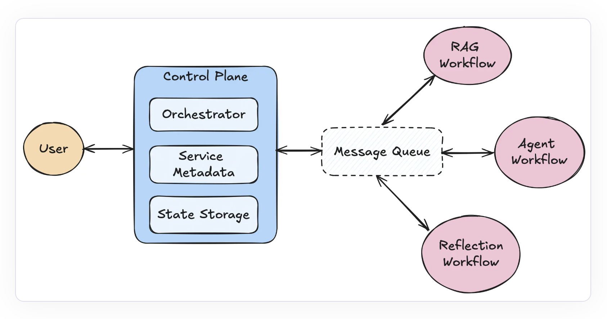

# Llama-Deploy: A Fully Open-Source Way to Deploy Your Agents as Production Microservices

> The field of Artificial Intelligence (AI-driven) agentic systems has seen significant change in recent times. The deployment of sophisticated, scalable systems depends heavily on workflows. A team of researchers has introduced llama-deploy, a unique and user-friendly solution designed to make agentic workflows constructed using LlamaIndex easier to scale and deploy. With just a few lines […]

The field of Artificial Intelligence (AI-driven) agentic systems has seen significant change in recent times. The deployment of sophisticated, scalable systems depends heavily on workflows. A team of researchers has introduced llama-deploy, a unique and user-friendly solution designed to make agentic workflows constructed using LlamaIndex easier to scale and deploy. With just a few lines of code, llama-deploy, replacing llama-agents, provides a simplified method for deploying workflows as scalable microservices.

Using llama-deploy, developers can create event-driven processes and implement them in real-world settings with ease, bridging the gap between development and production. Llama-deploy builds on the success of previous innovations by providing the convenience of creating LlamaIndex processes and the smooth deployment of those workflows through the use of a microservice architecture. Workflows and llama agents combined have produced a versatile, scalable, and production-ready technology.

**Architecture **

Llama-deploy offers an architecture that prioritizes fault tolerance, scalability, and ease of deployment in order to satisfy the increasing requirements of multi-agent systems. Its main elements are as follows.

- The message queue is a key component that enables the system to control task processing. It assigns tasks to different services and publishes methods to named queues.

- The Control Plane is the brain of the llama-deploy system. It keeps track of services and tasks, controls sessions and states, and assigns tasks using an orchestrator. It is in charge of service registration, which facilitates the scalability and administration of multi-service systems.

- The orchestrator controls the flow of results and determines which service should take on a given task. It allows for error handling and retries and assumes that incoming tasks have a specified destination by default.

- Workflow services are the fundamental components of where work is really done. Every service handles incoming work and outputs the outcomes. When a workflow is deployed, it becomes a service that performs tasks continuously.

**Primary features of llama deploy**

- Easy deployment: The ability of llama-deploy to deploy workflows with little to no code modifications is one of its best advantages. With the help of this capability, developers can more easily move from creating agents in local environments to deploying them in a scalable infrastructure. It bridges the gap between development and production.

- Scalability: llama-deploy’s microservice architecture makes it easy to scale individual components in response to demand. Flexible scalability is made possible with it, whether one needs to add new services or enhance message processing capabilities.

- Fault Tolerance: Llama-deploy is engineered to provide robustness in production contexts with integrated techniques for handling errors and retries. Because of these properties, the system is dependable for crucial applications and stays resilient even in the face of failures.

- Flexibility: Without causing any systemic disruptions, developers can add new services or modify system components like message queues with the help of the hub-and-spoke architecture. This versatility makes it simple to customize in accordance with the particular requirements of the application.

- Async-First: Llama-deploy is optimized for high-concurrency circumstances and enables asynchronous operations, which makes it perfect for high-throughput and real-time applications.

Getting started with llama-deploy is very simple. Pip can be used to install it, and it easily interacts with the production infrastructure already in place. Llama-deploy can be used with both RabbitMQ or Kubernetes (k8s). With an engaged community and an open-source project, llama-deploy is well-positioned to establish itself as the standard agentic workflow deployment tool.

In conclusion, llama-deploy unifies agent workflow UXs and streamlines the deployment process, providing a smooth transition for everyone who has been following the development of llama-agents. Developers can create workflows in LlamaIndex and scale them smoothly in production environments using llama-deploy.

---

Check out the **[Details](https://www.llamaindex.ai/blog/introducing-llama-deploy-a-microservice-based-way-to-deploy-llamaindex-workflows).** All credit for this research goes to the researchers of this project. Also, don’t forget to follow us on **[Twitter](https://twitter.com/Marktechpost)** and [**LinkedIn**](https://www.linkedin.com/company/marktechpost/?viewAsMember=true). Join our **[Telegram Channel](https://www.zyphra.com/post/zamba2-mini)**.

**If you like our work, you will love our**[** newsletter..**](https://marktechpost-newsletter.beehiiv.com/subscribe)

Don’t Forget to join our **[50k+ ML SubReddit](https://www.reddit.com/r/machinelearningnews/)**
