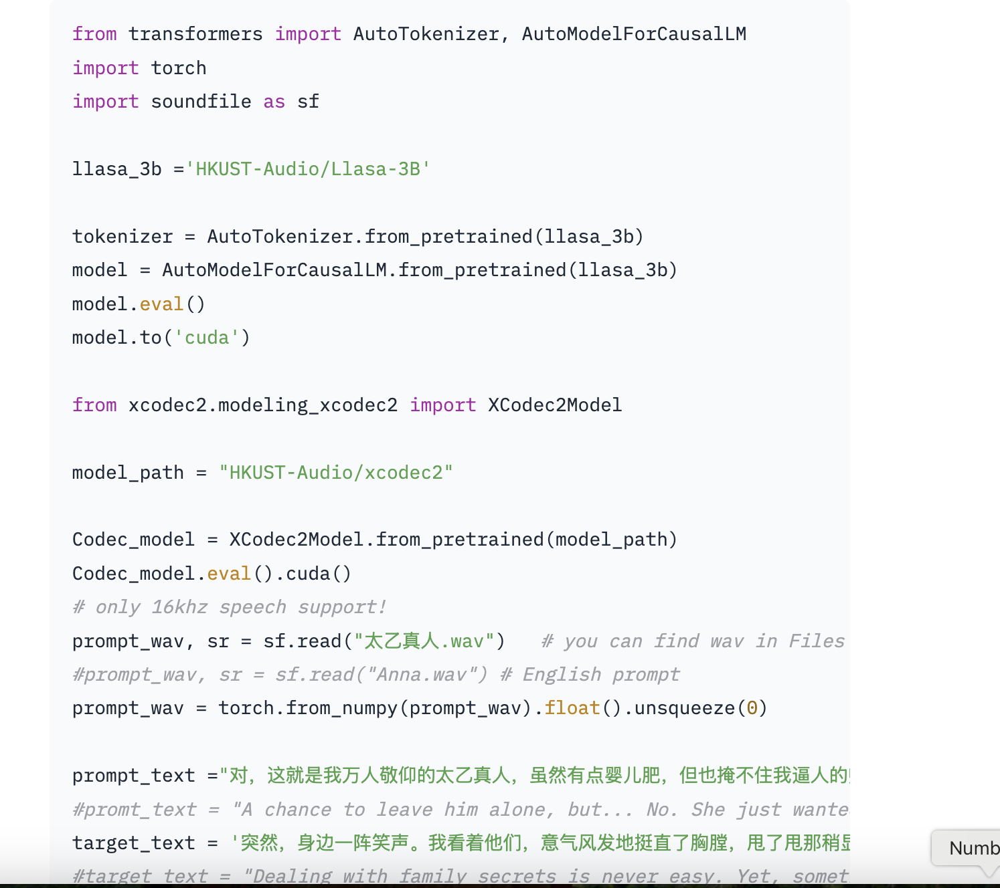

# LLaSA-3B: A Llama 3.2B Fine-Tuned Text-to-Speech Model with Ultra-Realistic Audio, Emotional Expressiveness, and Multilingual Support

> Text-to-speech (TTS) technology has emerged as a critical tool for bridging the gap between human and machine interaction. The demand for lifelike, emotionally resonant, and linguistically versatile voice synthesis has grown exponentially across entertainment, accessibility, customer service, and education. Traditional TTS systems, while functional, often fall short of delivering the nuanced realism required for immersive […]

Text-to-speech (TTS) technology has emerged as a critical tool for bridging the gap between human and machine interaction. The demand for lifelike, emotionally resonant, and linguistically versatile voice synthesis has grown exponentially across entertainment, accessibility, customer service, and education. Traditional TTS systems, while functional, often fall short of delivering the nuanced realism required for immersive experiences and personalized applications. 

Addressing these challenges, The [**LLaSA-3B**](https://huggingface.co/HKUSTAudio/Llasa-3B#paper) by the research team at HKUST Audio, an advanced audio model developed through meticulous fine-tuning of the Llama 3.2 framework, represents a groundbreaking TTS technology innovation. This sophisticated model has been designed to deliver ultra-realistic audio output that transcends the boundaries of conventional voice synthesis. The LLaSA-3B is gaining widespread acclaim for its ability to produce lifelike and emotionally nuanced speech in English and Chinese, setting a new benchmark for TTS applications.

At the center of the LLaSA-3B’s success is its training on an extensive dataset of 250,000 hours of audio, encompassing a diverse range of speech patterns, accents, and intonations. This monumental training volume enables the model to replicate human speech authentically. By leveraging a robust architecture featuring [**_1 billion_**](https://huggingface.co/HKUSTAudio/Llasa-1B)**_ and _**[**_3 billion_**](https://huggingface.co/HKUSTAudio/Llasa-3B#paper)**_ parameter variants_**, the model offers flexibility for various deployment scenarios, from lightweight applications to those requiring high-fidelity synthesis. An even larger 8-billion-parameter model is reportedly in development, which is expected to enhance the model’s capabilities further.

In many, one striking feature of the LLaSA-3B is its ability to convey emotions in speech. The model produces emotionally expressive audio, including tones that express happiness, anger, sadness, and even whispers. This level of emotional depth enhances user engagement. It broadens the scope of applications for the model, making it a valuable tool in industries such as entertainment, customer service, and accessibility. By mimicking subtle vocal variations, the LLaSA-3B bridges the gap between synthetic and natural voices, offering a listening experience that feels authentic and relatable.

Dual-language support for English and Chinese further elevates the LLaSA-3B’s utility. Its ability to seamlessly handle two linguistically complex languages showcases the versatility of its design and its potential for global applications. The model’s adaptability extends to its open-weight framework, allowing developers and researchers to integrate it with existing tools and frameworks such as Transformers and vLLM. This interoperability ensures that the LLaSA-3B can be utilized across various platforms, fostering innovation and collaboration within the TTS community.

Voice cloning, a particularly compelling feature of the LLaSA-3B, enables the replication of specific voices with striking accuracy. This capability is highly sought in fields ranging from personalized virtual assistants to dubbing and localization. By offering a precise and customizable voice synthesis solution, the model empowers creators and developers to produce content that resonates on a deeply personal level. Also, the support for voice cloning in two major global languages expands its applicability.

**Several Key Takeaways from this release include:**

- LLaSA-3B delivers lifelike voice synthesis with emotional depth, including happiness, sadness, anger, and whispers.

- With robust English and Chinese support and precise voice cloning, the model is suitable for diverse global audiences and personalized applications.

- Available in 1-billion and 3-billion parameter variants, with an 8-billion-parameter version underway, it adapts to various deployment needs.

- Its open-weight framework, compatible with tools like Transformers and vLLM, encourages collaboration and further advancements in TTS technology.

- From virtual reality and gaming to accessibility and customer service, LLaSA-3B redefines human-computer interaction with realistic and engaging audio.

In conclusion, the LLaSA-3B by HKUST Audio is a remarkable advancement in text-to-speech technology. With its ultra-realistic audio output, emotional expressiveness, dual-language support, and open-weight accessibility, it is redefining the standards of voice synthesis. The anticipation surrounding the upcoming 8-billion-parameter model underscores the trajectory of growth and innovation that the LLaSA series represents.

---

Check out **_the [Model on Hugging Face](https://huggingface.co/HKUSTAudio/Llasa-3B)._** All credit for this research goes to the researchers of this project. Also, don’t forget to follow us on **[Twitter](https://x.com/intent/follow?screen_name=marktechpost)** and join our **[Telegram Channel](https://arxiv.org/abs/2406.09406)** and [**LinkedIn Gr**](https://www.linkedin.com/groups/13668564/)[**oup**](https://www.linkedin.com/groups/13668564/). Don’t Forget to join our **[70k+ ML SubReddit](https://www.reddit.com/r/machinelearningnews/)**.

**🚨[ [Recommended Read] Nebius AI Studio expands with vision models, new language models, embeddings and LoRA](https://nebius.com/blog/posts/studio-embeddings-vision-and-language-models?utm_medium=newsletter&utm_source=marktechpost&utm_campaign=embedding-post-ai-studio) **_(Promoted)_
