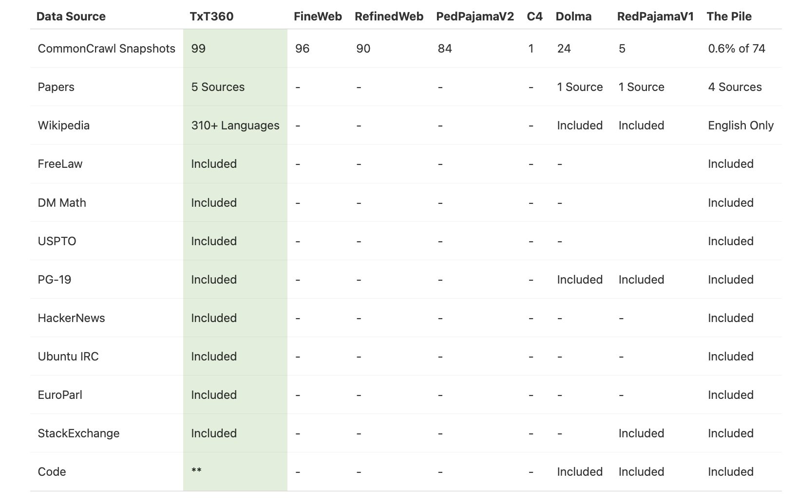

# LLM360 Group Introduces TxT360: A Top-Quality LLM Pre-Training Dataset with 15T Tokens

> In the ever-evolving world of large language models (LLMs), pre-training datasets form the backbone of how AI systems comprehend and generate human-like text. LLM360 has recently unveiled TxT360, a groundbreaking pre-training dataset comprising 15 trillion tokens. This release combines diversity, scale, and rigorous data filtering to achieve one of the most sophisticated open-source datasets to […]

In the ever-evolving world of large language models (LLMs), pre-training datasets form the backbone of how AI systems comprehend and generate human-like text. LLM360 has recently unveiled **TxT360**, a groundbreaking pre-training dataset comprising 15 trillion tokens. This release combines diversity, scale, and rigorous data filtering to achieve one of the most sophisticated open-source datasets to date.

### A Dataset Built on New Foundations

TxT360 differentiates itself from previous datasets by including fresh sources such as FreeLaw (legal corpora), PG-19 (a collection of books), scientific papers, and Wikipedia. By blending these sources, TxT360 presents a richer and more nuanced dataset, designed to bolster the capabilities of the next generation of LLMs.

### From Common Crawl to Clean Data

The creation of TxT360 began with Common Crawl, a publicly available web scrape that serves as the foundation for many modern language models.. However, simply using raw web data would not achieve the high standards LLM360 aimed for. Instead, the team embarked on a rigorous filtering journey to extract the most useful text from the massive collection of WARC (Web ARChive) files.

- **Text Extraction**: Clean, coherent text was isolated from noisy web data in WARC files.

- **Language Filtering**: Non-English content was removed to maintain a consistent dataset.

- **URL Filtering**: Redundant or low-value sources were filtered out, including spammy or promotional sites.

- **Repetition Removal**: Extensive efforts targeted repeated lines, paragraphs, and n-grams.

- **Document and Line-Level Filtering**: Heuristics were used to remove documents and lines that did not meet quality benchmarks.

In total, 97.65% of the original data was filtered out, retaining only high-quality, meaningful text to ensure robust and nuanced language models.

### Global Deduplication

Building a high-quality dataset like TxT360 required effective deduplication. LLM360 tackled this through two approaches: **exact deduplication** using a Bloom filter and **fuzzy deduplication** using a MinHash algorithm. These methods ensured that the dataset contained unique content, avoiding the pitfalls of repetitive learning.

### High-Quality Sources

After the filtering process, LLM360 added handpicked, high-quality corpora, including scientific papers, legal documents, classic books, and curated Wikipedia content. Each of these specialized sources went through tailored pipelines to preserve data integrity and quality, ensuring that the resulting language models can handle a wide range of topics.

### TxT360: A New Era for Open-Source AI

The release of TxT360 marks a significant leap forward in AI and NLP research. LLM360’s meticulous construction and filtering demonstrate that quality and quantity can coexist. With 15 trillion tokens, TxT360 supports the development of nuanced, capable, and intelligent language models.

Moreover, LLM360’s transparency about their processes sets a new standard in the field. According to the research group, their upcoming release of codebase will offer insights into the methodologies that underpinned this super cool dataset.

---

Check out the **[Details](https://huggingface.co/spaces/LLM360/TxT360) and [Dataset](https://huggingface.co/datasets/LLM360/TxT360)**. All credit for this research goes to the researchers of this project. Also, don’t forget to follow us on **[Twitter](https://twitter.com/Marktechpost)** and join our **[Telegram Channel](https://pxl.to/at72b5j)** and [**LinkedIn Gr**](https://www.linkedin.com/groups/13668564/)[**oup**](https://www.linkedin.com/groups/13668564/). **If you like our work, you will love our**[** newsletter..**](https://marktechpost-newsletter.beehiiv.com/subscribe) Don’t Forget to join our **[50k+ ML SubReddit](https://www.reddit.com/r/machinelearningnews/)**

**[[Upcoming Event- Oct 17 202] RetrieveX – The GenAI Data Retrieval Conference (Promoted)](https://www.eventbrite.com/e/retrievex-the-genai-data-retrieval-conference-tickets-983939869637?utm_source=print&utm_medium=markettechpost&utm_campaign=retrievex&utm_term=tagline&utm_content=SIZE)**
