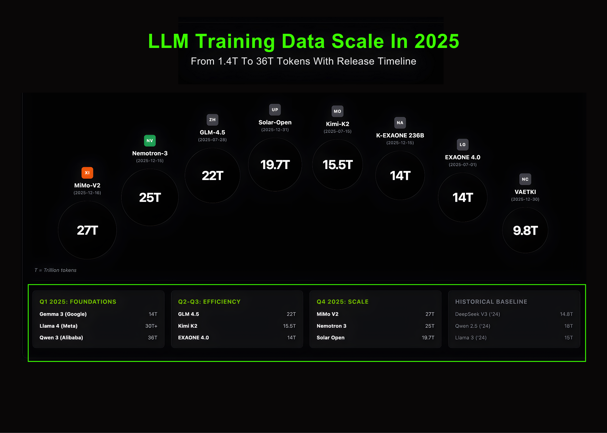

# Marktechpost Releases ‘AI2025Dev’: A Structured Intelligence Layer for AI Models, Benchmarks, and Ecosystem Signals

> Marktechpost has released AI2025Dev, its 2025 analytics platform (available to AI Devs and Researchers without any signup or login) designed to convert the year’s AI activity into a queryable dataset spanning model releases, openness, training scale, benchmark performance, and ecosystem participants. Marktechpost is a California based AI news platform covering machine learning, deep learning, and […]

Marktechpost has released [**AI2025Dev**,](https://ai2025.dev/) its 2025 analytics platform (available to AI Devs and Researchers without any signup or login) designed to convert the year’s AI activity into a queryable dataset spanning model releases, openness, training scale, benchmark performance, and ecosystem participants. Marktechpost is a California based AI news platform covering machine learning, deep learning, and data science research.

### What’s new in this release

**The 2025 release of [AI2025Dev**](https://ai2025.dev/) **expands coverage across two layers:**

- **[Release analytics](https://ai2025.dev/Dashboard)**, focusing on model and framework launches, license posture, vendor activity, and feature level segmentation.

- **[Ecosystem indexes](https://ai2025.dev/Dashboard)**, including curated “Top 100” collections that connect models to papers and the people and capital behind them. This release includes dedicated sections for:

- **Top 100 research papers**

- **Top 100 AI researchers**

- **Top AI startups**

- **Top AI founders**

- **Top AI investors**

- **Funding views** that link investors and companies

These indexes are designed to be navigable and filterable, rather than static editorial lists, so teams can trace relationships across artifacts like company, model type, benchmark scores, and release timing.

### AI Releases in 2025: year level metrics from the market map dataset

[**AI2025Dev**](https://ai2025.dev/Dashboard)’s ‘AI Releases in 2025’ overview is backed by a structured market map dataset covering **100 tracked releases** and **39 active companies**. The dataset normalizes each entry into a consistent schema: `name`, `company`, `type`, `license`, `flagship`, and `release_date`.

**Key aggregate indicators in this release include:**

- **Total releases: 100**

- **Open share: 69%**, computed as the combined share of **Open Source** and **Open Weights** releases (44 and 25 entries respectively), with **31 Proprietary** releases

- **Flagship models: 63**, enabling separation of frontier tier launches from derivative or narrow scope releases

- **Active companies: 39**, reflecting a concentration of major releases among a relatively fixed set of vendors

Model category coverage in the market map is explicitly typed, enabling faceted queries and comparative analysis. The distribution includes **LLM (58)**, **Agentic Model (11)**, **Vision Model (8)**, **Tool (7)**, **Multimodal (6)**, **Framework (4)**, **Code Model (2)**, **Audio Model (2)**, plus **Embedding Model (1)** and **Agent (1)**.

### Key Findings 2025: category level shifts captured as measurable signals

[The release packages a ‘Key Findings 2025’ layer](https://ai2025.dev/Dashboard) that surfaces year level shifts as measurable slices of the dataset rather than commentary. The platform highlights three recurring technical themes:

- **Open weights adoption**, capturing the rising share of releases with weights available under open source or open weights terms, and the downstream implication that more teams can benchmark, fine tune, and deploy without vendor locked inference.

- **Agentic and tool using systems**, tracking the growth of models and systems categorized around tool use, orchestration, and task execution, rather than pure chat interaction.

- **Efficiency and compression**, reflecting a 2025 pattern where distillation and other model optimization techniques increasingly target smaller footprints while maintaining competitive benchmark behavior.

### LLM Training Data Scale in 2025: token scale with timeline alignment

A dedicated visualization tracks **LLM training data scale in 2025**, spanning **1.4T to 36T tokens** and aligning token budgets to a **release timeline**. By encoding token scale and date in a single view, the platform makes it possible to compare how vendors are allocating training budgets over time and how extreme scale relates to observed benchmark outcomes.

### Performance Benchmarks: benchmark normalized scoring and inspection

[The Analytics section](https://ai2025.dev/Dashboard) includes a **Performance Benchmarks** view and an **Intelligence Index** derived from standard evaluation axes, including **MMLU**, **HumanEval**, and **GSM8K**. The objective is not to replace task specific evaluations, but to provide a consistent baseline for comparing vendor releases when public reporting differs in format and completeness.

**The platform exposes:**

- **Ranked performance summaries** for quick scanning

- **Per benchmark columns** to detect tradeoffs (for example, coding optimized models that diverge from reasoning centric performance)

- **Export controls** to support downstream analysis workflows

### Model Leaderboard and Model Comparison: operational evaluation workflows

**To reduce the friction of model selection, [AI2025Dev**](https://ai2025.dev/Dashboard) includes:

- A **Model Leaderboard** that aggregates scores and metadata for a broader 2025 model set

- A **Model Comparison** view that enables side by side evaluation across benchmarks and attributes, with search and filtering to build shortlists by vendor, type, and openness

These workflows are designed for engineering teams that need a structured comparison surface before committing to integration, inference spend, or fine tuning pipelines.

### Top 100 indexes: papers, researchers, startups, and investors

Beyond model tracking, the [release extends](https://ai2025.dev/Dashboard) to ecosystem mapping. The platform adds navigable “Top 100” modules for:

- **Research papers**, providing an entry point into the core technical work shaping 2025 systems

- **AI researchers**, presented as an unranked, evidence backed index with conference anchored context

- **AI startups and founders**, enabling linkage between product direction and released systems

- **AI investors and funding**, enabling analysis of capital flows around model and tool categories

### Availability

The updated platform is available now at [**AI2025Dev**](https://ai2025.dev/Dashboard) and you don’t need any signup or login to access the platform. The release is designed to support both fast scanning and analyst grade workflows, with normalized schemas, typed categories, and exportable views intended for quantitative comparison rather than narrative browsing.
