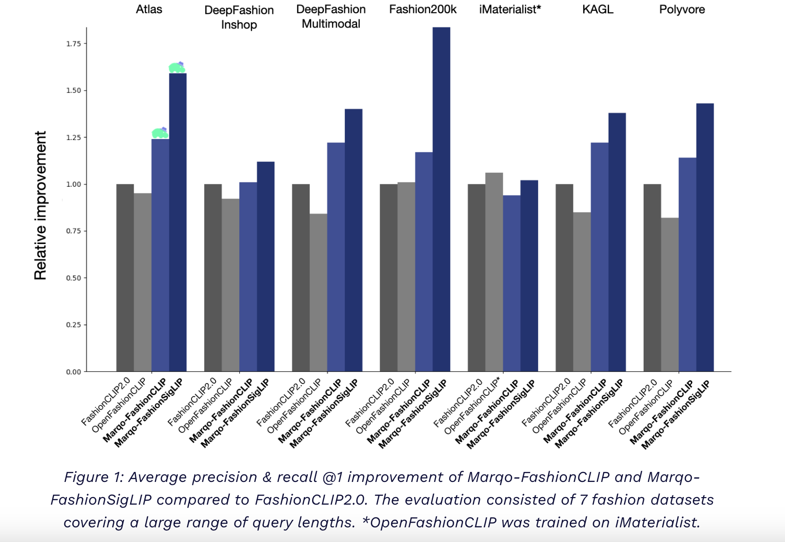

# Marqo Releases Marqo-FashionCLIP and Marqo-FashionSigLIP: A Family of Embedding Models for E-Commerce and Retail

> When it comes to fashion recommendation and search algorithms, multimodal techniques merge textual and visual data for better accuracy and customization. Users can use the system’s ability to assess visual and textual descriptions of clothes to get more accurate search results and personalized recommendations. These systems provide a more natural and context-aware way to shop […]

When it comes to fashion recommendation and search algorithms, multimodal techniques merge textual and visual data for better accuracy and customization. Users can use the system’s ability to assess visual and textual descriptions of clothes to get more accurate search results and personalized recommendations. These systems provide a more natural and context-aware way to shop by combining picture recognition with natural language processing, helping users discover clothing that fits their tastes and preferences well.

Margo releases two new state-of-the-art multimodal models for fashion domain search and recommendations, Marqo-FashionCLIP and Marqo-FashionSigLIP. For use in subsequent search and recommendation systems, Marqo-FashionCLIP and Marqo-FashionSigLIP can generate embeddings for both text and images. More than one million fashion items with extensive meta-data, including materials, colors, styles, keywords, and descriptions, were used to train the models.

The team used two pre-existing base models (ViT-B-16-laion and ViT-B-16-SigLIP-webli) to fine-tune the models using GCL. The seven-part loss is optimized for keywords, categories, details, colors, materials, and extensive descriptions. This multi-part loss was far superior to the conventional text-image InfoNCE loss concerning contrastive learning and fine-tuning. This produces a model that yields better search application results when dealing with shorter descriptive text and keyword-like material.

Researchers used seven publicly available fashion datasets, which were not part of the training dataset, were used to evaluate the models. This includes iMaterialist, DeepFashion (In-shop), DeepFashion (Multimodal), Fashion200K, KAGL, Atlas, and Polyvore. Each dataset is linked to distinct downstream activities depending on the available metadata. Interactions between text and pictures, categories and products, and subcategories and products were the three main foci of the evaluation. The text-to-image task mimics longer descriptive inquiries (such as tail queries) using distinct text sections. Shorter keyword-like inquiries (similar to head queries) that may have the product task category and subcategory represent several valid results.

In a comprehensive performance comparison, Marqo-FashionCLIP and Marqo-FashionSigLIP outshine their fashion-specific and basic models’ predecessors in every aspect. For Instance, Marqo-FashionCLIP achieved recall@1 (text-to-image) and precision@1 (category/sub-category-to-product) improvements of 22%, 8%, and 11% respectively, compared to FashionCLIP2.0. Similarly, Marqo-FashionSigLIP achieved recall@1 of 57%, precision@1 of 11%, and recall@1 of 13%, demonstrating its superiority over other models.

The study covers various query lengths, from simple categories to extensive descriptions. The results, broken down by query type, demonstrate the robustness of the models across different query lengths and types. The proposed models, Marqo-FashionCLIP and Marqo-FashionSigLIP, deliver superior performance and ensure efficiency. When compared to current fashion-specific models, they offer a 10% improvement in inference times. 

Using the Apache 2.0 license, researchers have released Marqo-FashionCLIP and Marqo-FashionSigLIP. Using their standard implementation, users may download it straight from Hugging Face and use it anywhere. 

---

Check out the **[Details ](https://www.marqo.ai/blog/search-model-for-fashion)and [Model Card](https://huggingface.co/collections/Marqo/marqo-fashionclip-and-marqo-fashionsiglip-66b43f2d09a06ad2368d4af6).** All credit for this research goes to the researchers of this project. Also, don’t forget to follow us on **[Twitter](https://twitter.com/Marktechpost)** and join our **[Telegram Channel](https://pxl.to/at72b5j)** and [**LinkedIn Gr**](https://www.linkedin.com/groups/13668564/)[**oup**](https://www.linkedin.com/groups/13668564/). **If you like our work, you will love our**[** newsletter..**](https://marktechpost-newsletter.beehiiv.com/subscribe)

Don’t Forget to join our **[48k+ ML SubReddit](https://www.reddit.com/r/machinelearningnews/)**

**Find Upcoming [AI Webinars here](https://www.marktechpost.com/ai-webinars-list-llms-rag-generative-ai-ml-vector-database/)**

---

> [Arcee AI Introduces Arcee Swarm: A Groundbreaking Mixture of Agents MoA Architecture Inspired by the Cooperative Intelligence Found in Nature Itself](https://www.marktechpost.com/2024/08/15/arcee-ai-introduces-arcee-swarm-a-groundbreaking-mixture-of-agents-moa-architecture-inspired-by-the-cooperative-intelligence-found-in-nature-itself/)
