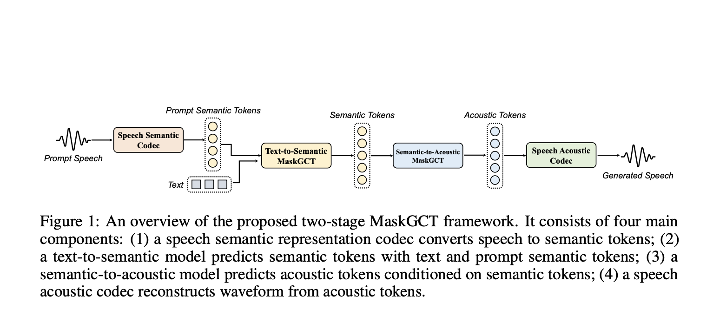

# MaskGCT: A New Open State-of-the-Art Text-to-Speech Model

> In recent years, text-to-speech (TTS) technology has made significant strides, yet numerous challenges still remain. Autoregressive (AR) systems, while offering diverse prosody, tend to suffer from robustness issues and slow inference speeds. Non-autoregressive (NAR) models, on the other hand, require explicit alignment between text and speech during training, which can lead to unnatural results. The […]

In recent years, text-to-speech (TTS) technology has made significant strides, yet numerous challenges still remain. Autoregressive (AR) systems, while offering diverse prosody, tend to suffer from robustness issues and slow inference speeds. Non-autoregressive (NAR) models, on the other hand, require explicit alignment between text and speech during training, which can lead to unnatural results. The new Masked Generative Codec Transformer (MaskGCT) addresses these issues by eliminating the need for explicit text-speech alignment and phone-level duration prediction. This novel approach aims to simplify the pipeline while maintaining or even enhancing the quality and expressiveness of generated speech.

MaskGCT is a new open-source, state-of-the-art TTS model available on Hugging Face. It brings several exciting features to the table, such as zero-shot voice cloning and emotional TTS, and can synthesize speech in both English and Chinese. The model was trained on an extensive dataset of 100,000 hours of in-the-wild speech data, enabling it to generate long-form and variable-speed synthesis. Notably, MaskGCT features a fully non-autoregressive architecture. This means the model does not rely on iterative prediction, resulting in faster inference times and a simplified synthesis process. With a two-stage approach, MaskGCT first predicts semantic tokens from text and subsequently generates acoustic tokens conditioned on those semantic token.

MaskGCT utilizes a two-stage framework that follows a “mask-and-predict” paradigm. In the first stage, the model predicts semantic tokens based on the input text. These semantic tokens are extracted from a speech self-supervised learning (SSL) model. In the second stage, the model predicts acoustic tokens conditioned on the previously generated semantic tokens. This architecture allows MaskGCT to fully bypass text-speech alignment and phoneme-level duration prediction, distinguishing it from previous NAR models. Moreover, it employs a Vector Quantized Variational Autoencoder (VQ-VAE) to quantize the speech representations, which minimizes information loss. The architecture is highly flexible, allowing for the generation of speech with controllable speed and duration, and supports applications like cross-lingual dubbing, voice conversion, and emotion control, all in a zero-shot setting.

MaskGCT represents a significant leap forward in TTS technology due to its simplified pipeline, non-autoregressive approach, and robust performance across multiple languages and emotional contexts. Its training on 100,000 hours of speech data, covering diverse speakers and contexts, gives it unparalleled versatility and naturalness in generated speech. Experimental results demonstrate that MaskGCT achieves human-level naturalness and intelligibility, outperforming other state-of-the-art TTS models on key metrics. For example, MaskGCT achieved superior scores in speaker similarity (SIM-O) and word error rate (WER) compared to other TTS models like VALL-E, VoiceBox, and NaturalSpeech 3. These metrics, alongside its high-quality prosody and flexibility, make MaskGCT an ideal tool for applications that require both precision and expressiveness in speech synthesis.

MaskGCT pushes the boundaries of what is possible in text-to-speech technology. By removing the dependencies on explicit text-speech alignment and duration prediction and instead using a fully non-autoregressive, masked generative approach, MaskGCT achieves a high level of naturalness, quality, and efficiency. Its flexibility to handle zero-shot voice cloning, emotional context, and bilingual synthesis makes it a game-changer for various applications, including AI assistants, dubbing, and accessibility tools. With its open availability on platforms like Hugging Face, MaskGCT is not just advancing the field of TTS but also making cutting-edge technology more accessible for developers and researchers worldwide.

---

Check out the** **[**Paper** ](https://arxiv.org/abs/2409.00750)and **[Model on Hugging Face](https://huggingface.co/amphion/MaskGCT)**. All credit for this research goes to the researchers of this project. Also, don’t forget to follow us on **[Twitter](https://twitter.com/Marktechpost)** and join our **[Telegram Channel](https://pxl.to/at72b5j)** and [**LinkedIn Gr**](https://www.linkedin.com/groups/13668564/)[**oup**](https://www.linkedin.com/groups/13668564/). **If you like our work, you will love our**[** newsletter..**](https://marktechpost-newsletter.beehiiv.com/subscribe) Don’t Forget to join our **[55k+ ML SubReddit](https://www.reddit.com/r/machinelearningnews/)**.

**[[Trending](https://www.marktechpost.com/2024/10/28/llmware-introduces-model-depot-an-extensive-collection-of-small-language-models-slms-for-intel-pcs/)] ****[LLMWare Introduces Model Depot: An Extensive Collection of Small Language Models (SLMs) for Intel PCs](https://www.marktechpost.com/2024/10/28/llmware-introduces-model-depot-an-extensive-collection-of-small-language-models-slms-for-intel-pcs/)**
