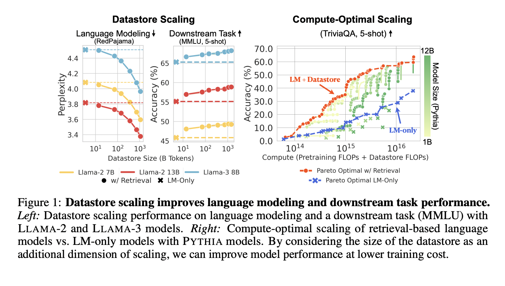

# MassiveDS: A 1.4 Trillion-Token Datastore Enabling Language Models to Achieve Superior Efficiency and Accuracy in Knowledge-Intensive NLP Applications

> Language models have become a cornerstone of modern NLP, enabling significant advancements in various applications, including text generation, machine translation, and question-answering systems. Recent research has focused on scaling these models in terms of the amount of training data and the number of parameters. These scaling laws have demonstrated that increasing data and model parameters […]

Language models have become a cornerstone of modern NLP, enabling significant advancements in various applications, including text generation, machine translation, and question-answering systems. Recent research has focused on scaling these models in terms of the amount of training data and the number of parameters. These scaling laws have demonstrated that increasing data and model parameters yields substantial performance improvements. However, a new scaling dimension is now being explored: the size of external data stores available at inference time. Unlike traditional parametric models, which depend solely on the training data, retrieval-based language models can dynamically access a much larger knowledge base during inference, enhancing their ability to generate more accurate and contextually relevant responses. This novel approach of integrating vast datastores opens new possibilities for efficiently managing knowledge and improving the factual accuracy of LMs.

One major challenge in NLP is retaining and utilizing vast knowledge without incurring significant computational costs. Traditional language models are typically trained on large static datasets encoded into the model parameters. Once trained, these models cannot integrate new information dynamically and require costly retraining to update their knowledge base. This is particularly problematic for knowledge-intensive tasks, where models need to reference extensive external sources. The problem is exacerbated when these models are required to handle diverse domains such as general web data, scientific papers, and technical codes. The inability to adapt dynamically to new information and the computational burden associated with retraining limit the effectiveness of these models. Thus, a new paradigm is needed to enable language models to dynamically access and use external knowledge.

Existing approaches for enhancing language models’ capabilities include using retrieval-based mechanisms that rely on external datastores. These models, known as retrieval-based language models (RIC-LMs), can access additional context during inference by querying an external datastore. This strategy contrasts with parametric models, constrained by the knowledge embedded within their parameters. Notable efforts include the use of Wikipedia-sized datastores with a few billion tokens. However, these datastores are often domain-specific and do not cover the full breadth of information required for complex downstream tasks. Additionally, previous retrieval-based models have computational feasibility and efficiency limitations, as large-scale datastores introduce challenges in maintaining retrieval speed and accuracy. Although some models like RETRO have used proprietary datastores, their results have not been fully replicable due to the closed nature of the datasets.

A research team from the University of Washington and the Allen Institute for AI constructed a new datastore called [**MassiveDS**](https://huggingface.co/collections/rulins/massiveds-669adf35119595d21b9b857e), which comprises 1.4 trillion tokens. This open-source datastore is the largest and most diverse available for retrieval-based LMs. It includes data from eight domains: books, scientific papers, Wikipedia articles, GitHub repositories, and mathematical texts. MassiveDS was specifically designed to facilitate large-scale retrieval during inference, enabling language models to access and utilize more information than ever before. The researchers implemented an efficient pipeline that reduces the computational overhead associated with datastore scaling. This pipeline allows for systematic evaluation of datastore scaling trends by retrieving a subset of documents and applying operations such as indexing, filtering, and subsampling only to these subsets, making the construction and utilization of large datastores computationally accessible.

The research demonstrated that MassiveDS significantly improves the performance of retrieval-based language models. For example, a smaller LM utilizing this datastore outperformed a larger parametric LM on multiple downstream tasks. Specifically, MassiveDS models achieved lower perplexity scores on general web and scientific data, indicating higher language modeling quality. Furthermore, in knowledge-intensive question-answering tasks such as TriviaQA and Natural Questions, the LMs using MassiveDS consistently outperformed their larger counterparts. On TriviaQA, models with access to less than 100 billion tokens from MassiveDS could surpass the performance of much larger language models that did not utilize external datastores. These findings suggest that increasing the datastore size allows models to perform better without improving their internal parameters, thereby reducing the overall training cost.

The researchers attribute these performance gains to MassiveDS’s ability to provide high-quality, domain-specific information during inference. Even for reasoning-heavy tasks such as MMLU and MedQA, retrieval-based LMs using MassiveDS showed notable improvements compared to parametric models. Using multiple data sources ensures the datastore can provide relevant context for various queries, making the language models more versatile and effective across different domains. The results highlight the importance of using data quality filters and optimized retrieval methods, further enhancing the benefits of datastore scaling.

In conclusion, this study demonstrates that retrieval-based language models equipped with a large datastore like MassiveDS can perform better at a lower computational cost than traditional parametric models. By leveraging an expansive 1.4 trillion-token datastore, these models can dynamically access diverse, high-quality information, significantly improving their ability to handle knowledge-intensive tasks. This represents a promising direction for future research, offering a scalable and efficient method to enhance language models’ performance without increasing the model size or training cost.

---

Check out the **[Paper](https://arxiv.org/abs/2407.12854)**,[ **Dataset**](https://huggingface.co/collections/rulins/massiveds-669adf35119595d21b9b857e), **[GitHub](https://github.com/RulinShao/retrieval-scaling)**, and **[Project](https://retrievalscaling.github.io/)**. All credit for this research goes to the researchers of this project. Also, don’t forget to follow us on **[Twitter](https://twitter.com/Marktechpost)** and join our **[Telegram Channel](https://pxl.to/at72b5j)** and [**LinkedIn Gr**](https://www.linkedin.com/groups/13668564/)[**oup**](https://www.linkedin.com/groups/13668564/). **If you like our work, you will love our**[** newsletter..**](https://marktechpost-newsletter.beehiiv.com/subscribe)

Don’t Forget to join our **[50k+ ML SubReddit](https://www.reddit.com/r/machinelearningnews/)**.

We are inviting startups, companies, and research institutions who are working on [small language models](https://www.marktechpost.com/2025/01/12/what-are-small-language-models-slms/) to participate in this upcoming **‘Small Language Models’ Magazine/Report by Marketchpost.com**. This Magazine/Report will be released in late October/early November 2024. **[Click here to set up a call!](https://pxl.to/g7qpb3)**
