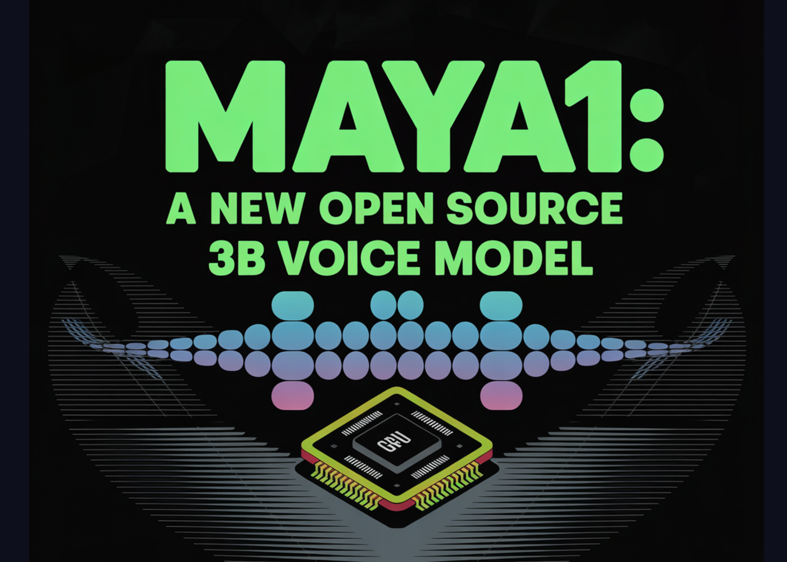

# Maya1: A New Open Source 3B Voice Model For Expressive Text To Speech On A Single GPU

> Maya Research has released Maya1, a 3B parameter text to speech model that turns text plus a short description into controllable, expressive speech while running in real time on a single GPU. What Maya1 Actually Does? Maya1 is a state of the art speech model for expressive voice generation. It is built to capture real […]

Maya Research has released Maya1, a 3B parameter text to speech model that turns text plus a short description into controllable, expressive speech while running in real time on a single GPU.

### What Maya1 Actually Does?

Maya1 is a state of the art speech model for expressive voice generation. It is built to capture real human emotion and precise voice design from text inputs.

**The core interface has 2 inputs**:

- A natural language voice description, for example ‘Female voice in her 20s with a British accent, energetic, clear diction” or “Demon character, male voice, low pitch, gravelly timbre, slow pacing’.

- The text that should be spoken

The model combines both signals and generates audio that matches the content and the described style. You can also insert inline emotion tags inside the text, such as `<laugh>`, `<sigh>`, `<whisper>`, `<angry>`, `<giggle>`, `<gasp>`, `<cry>` and more than 20 emotions.

Maya1 outputs 24 kHz mono audio and supports real time streaming, which makes it suitable for assistants, interactive agents, games, podcasts and live content.

The Maya Research team claims that the model outperforms top proprietary systems while remaining fully open source under the Apache 2.0 license.

### Architecture and SNAC Codec

Maya1 is a 3B parameter decoder only transformer with a Llama style backbone. Instead of predicting raw waveforms, it predicts tokens from a neural audio codec named SNAC.

**The generation flow is**

`text → tokenize → generate SNAC codes (7 tokens per frame) → decode → 24 kHz audio`

SNAC uses a multi scale hierarchical structure at about 12, 23 and 47 Hz. This keeps the autoregressive sequence compact while preserving detail. The codec is designed for real time streaming at about 0.98 kbps.

The important point is that the transformer operates on discrete codec tokens instead of raw samples. A separate SNAC decoder, for example `hubertsiuzdak/snac_24khz`, reconstructs the waveform. This separation makes generation more efficient and easier to scale than direct waveform prediction.

### Training Data And Voice Conditioning

Maya1 is pretrained on an internet scale English speech corpus to learn broad acoustic coverage and natural coarticulation. It is then fine tuned on a curated proprietary dataset of studio recordings that include human verified voice descriptions, more than 20 emotion tags per sample, multiple English accents, and character or role variations.

**The documented data pipeline includes**:

- 24 kHz mono resampling with about minus 23 LUFS loudness

- Voice activity detection with silence trimming between 1 and 14 seconds

- Forced alignment using Montreal Forced Aligner for phrase boundaries

- MinHash LSH text deduplication

- Chromaprint based audio deduplication

- SNAC encoding with 7 token frame packing

The Maya Research team evaluated several ways to condition the model on a voice description. Simple colon formats and key value tag formats either caused the model to speak the description or did not generalize well. The best performing format uses an XML style attribute wrapper that encodes the description and text in a natural way while remaining robust.

In practice, this means developers can describe voices in free form text, close to how they would brief a voice actor, instead of learning a custom parameter schema.

*https://huggingface.co/maya-research/maya1*

### Inference And Deployment On A Single GPU

The reference Python script on Hugging Face loads the model with `AutoModelForCausalLM.from_pretrained("maya-research/maya1", torch_dtype=torch.bfloat16, device_map="auto")` and uses the SNAC decoder from `SNAC.from_pretrained("hubertsiuzdak/snac_24khz")`.

The Maya Research team recommends a single GPU with 16 GB or more of VRAM, for example A100, H100 or a consumer RTX 4090 class card.

For production, they provide a `vllm_streaming_inference.py` script that integrates with vLLM. It supports Automatic Prefix Caching for repeated voice descriptions, a WebAudio ring buffer, multi GPU scaling and sub 100 millisecond latency targets for real time use.

**Beyond the core repository, they have released**:

- A Hugging Face Space that exposes an interactive browser demo where users enter text and voice descriptions and listen to output

- GGUF quantized variants of Maya1 for lighter deployments using `llama.cpp`

- A ComfyUI node that wraps Maya1 as a single node, with emotion tag helpers and SNAC integration

These projects reuse the official model weights and interface, so they stay consistent with the main implementation.

### Key Takeaways

- Maya1 is a 3B parameter, decoder only, Llama style text to speech model that predicts SNAC neural codec tokens instead of raw waveforms, and outputs 24 kHz mono audio with streaming support.

- The model takes 2 inputs, a natural language voice description and the target text, and supports more than 20 inline emotion tags such as ``, ``, `` and `` for local control of expressiveness.

- Maya1 is trained with a pipeline that combines large scale English pretraining and studio quality fine tuning with loudness normalization, voice activity detection, forced alignment, text deduplication, audio deduplication and SNAC encoding.

- The reference implementation runs on a single 16 GB plus GPU using `torch_dtype=torch.bfloat16`, integrates with a SNAC decoder, and has a vLLM based streaming server with Automatic Prefix Caching for low latency deployment.

- Maya1 is released under the Apache 2.0 license, with official weights, Hugging Face Space demo, GGUF quantized variants and ComfyUI integration, which makes expressive, emotion rich, controllable text to speech accessible for commercial and local use.

### Editorial Comments

Maya1 pushes open source text to speech into territory that was previously dominated by proprietary APIs. A 3B parameter Llama style decoder that predicts SNAC codec tokens, runs on a single 16 GB GPU with vLLM streaming and Automatic Prefix Caching, and exposes more than 20 inline emotions with natural language voice design, is a practical building block for real time agents, games and tools. Overall, Maya1 shows that expressive, controllable TTS can be both open and production ready.

---

Check out the **[Model Weights](https://huggingface.co/maya-research/maya1)** and [**Demo**](https://huggingface.co/spaces/maya-research/maya1). Feel free to check out our **[GitHub Page for Tutorials, Codes and Notebooks](https://github.com/Marktechpost/AI-Tutorial-Codes-Included)**. Also, feel free to follow us on **[Twitter](https://x.com/intent/follow?screen_name=marktechpost)** and don’t forget to join our **[100k+ ML SubReddit](https://www.reddit.com/r/machinelearningnews/)** and Subscribe to **[our Newsletter](https://www.aidevsignals.com/)**. Wait! are you on telegram? **[now you can join us on telegram as well.](https://t.me/machinelearningresearchnews)**
