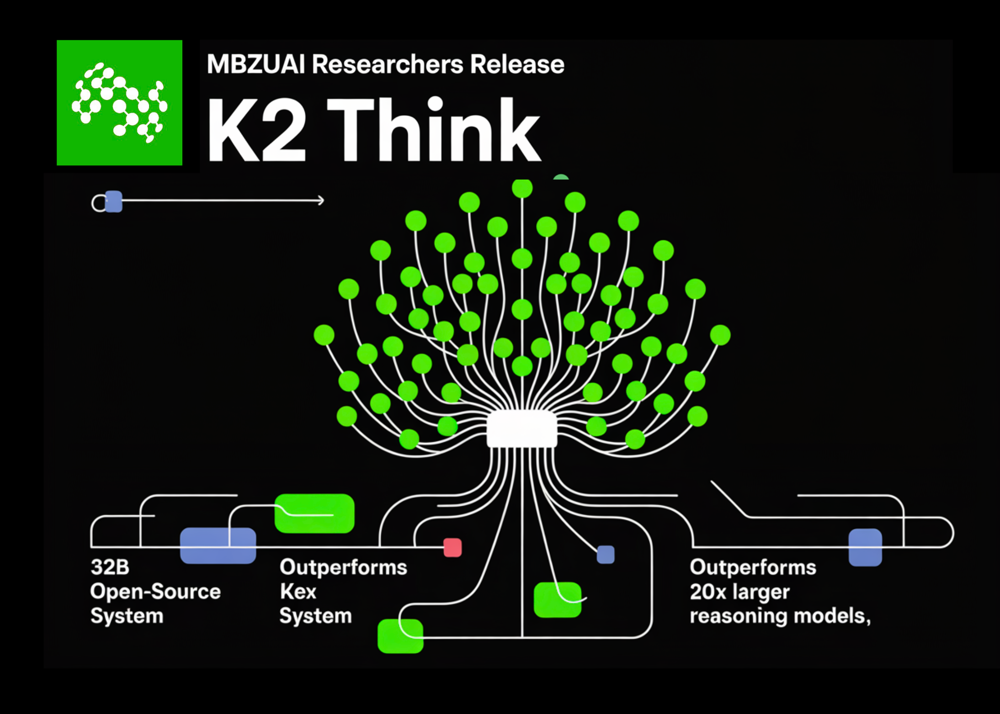

# MBZUAI Researchers Release K2 Think: A 32B Open-Source System for Advanced AI Reasoning and Outperforms 20x Larger Reasoning Models

> A team of researchers from MBZUAI’s Institute of Foundation Models and G42 released K2 Think, is a 32B-parameter open reasoning system for advanced AI reasoning. It pairs long chain-of-thought supervised fine-tuning with reinforcement learning from verifiable rewards, agentic planning, test-time scaling, and inference optimizations (speculative decoding + wafer-scale hardware). The result is frontier-level math performance […]

A team of researchers from MBZUAI’s Institute of Foundation Models and G42 released K2 Think, is a 32B-parameter open reasoning system for advanced AI reasoning. It pairs long chain-of-thought supervised fine-tuning with reinforcement learning from verifiable rewards, agentic planning, test-time scaling, and inference optimizations (speculative decoding + wafer-scale hardware). The result is frontier-level math performance with markedly lower parameter count and competitive results on code and science—together with a transparent, fully open release spanning weights, data, and code.

### System overview

K2 Think is built by post-training an open-weight Qwen2.5-32B base model and adding a lightweight test-time compute scaffold. The design emphasizes parameter efficiency: a 32B backbone is deliberately chosen to enable fast iteration and deployment while leaving headroom for post-training gains. The core recipe combines six “pillars”: (1) Long chain-of-thought (CoT) supervised fine-tuning; (2) Reinforcement Learning with Verifiable Rewards (RLVR); (3) agentic planning before solving; (4) test-time scaling via best-of-N selection with verifiers; (5) speculative decoding; and (6) inference on a wafer-scale engine.

The goals are straightforward: raise pass@1 on competition-grade math benchmarks, maintain strong code/science performance, and keep response length and wall-clock latency under control through plan-before-you-think prompting and hardware-aware inference.

### Pillar 1: Long CoT SFT 

Phase-1 SFT uses curated, long chain-of-thought traces and instruction/response pairs spanning math, code, science, instruction following, and general chat (AM-Thinking-v1-Distilled). The effect is to teach the base model to externalize intermediate reasoning and adopt a structured output format. Rapid pass@1 gains occur early (≈0.5 epoch), with AIME’24 stabilizing around ~79% and AIME’25 around ~72% on the SFT checkpoint before RL, indicating convergence.

### Pillar 2: RL with Verifiable Rewards 

K2 Think then trains with RLVR on **Guru**, a ~92k-prompt, six-domain dataset (Math, Code, Science, Logic, Simulation, Tabular) designed for verifiable end-to-end correctness. The implementation uses the **verl** library with a GRPO-style policy-gradient algorithm. Notable observation: starting RL from a _strong_ SFT checkpoint yields modest absolute gains and can plateau/degenerate, whereas applying the same RL recipe directly on the base model shows large relative improvements (e.g., ~40% on AIME’24 over training), supporting a trade-off between SFT strength and RL headroom.

A second ablation shows multi-stage RL with a reduced initial context window (e.g., 16k → 32k) underperforms—failing to recover the SFT baseline—suggesting that reducing max sequence length below the SFT regime can disrupt learned reasoning patterns.

### Pillars 3–4: Agentic “Plan-Before-You-Think” and Test-time Scaling

At inference, the system first elicits a compact **plan** before generating a full solution, then performs best-of-N (e.g., N=3) sampling with verifiers to select the most likely-correct answer. Two effects are reported: (i) consistent quality gains from the combined scaffold; and (ii) **shorter** final responses despite the added plan—average token counts drop across benchmarks, with reductions up to ~11.7% (e.g., Omni-HARD), and overall lengths comparable to much larger open models. This matters for both latency and cost.

Table-level analysis shows K2 Think’s response lengths are **shorter** than Qwen3-235B-A22B and in the same range as GPT-OSS-120B on math; after adding plan-before-you-think and verifiers, K2 Think’s average tokens fall versus its own post-training checkpoint (e.g., AIME’24 −6.7%, AIME’25 −3.9%, HMMT25 −7.2%, Omni-HARD −11.7%, LCBv5 −10.5%, GPQA-D −2.1%).

### Pillars 5–6: Speculative decoding and wafer-scale inference

K2 Think targets **Cerebras Wafer-Scale Engine** inference with **speculative decoding**, advertising per-request throughput upwards of **2,000 tokens/sec**, which makes the test-time scaffold practical for production and research loops. The hardware-aware inference path is a central part of the release and aligns with the system’s “small-but-fast” philosophy.

*https://k2think-about.pages.dev/assets/tech-report/K2-Think_Tech-Report.pdf*

### Evaluation protocol

Benchmarking covers competition-level math (AIME’24, AIME’25, HMMT’25, Omni-MATH-HARD), code (LiveCodeBench v5; SciCode sub/main), and science knowledge/reasoning (GPQA-Diamond; HLE). The research team reports a standardized setup: max generation length 64k tokens, temperature 1.0, top-p 0.95, stop marker `</answer>`, and each score as an average of **16 independent pass@1** evaluations to reduce run-to-run variance.

*https://k2think-about.pages.dev/assets/tech-report/K2-Think_Tech-Report.pdf*

### Results

**Math (micro-average across AIME’24/’25, HMMT25, Omni-HARD).** K2 Think reaches **67.99**, leading the open-weight cohort and comparing favorably even to much larger systems; it posts **90.83** (AIME’24), **81.24** (AIME’25), **73.75** (HMMT25), and **60.73** on Omni-HARD—the latter being the most difficult split. The positioning is consistent with strong parameter efficiency relative to DeepSeek V3.1 (671B) and GPT-OSS-120B (120B).

**Code.** LiveCodeBench v5 score is **63.97**, exceeding similarly sized peers and even larger open models (e.g., > Qwen3-235B-A22B at 56.64). On SciCode, K2 Think is **39.2/12.0** (sub/main), tracking the best open systems closely on sub-problem accuracy.

**Science.** GPQA-Diamond reaches **71.08**; HLE is **9.95**. The model is not just a math specialist: it stays competitive across knowledge-heavy tasks.

*https://k2think-about.pages.dev/assets/tech-report/K2-Think_Tech-Report.pdf*

*https://k2think-about.pages.dev/assets/tech-report/K2-Think_Tech-Report.pdf*

### Key numbers at a glance

- **Backbone:** Qwen2.5-32B (open weight), post-trained with long CoT SFT + RLVR (GRPO via **verl**).

- **RL data:** Guru (~92k prompts) across Math/Code/Science/Logic/Simulation/Tabular.

- **Inference scaffold:** Plan-before-you-think + BoN with verifiers; shorter outputs (e.g., −11.7% tokens on Omni-HARD) at higher accuracy.

- **Throughput target:** ~**2,000 tok/s** on Cerebras WSE with speculative decoding.

- **Math micro-avg:** **67.99** (AIME’24 **90.83**, AIME’25 **81.24**, HMMT’25 **73.75**, Omni-HARD **60.73**).

- **Code/Science:** LCBv5 **63.97**; SciCode **39.2/12.0**; GPQA-D **71.08**; HLE **9.95**.

- **Safety-4 macro:** **0.75** (Refusal 0.83, Conv. Robustness 0.89, Cybersecurity 0.56, Jailbreak 0.72).

### Summary

K2 Think demonstrates that **integrative post-training + test-time compute + hardware-aware inference** can close much of the gap to larger, proprietary reasoning systems. At 32B, it is tractable to fine-tune and serve; with plan-before-you-think and BoN-with-verifiers, it controls token budgets; with speculative decoding on wafer-scale hardware, it reaches **~2k tok/s** per request. K2 Think is presented as a **fully open** system—**weights, training data, deployment code, and test-time optimization code**.

---

Check out the **[Paper](https://k2think-about.pages.dev/assets/tech-report/K2-Think_Tech-Report.pdf)**, **Model on [Hugging Face](https://huggingface.co/LLM360/K2-Think), [GitHub](https://github.com/MBZUAI-IFM/K2-Think-SFT) and [Direct Access](https://www.k2think.ai/k2think)_._** Feel free to check out our **[GitHub Page for Tutorials, Codes and Notebooks](https://github.com/Marktechpost/AI-Tutorial-Codes-Included)**. Also, feel free to follow us on **[Twitter](https://x.com/intent/follow?screen_name=marktechpost)** and don’t forget to join our **[100k+ ML SubReddit](https://www.reddit.com/r/machinelearningnews/)** and Subscribe to **[our Newsletter](https://www.aidevsignals.com/)**.
