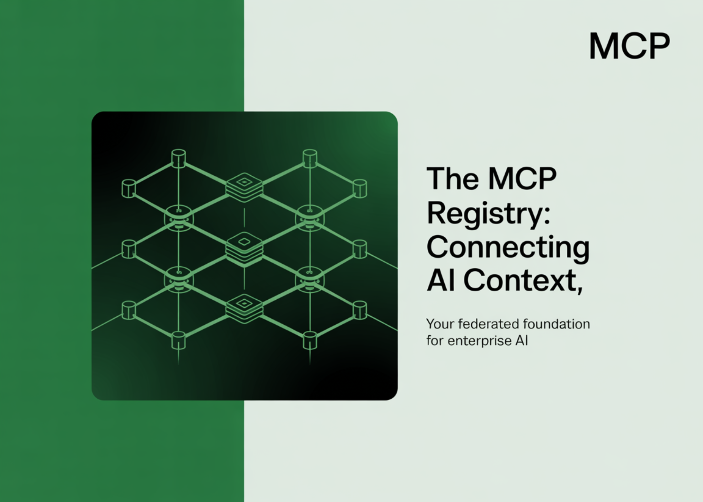

# MCP Team Launches the Preview Version of the ‘MCP Registry’: A Federated Discovery Layer for Enterprise AI

> The Model Context Protocol (MCP) team has released the preview version of the MCP Registry, a system that could be the final puzzle piece for making enterprise AI truly production-ready. More than just a catalog, the MCP Registry introduces a federated architecture for discovering MCP servers—public or private—that mirrors how the internet itself solved addressability […]

### Table of contents

- [The Registry as DNS for AI Context](#h-the-registry-as-dns-for-ai-context)
- [Why the Federated Model Works ?](#h-why-the-federated-model-works)
- [Architecture, Moderation, and Open Source Foundation](#h-architecture-moderation-and-open-source-foundation)
- [Summary](#h-summary)
- [FAQs](#h-faqs)

The Model Context Protocol (MCP) team has released the [preview version](https://blog.modelcontextprotocol.io/posts/2025-09-08-mcp-registry-preview/) of the **[MCP Registry](https://github.com/modelcontextprotocol/registry/tree/main/docs)**, a system that could be the final puzzle piece for making enterprise AI truly production-ready. More than just a catalog, the MCP Registry introduces a federated architecture for discovering MCP servers—public or private—that mirrors how the internet itself solved addressability decades ago.

### The Registry as DNS for AI Context

At its core, the MCP Registry functions as the **DNS of AI context**. It provides a global, public directory where companies like GitHub or Atlassian can publish MCP servers, while also offering enterprises a standardized way to run private sub-registries. This dual-layer approach creates a secure “front door” to the broader MCP ecosystem without compromising internal privacy.

A single, monolithic registry would have created untenable security and compliance risks. By contrast, the federated model strikes the balance enterprises need: an authoritative upstream source of truth, and the flexibility to extend or restrict it with organization-specific rules.

### Why the Federated Model Works?

Enterprises operate in hybrid environments—bridging internal systems with external services. The registry’s design acknowledges that reality and enables use cases that were previously were not easily possible:

- **Secure Internal Discovery**: Teams can discover and consume internal servers (e.g., “customer support context”) without exposing private infrastructure to the internet.

- **Centralized Governance**: Enterprises can enforce which external MCP servers are accessible, with full audit trails for compliance.

- **Reduced Context Sprawl**: Instead of bespoke, ad hoc integrations, teams align around a single protocol and governance layer.

- **Hybrid AI Agents**: Agents can seamlessly query both private data (via internal MCP servers) and public documentation (via GitHub’s MCP server) within the same framework.

The result is a governed, extensible infrastructure layer that unifies AI agent connectivity across boundaries.

### Architecture, Moderation, and Open Source Foundation

The MCP Registry is an **open project** with a permissive license and now available in preview, managed by the MCP registry working group. It offers an upstream API specification that sub-registries can inherit, ensuring interoperability. Public “marketplaces” can augment the upstream data for specific client needs, while private enterprise registries can enforce internal policies.

### Summary

For enterprises, the stable version of the MCP Registry can provide the missing connective tissue between private context and public AI infrastructure. It can eliminate the fragmentation and risk of uncontrolled integrations by standardizing discovery and governance. This architecture scales securely—because it distributes responsibility while maintaining a single upstream source of truth.

**The MCP Registry is now available in preview. To get started:**

- **Add your server** by following the guide on [Adding Servers to the MCP Registry](https://github.com/modelcontextprotocol/registry/blob/main/docs/guides/publishing/publish-server.md) (for server maintainers)

- **Access server data** by following the guide on [Accessing MCP Registry Data](https://github.com/modelcontextprotocol/registry/blob/main/docs/guides/consuming/use-rest-api.md) (for client maintainers)

---

### FAQs

**FAQ 1: What is the MCP Registry?**
The MCP Registry is a global directory and API for discovering MCP servers. It acts like DNS for AI context, enabling both public catalogs and enterprise sub-registries.

**FAQ 2: Why does the registry use a federated model instead of a single global registry?**
A single registry would create compliance and security risks. The federated model allows enterprises to run private sub-registries while relying on a shared upstream source of truth.

**FAQ 3: How can enterprises benefit from the MCP Registry?**
Enterprises gain secure internal discovery, centralized governance of external servers, prevention of context sprawl, and support for hybrid AI agents.

**FAQ 4: Is the MCP Registry open source?**
Yes. It is an official MCP project, open source and permissively licensed, with APIs and specifications available for sub-registry development.

**FAQ 5: Is the MCP Registry generally available?**
Not yet. The MCP Registry is currently in preview mode, meaning features may change and no durability guarantees are provided until general availability.
