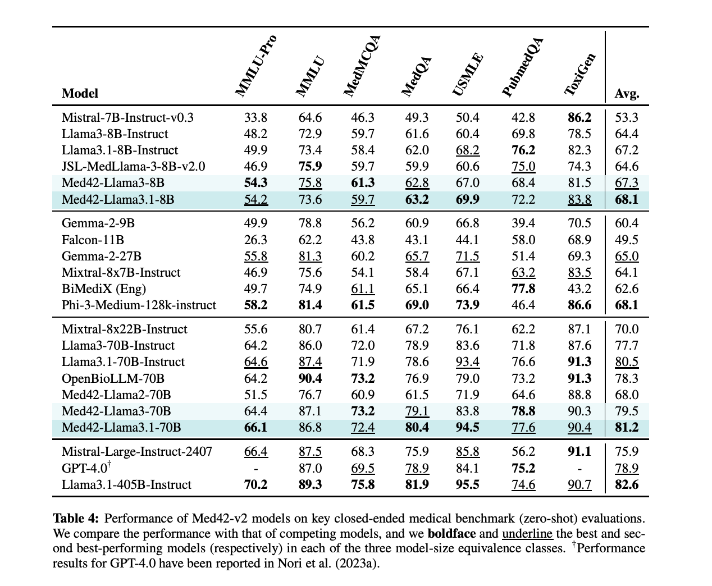

# Med42-v2 Released: A Groundbreaking Suite of Clinical Large Language Models Built on Llama3 Architecture, Achieving Up to 94.5% Accuracy on Medical Benchmarks

> Healthcare artificial intelligence (AI) is rapidly advancing, with large language models (LLMs) emerging as powerful tools to transform various aspects of clinical practice. These models, capable of understanding and generating human language, are particularly promising in addressing complex medical queries, enhancing patient communication, and supporting clinical decision-making. However, while LLMs have shown remarkable potential across […]

Healthcare artificial intelligence (AI) is rapidly advancing, with large language models (LLMs) emerging as powerful tools to transform various aspects of clinical practice. These models, capable of understanding and generating human language, are particularly promising in addressing complex medical queries, enhancing patient communication, and supporting clinical decision-making. However, while LLMs have shown remarkable potential across different domains, their application in healthcare remains challenging due to the need for domain-specific knowledge, accuracy, and adherence to ethical standards. This is where specialized models, such as the Med42-v2 suite of clinical LLMs, come into play.

A significant challenge in deploying AI in healthcare is that most generic language models need more depth of understanding to be truly effective in clinical settings. These models often need help with the intricate medical terminology and the nuanced reasoning required to navigate complex clinical scenarios. Furthermore, they may introduce errors, such as hallucinations, biases, and ethical concerns, that can compromise their utility in medical applications. Addressing these shortcomings is critical for successfully integrating AI into healthcare systems.

Due to their broad capabilities, generic LLMs, such as GPT-4, have been employed in various industries, including healthcare. However, these models must catch up in clinical environments where precision and reliability are paramount. The limitations of generic models become particularly evident in high-stakes situations where incorrect or biased information can have serious consequences. Therefore, the development of LLMs tailored specifically for the healthcare domain has become an essential focus for researchers aiming to improve the safety and effectiveness of AI in medicine.

Researchers from M42 Abu Dhabi, UAE, have introduced the [**Med42-v2**](https://huggingface.co/m42-health), a suite of clinical LLMs built on the advanced Llama3 architecture. Developed by the team at M42 in Abu Dhabi, these models are meticulously fine-tuned using specialized clinical datasets, making them particularly adept at handling medical queries. Unlike generic models, which are often preference-aligned to avoid answering clinical questions, Med42-v2 is specifically trained to engage with such queries, ensuring that it can provide relevant and accurate information to clinicians, patients, & other stakeholders in the healthcare sector.

The development of Med42-v2 involved a two-stage training process designed to optimize the models for clinical use. The Llama3 models were fine-tuned in the first stage using a curated dataset that included medical and biomedical information, chain-of-thought reasoning, and conversational examples. This stage accounted for 26.5% of the final training dataset and enhanced the models’ ability to understand and generate responses relevant to clinical contexts. The second stage focused on preference alignment, ensuring the models’ outputs aligned with human expectations and ethical standards. This stage utilized datasets such as UltraFeedback and Snorkel-DPO, allowing the models to be iteratively refined to meet clinical requirements.

The performance of Med42-v2 models has been rigorously tested across a range of medical benchmarks, demonstrating their superiority over their Llama3 predecessors and other leading models like GPT-4. For instance, in zero-shot evaluations on key benchmarks such as the USMLE, MedMCQA, and PubmedQA, the 70B parameter configuration of Med42-v2 consistently outperformed other models, achieving scores as high as 94.5% on some tasks. These results highlight the effectiveness of the model’s specialized training in enhancing its clinical reasoning capabilities and its potential to improve AI-driven decision support in healthcare significantly.

In conclusion, the Med42-v2 suite offers a solution tailored to healthcare needs by overcoming the limitations of generic models. Its superior performance across various benchmarks underscores its potential to revolutionize clinical decision-making, patient care, and medical research. Through continued development and rigorous testing, Med42-v2 is poised to become an integral component of the future of healthcare, providing critical support in high-stakes environments where precision and reliability are non-negotiable.

---

Check out the **[Paper](https://arxiv.org/abs/2408.06142)** and **[Model Card](https://huggingface.co/m42-health)**. All credit for this research goes to the researchers of this project. Also, don’t forget to follow us on **[Twitter](https://twitter.com/Marktechpost)** and join our **[Telegram Channel](https://pxl.to/at72b5j)** and [**LinkedIn Gr**](https://www.linkedin.com/groups/13668564/)[**oup**](https://www.linkedin.com/groups/13668564/). **If you like our work, you will love our**[** newsletter..**](https://marktechpost-newsletter.beehiiv.com/subscribe)

Don’t Forget to join our **[48k+ ML SubReddit](https://www.reddit.com/r/machinelearningnews/)**

**Find Upcoming [AI Webinars here](https://www.marktechpost.com/ai-webinars-list-llms-rag-generative-ai-ml-vector-database/)**

---

> [Arcee AI Released DistillKit: An Open Source, Easy-to-Use Tool Transforming Model Distillation for Creating Efficient, High-Performance Small Language Models](https://www.marktechpost.com/2024/08/01/arcee-ai-released-distillkit-an-open-source-easy-to-use-tool-transforming-model-distillation-for-creating-efficient-high-performance-small-language-models/)
