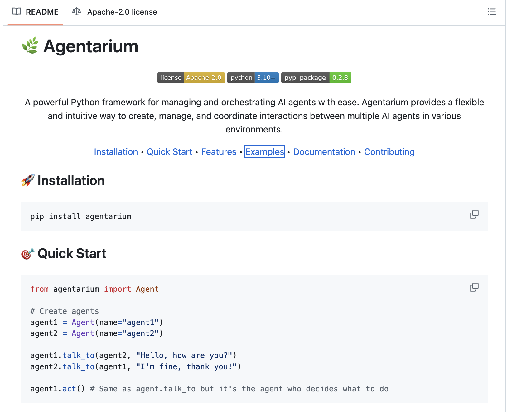

# Meet Agentarium: A Powerful Python Framework for Managing and Orchestrating AI Agents

> AI agents have become an integral part of modern industries, automating tasks and simulating complex systems. Despite their potential, managing multiple AI agents, especially those with diverse roles, can be challenging. Developers often face issues such as inefficient communication protocols, difficulties in maintaining agent states, and limited scalability in large-scale setups. Additionally, generating synthetic data […]

AI agents have become an integral part of modern industries, automating tasks and simulating complex systems. Despite their potential, managing multiple AI agents, especially those with diverse roles, can be challenging. Developers often face issues such as inefficient communication protocols, difficulties in maintaining agent states, and limited scalability in large-scale setups. Additionally, generating synthetic data through agent interactions and configuring environments for testing can be labor-intensive. These obstacles highlight the need for a cohesive framework to simplify and optimize AI agent systems.

### Meet Agentarium

**[Agentarium is a Python framework that aims to tackle these challenges by offering a unified platform for managing and orchestrating AI agents.](https://github.com/Thytu/Agentarium?tab=readme-ov-file)** It enables developers to create, manage, and coordinate AI agents effectively while providing tools to streamline their workflows. Key features include role-based agent management, checkpointing for saving and restoring agent states, and synthetic data generation—all within a single, cohesive framework.

A notable strength of Agentarium is its flexibility. Developers can use YAML configuration files to define custom environments, offering precise control over agent interactions. This makes the framework suitable for a wide range of applications, including multi-agent simulations, synthetic data generation for AI training, and managing complex workflows.

### Technical Details and Benefits

Agentarium provides several features that address common challenges in AI agent development:

- **Advanced Agent Management:** The framework supports the creation and orchestration of multiple AI agents with distinct roles, enabling modular and maintainable designs.

- **Interaction Management:** It facilitates seamless coordination of complex interactions between agents, improving efficiency and reducing errors.

- **Checkpoint System:** The ability to save and restore agent states helps mitigate risks and ensures progress is not lost during testing.

- **Synthetic Data Generation:** Agentarium’s tools for generating data through agent interactions are invaluable for training and testing AI models.

- **Performance Optimization:** Designed for scalability, the framework efficiently handles large-scale agent systems without compromising on performance.

- **Extensibility:** Its modular architecture allows developers to customize the framework for specific project requirements.

### Conclusion

Agentarium offers a practical and efficient solution for managing and orchestrating AI agents. Its thoughtful design addresses the common pain points faced by developers, from managing interactions to generating synthetic data. The framework’s flexibility and scalability make it well-suited to a variety of applications, helping developers build robust and adaptable AI systems.

As AI technologies continue to advance, tools like Agentarium will play a critical role in simplifying development processes and expanding the capabilities of AI agents. By streamlining workflows and providing robust tools, Agentarium positions itself as an essential framework for developers aiming to optimize their AI projects.

---

Check out **_the [GitHub Repo](https://github.com/Thytu/Agentarium?tab=readme-ov-file)_**. All credit for this research goes to the researchers of this project. Also, don’t forget to follow us on **[Twitter](https://twitter.com/Marktechpost)** and join our **[Telegram Channel](https://github.com/XGenerationLab/XiYan-SQL)** and [**LinkedIn Gr**](https://www.linkedin.com/groups/13668564/)[**oup**](https://www.linkedin.com/groups/13668564/). Don’t Forget to join our **[60k+ ML SubReddit](https://www.reddit.com/r/machinelearningnews/)**.

**🚨 FREE UPCOMING AI WEBINAR (JAN 15, 2025): [Boost LLM Accuracy with Synthetic Data and Evaluation Intelligence](https://info.gretel.ai/boost-llm-accuracy-with-sd-and-evaluation-intelligence?utm_source=marktechpost&utm_medium=newsletter&utm_campaign=202501_gretel_galileo_webinar)**–**[Join this webinar to gain actionable insights into boosting LLM model performance and accuracy while safeguarding data privacy](https://info.gretel.ai/boost-llm-accuracy-with-sd-and-evaluation-intelligence?utm_source=marktechpost&utm_medium=newsletter&utm_campaign=202501_gretel_galileo_webinar).**
