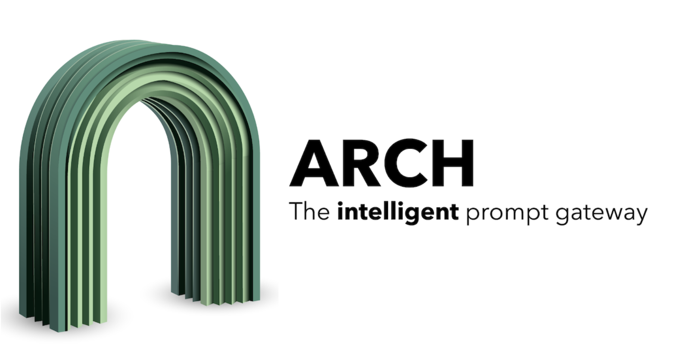

# Meet Arch 0.1.3: Open-Source Intelligent Proxy for AI Agents

> The integration of AI agents into various workflows has increased the need for intelligent coordination, data routing, and enhanced security among systems. As these agents proliferate, ensuring secure, reliable, and efficient communication between them has become a pressing challenge. Traditional approaches, such as static proxies, often fall short in handling the intelligent routing, adaptation, and […]

The integration of AI agents into various workflows has increased the need for intelligent coordination, data routing, and enhanced security among systems. As these agents proliferate, ensuring secure, reliable, and efficient communication between them has become a pressing challenge. Traditional approaches, such as static proxies, often fall short in handling the intelligent routing, adaptation, and flexibility required by modern agent architectures. These challenges call for a solution that understands the unique requirements of agent-to-agent interactions, offers scalability, and adapts to the diverse nature of AI-powered environments.

Arch 0.1.3 has been released as an open-source, intelligent proxy for agents, built on Envoy, to address these challenges. Designed as an agent gateway, Arch functions as an intermediary, facilitating secure and efficient communication between AI agents. Built on the reliable Envoy proxy—a high-performance edge and service proxy—Arch leverages Envoy’s capabilities while adding features specifically for AI-driven agent scenarios. The open-source nature of Arch allows developers to customize the tool to their needs, enabling broad adoption and collaborative growth within the community.

### Technical Details and Features

Arch 0.1.3 extends Envoy’s robust proxy capabilities with AI-centric features, providing a specialized solution. At its core, Arch is an agent proxy that enables contextual routing, protocol translation, and efficient data management between agents. One of the key features of Arch 0.1.3 is its capacity for dynamic behavior, meaning it can adapt routing policies based on agent states and specific contexts. This adaptability ensures optimized communication while avoiding traditional bottlenecks.

Another technical capability of Arch is its powerful API that allows real-time monitoring and customizable integrations. It provides efficient load balancing between multiple agents, which is critical in large-scale deployments. Additionally, Arch introduces an easy-to-use configuration mechanism, supporting both YAML and JSON formats, making it accessible for developers to quickly set up and deploy intelligent proxy solutions.

Arch 0.1.3 is important because the evolution of agents into interconnected workflows has made intelligent routing an essential aspect of system design. This release provides a sophisticated solution for problems such as agent communication failures, lack of context-aware routing, and scaling challenges. The intelligent routing offered by Arch translates to fewer message losses and reduced latencies, making real-time systems more reliable.

According to data shared by the development team, in controlled tests, Arch reduced agent communication latency by approximately 30% compared to traditional proxy setups. This kind of improvement is significant in environments requiring tight coordination between distributed agents, such as autonomous systems or financial transaction monitoring. The benefit of using Arch lies not only in its adaptability and performance enhancements but also in its commitment to community-driven development, encouraging contributions to further advance its capabilities.

### Conclusion

Arch 0.1.3 represents a meaningful development in intelligent agent communication. By combining the stability and power of Envoy with specialized AI-centric features, Arch addresses the need for adaptable, reliable, and efficient data routing between agents. The open-source release encourages the developer community to experiment and enhance this gateway, making it a promising solution for improving the efficiency of AI-driven workflows. Whether for smaller research projects or scaling complex multi-agent systems, Arch is positioned as a flexible tool that meets the needs of modern agent architectures, offering a reliable solution for agent-to-agent communication.

---

Check out the **[GitHub Page](https://github.com/katanemo/archgw)**. All credit for this research goes to the researchers of this project. Also, don’t forget to follow us on **[Twitter](https://twitter.com/Marktechpost)** and join our **[Telegram Channel](https://github.com/XGenerationLab/XiYan-SQL)** and [**LinkedIn Gr**](https://www.linkedin.com/groups/13668564/)[**oup**](https://www.linkedin.com/groups/13668564/). **If you like our work, you will love our**[** newsletter..**](https://marktechpost-newsletter.beehiiv.com/subscribe) Don’t Forget to join our **[55k+ ML SubReddit](https://www.reddit.com/r/machinelearningnews/)**.

**[[FREE AI VIRTUAL CONFERENCE](https://predibase.com/smallcon?utm_medium=3rdparty&utm_source=marktechpost)] ****[SmallCon: Free Virtual GenAI Conference ft. Meta, Mistral, Salesforce, Harvey AI & more](https://predibase.com/smallcon?utm_medium=3rdparty&utm_source=marktechpost)**. _[Join us on Dec 11th for this free virtual event to learn what it takes to build big with small models from AI trailblazers like Meta, Mistral AI, Salesforce, Harvey AI, Upstage, Nubank, Nvidia, Hugging Face, and more.](https://predibase.com/smallcon?utm_medium=3rdparty&utm_source=marktechpost)_
