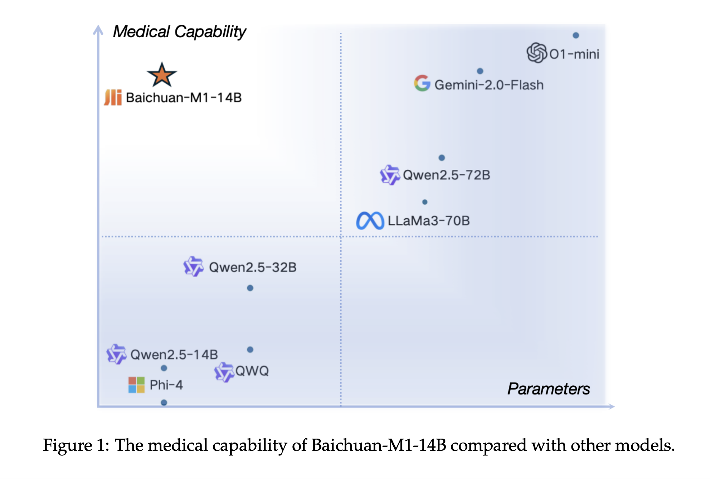

# Meet Baichuan-M1: A New Series of Large Language Models Trained on 20T Tokens with a Dedicated Focus on Enhancing Medical Capabilities

> While LLMs have shown remarkable advancements in general-purpose applications, their development for specialized fields like medicine remains limited. The complexity of medical knowledge and the scarcity of high-quality, domain-specific data make creating highly efficient medical LLMs challenging. Although models like GPT-4 and DeepseekR1 have demonstrated impressive capabilities across industries, their adaptation to the medical domain […]

While LLMs have shown remarkable advancements in general-purpose applications, their development for specialized fields like medicine remains limited. The complexity of medical knowledge and the scarcity of high-quality, domain-specific data make creating highly efficient medical LLMs challenging. Although models like GPT-4 and DeepseekR1 have demonstrated impressive capabilities across industries, their adaptation to the medical domain is hindered by the intricate nature of medical terminology, diverse disciplines, and constantly evolving literature. Unlike general applications, medical AI must interpret highly technical language and provide precise, contextually relevant responses, which traditional LLMs struggle to achieve.

One major obstacle in building effective medical LLMs is the limited accessibility of high-quality training data, which is restricted due to privacy concerns and regulatory barriers. Medical datasets consist of structured and unstructured information, including clinical notes, textbooks, and research articles, making comprehensive model training difficult. While approaches like fine-tuning general LLMs on medical datasets and applying transfer learning have been explored, these methods often fail to grasp the depth of medical knowledge fully. As a result, such models may perform well on specific tasks but lack the nuanced understanding necessary for complex medical inquiries, highlighting the need for more refined training strategies.

Researchers at Baichuan Inc. introduced Baichuan-M1, a specialized [large language model](https://www.marktechpost.com/2025/01/11/what-are-large-language-model-llms/) series designed specifically for medical applications. Unlike traditional models that refine existing architectures through additional pretraining or post-training, Baichuan-M1 is built from scratch with a strong focus on medical expertise. Trained on 20 trillion tokens, including both general and medical-specific data, the model balances broad language understanding with domain-specific precision. It excels in general tasks like coding and mathematics and in medical applications such as diagnostics and treatment recommendations. With an optimized Transformer architecture, Baichuan-M1 sets a new benchmark for AI-driven advancements in healthcare.

The model architecture follows Llama and similar frameworks, incorporating pre-norm RMSNorm, SwishGlu in the FFN layer, and rotary position embeddings. The study integrates global and sliding window attention to optimize inference efficiency, increasing the head dimension to 256 for global layers. Additionally, temporal short convolutions on key-value attention enhance in-context learning. The model employs a hybrid tokenizer for medical and general text, a curriculum-based training strategy with progressive data complexity, and adaptive gradient clipping for stability. Supervised fine-tuning refines general reasoning and medical-specific tasks, ensuring robust language understanding, medical reasoning, and long-document handling capabilities while maintaining inference efficiency.

Using various benchmarks, baichuan-M1-14B-Base’s code and mathematical abilities were evaluated against the Qwen2.5 series models. Code generation performance was tested with the EvalPlus framework and Bigcodebench, while mathematical proficiency was assessed using MATH and CMATH datasets. Although the 14B-Instruct variant still lags behind proprietary models like Claude-3.5-Sonnet and GPT-4o, the gap has narrowed significantly. The results demonstrate that Baichuan-M1-14B-Base performs competitively in certain tasks, showcasing its code generation and mathematical reasoning strengths compared to other advanced models.

In conclusion, Traditional methods for adapting LLMs to specialized fields often involve fine-tuning existing models. However, experiments suggest that further training on pre-existing models can hinder domain-specific improvements without sacrificing general performance. In the medical domain, fine-tuning general models with domain-specific data may be less effective than training from scratch. Baichuan-M1 was developed with this approach, using 20 trillion tokens to enhance medical expertise while maintaining general capabilities. Open-sourcing Baichuan-M1-14B allows further research, though challenges remain in rare disease diagnosis and real-world applications. Its continued evolution could significantly advance AI-driven medical decision-making.

---

Check out **_the [Paper](https://arxiv.org/abs/2502.12671), [Baichuan-M1-14B-Base](https://huggingface.co/baichuan-inc/Baichuan-M1-14B-Base)_** and **_[Baichuan-M1-14B-Instruct](https://huggingface.co/baichuan-inc/Baichuan-M1-14B-Instruct)._** All credit for this research goes to the researchers of this project. Also, feel free to follow us on **[Twitter](https://x.com/intent/follow?screen_name=marktechpost)** and don’t forget to join our **[75k+ ML SubReddit](https://www.reddit.com/r/machinelearningnews/)**.

**🚨 [Recommended Read- LG AI Research Releases NEXUS: An Advanced System Integrating Agent AI System and Data Compliance Standards to Address Legal Concerns in AI Datasets](https://www.marktechpost.com/2025/02/16/lg-ai-research-releases-nexus-an-advanced-system-integrating-agent-ai-system-and-data-compliance-standards-to-address-legal-concerns-in-ai-datasets/)**
