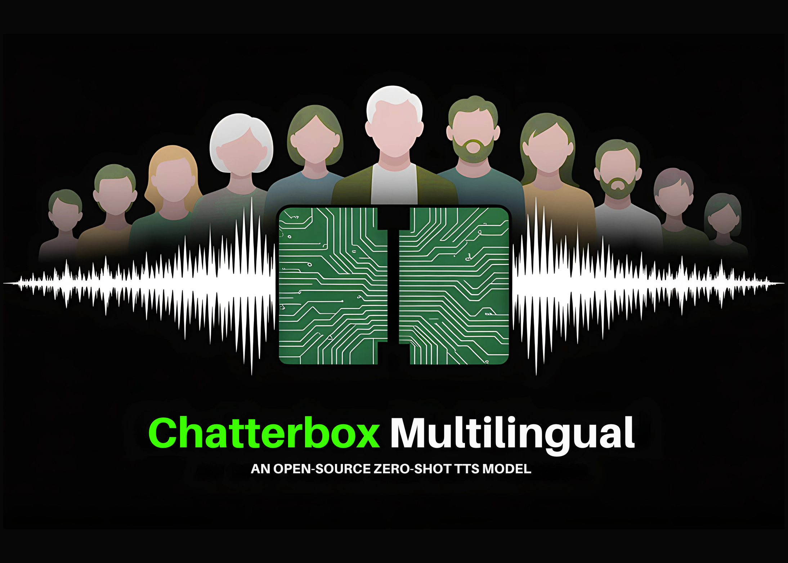

# Meet Chatterbox Multilingual: An Open-Source Zero-Shot Text To Speech (TTS) Multilingual Model with Emotion Control and Watermarking

> Resemble AI has recently released Chatterbox Multilingual, a production grade open-source Text To Speech (TTS) model designed for zero-shot voice cloning in 23 languages. It is distributed under the MIT license, making it freely available for integration and modification. The system builds on the original Chatterbox framework and adds multilingual capability, expressive controls, and built-in […]

### Table of contents

- [What does Chatterbox Multilingual offer?](#h-what-does-chatterbox-multilingual-offer)
- [How does it compare with commercial systems?](#h-how-does-it-compare-with-commercial-systems)
- [How is expressive control implemented?](#h-how-is-expressive-control-implemented)
- [How does watermarking contribute to responsible AI usage?](#h-how-does-watermarking-contribute-to-responsible-ai-usage)
- [What deployment options are available?](#h-what-deployment-options-are-available)
- [What is the significance of Chatterbox Multilingual open release?](#h-what-is-the-significance-of-chatterbox-multilingual-open-release)

Resemble AI has recently released **Chatterbox Multilingual**, a production grade open-source Text To Speech (TTS) model designed for **zero-shot voice cloning** in **23 languages**. It is distributed under the **MIT license**, making it freely available for integration and modification. The system builds on the original Chatterbox framework and adds multilingual capability, expressive controls, and built-in watermarking for traceability.

### What does Chatterbox Multilingual offer?

Chatterbox Multilingual enables **voice cloning without retraining** by leveraging zero-shot learning. You can easily generate a synthetic voice using a short audio sample that captures the speaker’s features/characteristics. It supports **23 languages**, including Arabic, Hindi, Chinese, Swahili, and other widely spoken languages, giving it coverage across diverse linguistic families.

Apart from basic voice cloning, the model integrates **emotion and intensity controls**, which allow users to specify not just what is said, but also how it is delivered. The model also includes **PerTh watermarking** by default to ensures that every output can be authenticated through neural watermark extraction. These features make the model suitable for tasks where both accuracy and security are important.

### How does it compare with commercial systems?

Evaluations indicate that Chatterbox Multilingual performs competitively with most commercial TTS models. In **[blind A/B tests conducted on Podonos](https://www.podonos.com/resembleai/chatterbox-multilingual-german?tab=analysis)**, listeners expressed a **63.75% preference** for Chatterbox over ElevenLabs. This suggests that in certain conditions, users found Chatterbox outputs closer to natural or accurate speech reproduction.

*https://www.resemble.ai/chatterbox/*

It is worth noting that while some reported numbers compare performance on specific languages such as German, the only verifiable public metric is the Podonos listener preference result. This makes preference-based benchmarking the most reliable evidence currently available.

### How is expressive control implemented?

Chatterbox Multilingual not only reproduce voice identity but also provides tools for **controlling delivery style**. The model allows adjustment of **emotion categories** such as happy, sad, or angry, and includes an **exaggeration parameter** to regulate intensity. This means a cloned voice can be made more enthusiastic, subdued, or dramatic depending on context.

Such flexibility is useful in **interactive media, dialog agents, gaming, and assistive technologies**, where emotional nuance affects the effectiveness of communication. Rather than producing static or neutral speech, the system can generate output that adapts to context-specific needs.

### How does watermarking contribute to responsible AI usage?

Every file generated by Chatterbox Multilingual contains **PerTh (Perceptual Threshold) watermarking**, a neural technique developed by Resemble AI. The watermark is **inaudible to listeners** but can be extracted using the provided open-source detector. This enables traceability and verification of generated content, an increasingly important factor as synthetic audio becomes more widespread.

By embedding watermarking at the system level and keeping it always active, Chatterbox helps mitigate risks of misuse without requiring external enforcement mechanisms. This design choice aligns with ongoing discussions about the ethics of generative audio systems.

### What deployment options are available?

The open-source release provides a **baseline system** that can be installed and run by researchers, developers, or hobbyists under the permissive MIT license. For environments where **high concurrency, latency targets, or compliance guarantees** are necessary, Resemble AI offers a managed variant called **Chatterbox Multilingual Pro**.

This hosted version supports **sub-200 ms latency**, **fine-tuned voices**, and includes **SLAs (service-level agreements)** along with compliance features required in enterprise deployments. While the open-source project serves as a general foundation, the Pro service is aimed at production workloads with operational constraints.

### What is the significance of Chatterbox Multilingual open release?

Chatterbox Multilingual contributes a **multilingual, open, and controllable voice cloning system** to the speech synthesis community. It integrates **zero-shot cloning**, **expressivity controls**, and **watermarking** in a framework that is both technically advanced and freely available.

Performance studies suggest it is competitive with leading proprietary solutions, offering a practical platform for further research and application development. Its open-source license makes it accessible to a broad range of users, from academic researchers to independent developers, strengthening the ecosystem of multilingual speech synthesis tools.

---

Check out the **[GitHub Page](https://github.com/resemble-ai/chatterbox?tab=readme-ov-file)_._** Feel free to check out our **[GitHub Page for Tutorials, Codes and Notebooks](https://github.com/Marktechpost/AI-Tutorial-Codes-Included)**. Also, feel free to follow us on **[Twitter](https://x.com/intent/follow?screen_name=marktechpost)** and don’t forget to join our **[100k+ ML SubReddit](https://www.reddit.com/r/machinelearningnews/)** and Subscribe to **[our Newsletter](https://www.aidevsignals.com/)**.
