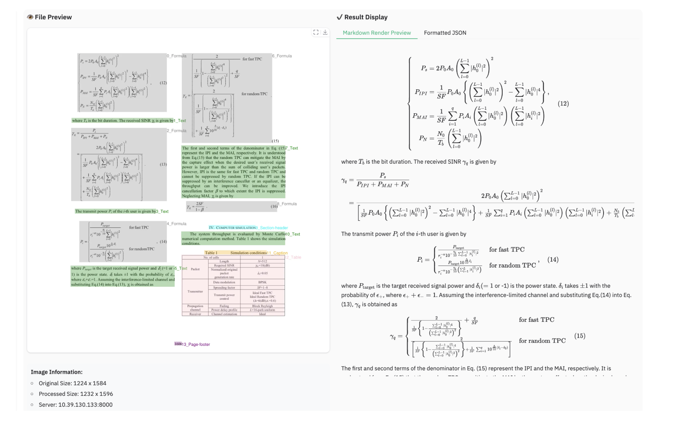

# Meet dots.ocr: A New 1.7B Vision-Language Model that Achieves SOTA Performance on Multilingual Document Parsing

> dots.ocr is an open-source vision-language transformer model developed for multilingual document layout parsing and optical character recognition (OCR). It performs both layout detection and content recognition within a single architecture, supporting over 100 languages and a wide variety of structured and unstructured document types. Architecture Capabilities Benchmark Performance dots.ocr has been evaluated against modern document […]

**[dots.ocr](https://github.com/rednote-hilab/dots.ocr?tab=readme-ov-file)** is an open-source vision-language transformer model developed for multilingual document layout parsing and optical character recognition (OCR). It performs both layout detection and content recognition within a single architecture, supporting over 100 languages and a wide variety of structured and unstructured document types.

### Architecture

- **Unified Model:** dots.ocr combines layout detection and content recognition into a single transformer-based neural network. This eliminates the complexity of separate detection and OCR pipelines, allowing users to switch tasks by adjusting input prompts.

- **Parameters:** The model contains 1.7 billion parameters, balancing computational efficiency with performance for most practical scenarios.

- **Input Flexibility:** Inputs can be image files or PDF documents. The model features preprocessing options (such as fitz_preprocess) for optimizing quality on low-resolution or dense multi-page files.

### Capabilities

- **Multilingual:** dots.ocr is trained on datasets spanning more than 100 languages, including major world languages and less common scripts, reflecting broad multilingual support.

- **Content Extraction:** The model extracts plain text, tabular data, mathematical formulas (in LaTeX), and preserves reading order within documents. Output formats include structured JSON, Markdown, and HTML, depending on the layout and content type.

- **Preserves Structure:** dots.ocr maintains document structure, including table boundaries, formula regions, and image placements, ensuring extracted data remains faithful to the original document.

### Benchmark Performance

dots.ocr has been evaluated against modern document AI systems, with results summarized below:

Benchmarkdots.ocrGemini2.5-ProTable TEDS accuracy88.6%85.8%Text edit distance0.0320.055

- **Tables:** Outperforms Gemini2.5-Pro in table parsing accuracy.

- **Text:** Demonstrates lower text edit distance (indicating higher precision).

- **Formulas and Layout:** Matches or exceeds leading models in formula recognition and document structure reconstruction.

*https://github.com/rednote-hilab/dots.ocr/blob/master/assets/blog.md*

### Deployment and Integration

- **Open-Source:** Released under the MIT license, with source, documentation, and pre-trained models available on GitHub. The repository provides installation instructions for pip, Conda, and Docker-based deployments.

- **API and Scripting:** Supports flexible task configuration via prompt templates. The model can be used interactively or within automated pipelines for batch document processing.

- **Output Formats:** Extracted results are supplied in structured JSON for programmatic use, with options for Markdown and HTML where appropriate. Visualization scripts enable inspection of detected layouts.

### Conclusion

dots.ocr provides a technical solution for high-accuracy, multilingual document parsing by unifying layout detection and content recognition in a single, open-source model. It is particularly suited for scenarios requiring robust, language-agnostic document analysis and structured information extraction in resource-constrained or production environments.

---

Check out the **[GitHub Page](https://github.com/rednote-hilab/dots.ocr?tab=readme-ov-file)**. Feel free to check out our **[GitHub Page for Tutorials, Codes and Notebooks](https://github.com/Marktechpost/AI-Tutorial-Codes-Included)**. Also, feel free to follow us on **[Twitter](https://x.com/intent/follow?screen_name=marktechpost)** and don’t forget to join our **[100k+ ML SubReddit](https://www.reddit.com/r/machinelearningnews/)** and Subscribe to **[our Newsletter](https://www.aidevsignals.com/)**.

[Partner with Marktechpost for Promotion](https://95xaxi6d7td.typeform.com/to/jhs8ftBd)
