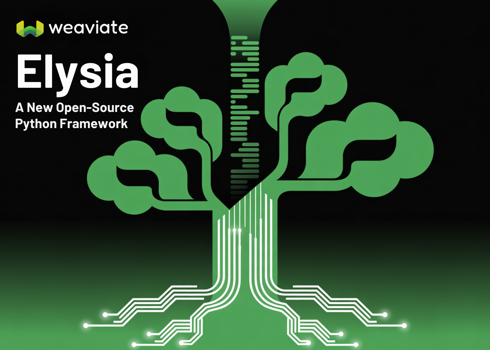

# Meet Elysia: A New Open-Source Python Framework Redefining Agentic RAG Systems with Decision Trees and Smarter Data Handling

> If you’ve ever tried to build a agentic RAG system that actually works well, you know the pain. You feed it some documents, cross your fingers, and hope it doesn’t hallucinate when someone asks it a simple question. Most of the time, you get back irrelevant chunks of text that barely answer what was asked. […]

If you’ve ever tried to build a agentic RAG system that actually works well, you know the pain. You feed it some documents, cross your fingers, and hope it doesn’t hallucinate when someone asks it a simple question. Most of the time, you get back irrelevant chunks of text that barely answer what was asked.

**Elysia** is trying to fix this mess, and honestly, their approach is quite creative. Built by the folks at Weaviate, this open-source Python framework doesn’t just throw more AI at the problem – it completely rethinks how AI agents should work with your data.

**Note**: Python 3.12 required

## What’s Actually Wrong with Most RAG Systems

Here’s the thing that drives everyone crazy: traditional RAG systems are basically **blind**. They take your question, convert it to vectors, find some “similar” text, and hope for the best. It’s like asking someone to find you a good restaurant while they’re wearing a blindfold – they might get lucky, but probably not.

Most systems also dump every possible tool on the AI at once, which is like giving a toddler access to your entire toolbox and expecting them to build a bookshelf.

## Elysia’s Three Pillars:

### 1) Decision Trees

Instead of giving AI agents every tool at once, Elysia guides them through a **structured nodes for decisions**. Think of it like a flowchart that actually makes sense. Each step has context about what happened before and what options come next.

The really cool part? The system shows you exactly which path the agent took and why, so when something goes wrong, you can actually debug it instead of just shrugging and trying again.

When the AI realizes it can’t do something (like searching for car prices in a makeup database), it doesn’t just keep trying forever. It sets an “impossible flag” and moves on, which sounds obvious but apparently needed to be invented.

### 2) Smart Data Source Display

Remember when every AI just spat out paragraphs of text? Elysia actually **looks at your data** and figures out how to show it properly. Got e-commerce products? You get product cards. GitHub issues? You get ticket layouts. Spreadsheet data? You get actual tables.

The system examines your data structure first – the fields, the types, the relationships – then picks one of the **seven** **formats **that makes sense.

### 3) Data Expertise

This might be the biggest difference. Before Elysia searches anything, it **analyzes your database** to understand what’s actually in there. It can summarize, generate metadata, and choose display types. It looks at:

- What kinds of fields you have

- What the data ranges look like

- How different pieces relate to each other

- What would make sense to search for

## How does it Work?


### Learning from Feedback

Elysia remembers when users say “yes, this was helpful” and uses those examples to **improve future responses**. But it does this smartly – your feedback doesn’t mess up other people’s results, and it helps the system get better at answering _your_ specific types of questions.

This means you can use smaller, cheaper models that still give good results because they’re learning from actual success cases.

### Chunking That Makes Sense

Most RAG systems chunk all your documents upfront, which uses tons of storage and often creates weird breaks. Elysia **chunks documents only when needed**. It searches full documents first, then if a document looks relevant but is too long, it breaks it down on the fly.

This saves storage space and actually works better because the chunking decisions are informed by what the user is actually looking for.

### Model Routing

Different tasks need different models. Simple questions don’t need GPT-4, and complex analysis doesn’t work well with tiny models. Elysia **automatically routes tasks** to the right model based on complexity, which saves money and improves speed.

*https://weaviate.io/blog/elysia-agentic-rag*

## Getting Started

The setup is quite simple:

Copy CodeCopiedUse a different Browser
```
pip install elysia-ai
elysia start
```

That’s it. You get both a web interface and the Python framework.

For developers who want to customize things:

Copy CodeCopiedUse a different Browser
```
from elysia import tool, Tree

tree = Tree()

@tool(tree=tree)
async def add(x: int, y: int) -> int:
    return x + y

tree("What is the sum of 9009 and 6006?")

```

If you have Weaviate data, it’s even simpler:

Copy CodeCopiedUse a different Browser
```
import elysia
tree = elysia.Tree()
response, objects = tree(
    "What are the 10 most expensive items in the Ecommerce collection?",
    collection_names = ["Ecommerce"]
)

```

## Real-World Example: Glowe’s Chatbot

The [**Glowe skincare chatbot platform** ](https://weaviate.io/blog/glowe-app)uses Elysia to handle complex product recommendations. Users can ask things like “What products work well with retinol but won’t irritate sensitive skin?” and get intelligent responses that consider ingredient interactions, user preferences, and product availability.youtube

This isn’t just keyword matching – it’s understanding context and relationship between ingredients, user history, and product characteristics in ways that would be really hard to code manually.youtube

## Summary

Elysia represents Weaviate’s attempt to move beyond traditional ask-retrieve-generate RAG patterns by combining decision-tree agents, adaptive data presentation, and learning from user feedback. Rather than just generating text responses, it analyzes data structure beforehand and selects appropriate display formats while maintaining transparency in its decision-making process. As Weaviate’s planned replacement for their Verba RAG system, it offers a foundation for building more sophisticated AI applications that understand both what users are asking and how to present answers effectively, though whether this translates to meaningfully better real-world performance remains to be seen since it is still in beta.

---

Check out the **[TECHNICAL DETAILS](https://weaviate.io/blog/elysia-agentic-rag) **and **[GITHUB PAGE](https://github.com/weaviate/elysia?tab=readme-ov-file).** Feel free to check out our **[GitHub Page for Tutorials, Codes and Notebooks](https://github.com/Marktechpost/AI-Tutorial-Codes-Included)**. Also, feel free to follow us on **[Twitter](https://x.com/intent/follow?screen_name=marktechpost)** and don’t forget to join our **[100k+ ML SubReddit](https://www.reddit.com/r/machinelearningnews/)** and Subscribe to **[our Newsletter](https://www.aidevsignals.com/)**.
