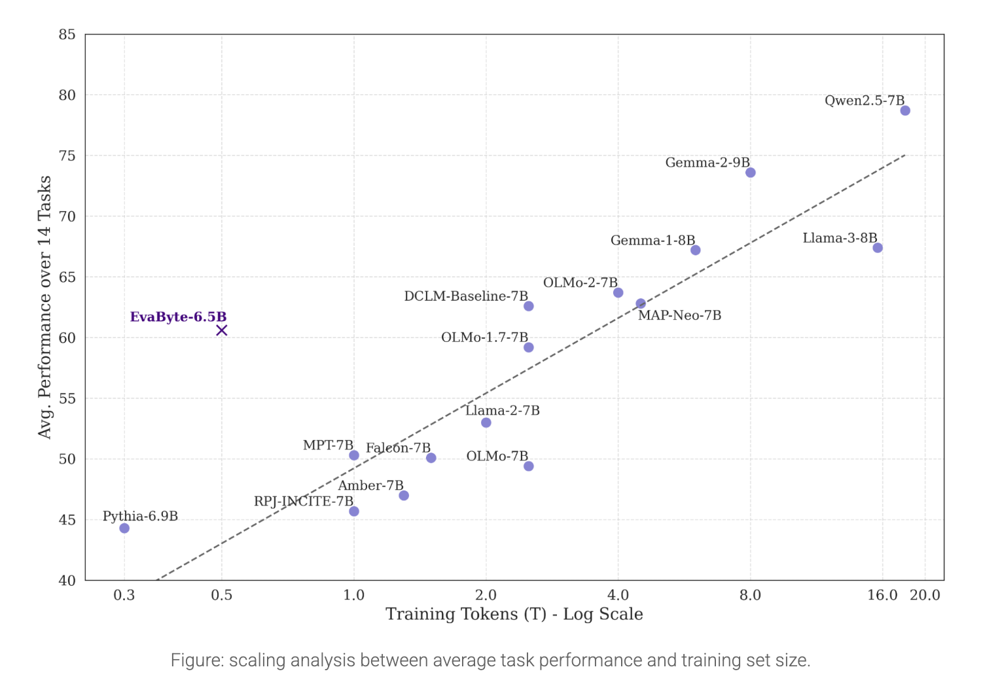

# Meet EvaByte: An Open-Source 6.5B State-of-the-Art Tokenizer-Free Language Model Powered by EVA

> Tokenization, the process of breaking text into smaller units, has long been a fundamental step in natural language processing (NLP). However, it presents several challenges. Tokenizer-based language models (LMs) often struggle with multilingual text, out-of-vocabulary (OOV) words, and inputs like typos, emojis, or mixed-code text. These issues can reduce model robustness and add complexity to […]

Tokenization, the process of breaking text into smaller units, has long been a fundamental step in natural language processing (NLP). However, it presents several challenges. Tokenizer-based language models (LMs) often struggle with multilingual text, out-of-vocabulary (OOV) words, and inputs like typos, emojis, or mixed-code text. These issues can reduce model robustness and add complexity to preprocessing pipelines. Furthermore, tokenization often fails to adapt seamlessly to multimodal tasks, creating inefficiencies and complicating scalability. Addressing these limitations requires moving beyond token-based processing to a more universal and adaptable approach.

**University of Hong Kong Researchers propose EvaByte, an open-source tokenizer-free language model designed to address these challenges. With 6.5 billion parameters, this byte-level model matches the performance of modern tokenizer-based LMs while requiring 5x less data and delivering 2x faster decoding speeds. EvaByte is powered by EVA – an efficient attention mechanism designed for scalability and performance. By processing raw bytes instead of relying on tokenization, EvaByte can handle diverse data formats—including text, images, and audio—with consistency and ease.** This approach eliminates common tokenization issues, such as inconsistent subword splits and rigid encoding boundaries, making it a robust choice for multilingual and multimodal tasks. Additionally, its open-source framework invites collaboration and innovation, making cutting-edge NLP accessible to a wider community.

### Technical Details and Benefits

EvaByte employs a byte-level processing strategy, using raw bytes as the fundamental units for training and inference. This design inherently supports all languages, symbols, and non-textual data without the need for specialized preprocessing. Its 6.5B parameter architecture strikes a balance between computational efficiency and high performance.

**Key benefits of EvaByte include:**

- **Data Efficiency**: The model minimizes redundancy by operating at the byte level, achieving competitive results with significantly smaller datasets.

- **Faster Decoding**: EvaByte’s streamlined architecture enhances inference speed, making it suitable for real-time applications.

- **Multimodal Capabilities**: Unlike traditional LMs, EvaByte extends naturally to multimodal tasks, allowing unified processing of diverse data types.

- **Robustness**: By eliminating tokenization, EvaByte handles a wide range of input formats consistently, improving reliability across applications.

### Results and Insights

EvaByte’s performance is notable. Despite using 5x less data, it achieves comparable results to leading tokenizer-based models in standard NLP benchmarks. Its ability to generalize across languages makes it particularly effective in multilingual scenarios, where it consistently outperforms traditional models. EvaByte also demonstrates strong performance in multimodal tasks like image captioning and audio-text integration, achieving competitive results without extensive fine-tuning.

The open-source release includes pre-trained checkpoints, evaluation tools, and integration with Hugging Face, making it accessible for experimentation and development. Researchers and developers can leverage EvaByte for applications ranging from conversational agents to cross-modal information retrieval, benefiting from its efficiency and versatility.

### Conclusion

EvaByte offers a thoughtful solution to the limitations of traditional tokenization, presenting a tokenizer-free architecture that combines efficiency, speed, and adaptability. By addressing long-standing challenges in NLP and multimodal processing, EvaByte sets a new standard for language models. Its open-source nature fosters collaboration and innovation, ensuring that advanced NLP capabilities are available to a broader audience. For those looking to explore cutting-edge NLP solutions, EvaByte represents a significant step forward in language understanding and generation.

---

Check out **_the [Details](https://hkunlp.github.io/blog/2025/evabyte/), [Models on Hugging Face](https://huggingface.co/collections/linzheng/evabyte-6781cfc1793bdaf579fc4461) and [GitHub Page](https://github.com/OpenEvaByte/evabyte?tab=readme-ov-file)._** All credit for this research goes to the researchers of this project. Also, don’t forget to follow us on **[Twitter](https://x.com/intent/follow?screen_name=marktechpost)** and join our **[Telegram Channel](https://arxiv.org/abs/2406.09406)** and [**LinkedIn Gr**](https://www.linkedin.com/groups/13668564/)[**oup**](https://www.linkedin.com/groups/13668564/). Don’t Forget to join our **[65k+ ML SubReddit](https://www.reddit.com/r/machinelearningnews/)**.

**🚨[ [Recommended Read] Nebius AI Studio expands with vision models, new language models, embeddings and LoRA](https://nebius.com/blog/posts/studio-embeddings-vision-and-language-models?utm_medium=newsletter&utm_source=marktechpost&utm_campaign=embedding-post-ai-studio) **_(Promoted)_
