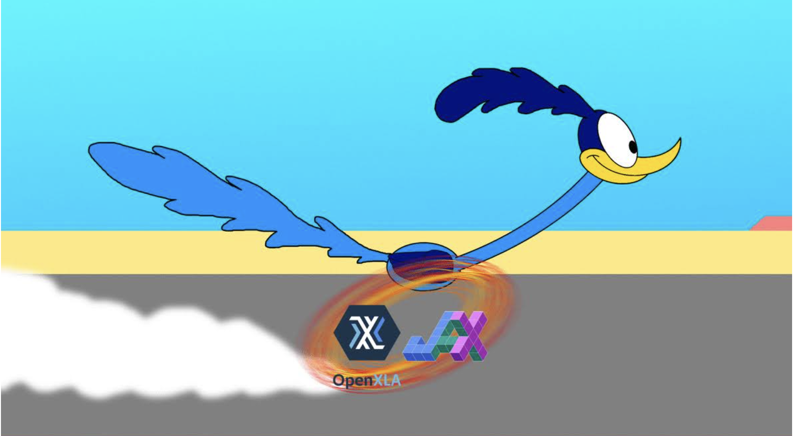

# Meet Felafax: An AI Startup Building an Open-Source AI Platform for Next-Generation AI Hardware, Reducing Machine Learning ML Training Costs by 30%

> It is a hassle to spin up AI workloads on the cloud. The lengthy training process involves installing several low-level dependencies, which might lead to infamous CUDA failures. It also consists of attaching persistent storage, waiting for the system to boot up for 20 minutes, and much more. Machine learning (ML) support for GPUs that […]

It is a hassle to spin up AI workloads on the cloud. The lengthy training process involves installing several low-level dependencies, which might lead to infamous CUDA failures. It also consists of attaching persistent storage, waiting for the system to boot up for 20 minutes, and much more. Machine learning (ML) support for GPUs that aren’t NVIDIA is lacking. On the other hand, Google TPUs and other alternative chipsets have a 30% lower total cost of ownership while still providing superior performance. The increasing size of models (such as Llama 405B) necessitates intricate multi-GPU orchestration because they cannot be rendered on a single GPU.

Meet a cool start-up [**Felafax**](https://felafax.ai/). Starting with 8 TPU cores and going up to 2048 cores, Felafax’s new cloud layer makes building AI training clusters simple. To help you get going fast, it offer pre-made templates for PyTorch XLA and JAX that are easy to set up. Simplified LLaMa Fine-tuning—use pre-built notebooks to jump right into fine-tuning LLaMa 3.1 models (8B, 70B, and 405B). Felafax has taken care of the complex multi-TPU orchestration.

A competing stack to NVIDIA’s CUDA, Felafax’s open-source AI platform is set to debut in the next weeks. It is based on JAX and OpenXLA. They provide 30% cheaper performance than NVIDIA while supporting AI training on a wide range of non-NVIDIA hardware, including Google TPU, AWS Trainium, AMD, and Intel GPU.

**Key Features**

- Large training cluster with one click: quickly spin up 8 to 1024 TPUs or non-Nvidia GPU clusters. No matter the size of the cluster, the framework effortlessly handles the training orchestration.

- The bespoke training platform, built on a non-cuda XLA architecture, offers unrivaled performance at a lower cost. At 30% less expense, you receive the same level of performance as H100.

- Personalize your training run by dropping it into your Jupyter notebook at the touch of a button: complete command, no room for error.

- Felafax handle all the grunt work, including optimizing model partitioning for Llama 3.1 405B, dealing with distributed checkpointing, and orchestrating training on several controllers. Redirect your attention from infrastructure to innovation.

- Standard templates: You have two options: Pytorch XLA and JAX. Use pre-configured environments with all the required dependencies installed and get going immediately.

- Llama 3.1’s JAX implementation: Training times are reduced by 25%, and GPU usage is increased by 20% using JAX. Get the most out of the expensive computing you’ve invested in.

**In Conclusion**

Felafax is constructing an open-source AI platform for use with next-gen AI technology, which will cut the cost of machine learning training by 30%. The organization strives to make high-performance AI computing accessible to more people with its open-source platform and emphasis on GPUs that NVIDIA doesn’t make. There is still a long way to go, but Felafax’s work could revolutionize artificial intelligence by cutting costs, increasing accessibility, and encouraging creativity.
