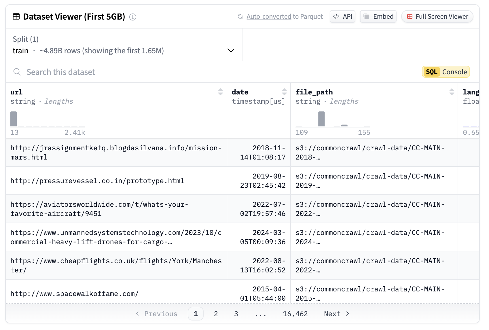

# Meet FineFineWeb: An Open-Sourced Automatic Classification System for Fine-Grained Web Data

> Multimodal Art Projection (M-A-P) researchers have introduced FineFineWeb, a large open-source automatic classification system for fine-grained web data. The project decomposes the deduplicated Fineweb into 67 unique categories with extensive seed data. Moreover, a comprehensive correlation analysis between vertical categories and common benchmarks and detailed URL and content distribution analysis are conducted. The system provides […]

[Multimodal Art Projection (M-A-P)](https://m-a-p.ai/) researchers have introduced FineFineWeb, a large open-source automatic classification system for fine-grained web data. The project decomposes the deduplicated Fineweb into 67 unique categories with extensive seed data. Moreover, a comprehensive correlation analysis between vertical categories and common benchmarks and detailed URL and content distribution analysis are conducted. The system provides specialized test sets for PPL evaluation, featuring both “small cup” validation and “medium cup” test options. Complete training materials for FastText and Bert implementation accompany the dataset, with upcoming suggestions for data proportioning based on RegMix methodology.

The data construction process for FineFineWeb follows a systematic multi-step workflow. The initial deduplication of FineWeb employs exact deduplication and MinHash techniques. URL labeling utilizes GPT-4 to process the top million root URLs, categorizing them into Domain-of-Interest (DoI) and Domain-of-Non-Interest (DoNI) URLs. Further, the coarse recall phase involves domain-specific sampling based on the labeled root URLs, with Qwen2-7B-Instruct handling the labeling of 500K positive and negative data points. FastText models, trained on this labeled data, perform coarse recall operations across FineWeb to generate Coarse DoI Data.

The fine recall stage advances the data refinement process using Qwen2-72B-Instruct to label the Coarse DoI Data, creating 100K Dol positive and 100K Dol negative data points. After that, a BERT model, trained on this labeled data, performs fine recall to produce the final DoI subset of FineFineWeb. Moreover, the entire coarse-fine recall iteration undergoes three rounds with specific modifications: 

- FastText is re-trained using updated seed data, which combines BERT-recalled samples, BERT-dropped samples, and previously labeled seed data.

- The BERT model keeps frozen during subsequent iterations.

- Steps for training FastText, coarse recall, and fine recall are repeated without re-labeling data with Qwen2-Instruct models.

The domain-domain similarity Analysis employs a sophisticated analytical approach using proportional weighted sampling across domain subsets, processing one billion tokens from the domain subsets. Then the BGE-M3 model is used to generate two types of embeddings: domain embeddings from domain subset samples and benchmark embeddings from benchmark samples. The analysis concludes by calculating MMD and Wasserstein distances between domain embeddings and benchmark embeddings to quantify domain relationships.

The similarity analysis reveals several key patterns in domain-benchmark relationships. Code-related benchmarks (MBPP and HumanEval) show significant distance from most domains except mathematics, indicating limited code representation in the dataset. General knowledge benchmarks (Hellaswag, ARC, MMLU, BoolQ) demonstrate close relationships with multiple domains, suggesting broad knowledge distribution, while excluding gambling content. Moreover, GSM8K and TriviaQA exhibit notable domain-specific variations, particularly in mathematics and factual content. Lastly, the gambling domain stands distinctly separate, showing minimal overlap with other domains and benchmarks.

The domain-domain duplication analysis examines URL uniqueness across domains using TF-IDF values. High TF-IDF scores indicate domain-specific unique URLs, while low values suggest common URLs across domains. The analysis reveals minimal duplication across most domains, with exceptions in topicality, pet, and atmospheric science categories. The domain-benchmark correlation study, conducted across 28 models, compares domain-specific performance (BPC) rankings with benchmark performance rankings using Spearman correlation. STEM-related domains show stronger correlations with reasoning-focused benchmarks (ARC, MMLU, GSM8K, HumanEval, MBPP), while knowledge-intensive domains like literature and history correlate higher with fact-based benchmarks like TriviaQA.

---

Check out **the** **_[Dataset](https://huggingface.co/datasets/m-a-p/FineFineWeb) _**_and_**_ [Tweet](https://x.com/GeZhang86038849/status/1869438759105958028)_**. All credit for this research goes to the researchers of this project. Also, don’t forget to follow us on **[Twitter](https://twitter.com/Marktechpost)** and join our **[Telegram Channel](https://github.com/XGenerationLab/XiYan-SQL)** and [**LinkedIn Gr**](https://www.linkedin.com/groups/13668564/)[**oup**](https://www.linkedin.com/groups/13668564/). Don’t Forget to join our **[60k+ ML SubReddit](https://www.reddit.com/r/machinelearningnews/)**.

**[🚨 Trending: LG AI Research Releases EXAONE 3.5: Three Open-Source Bilingual Frontier AI-level Models Delivering Unmatched Instruction Following and Long Context Understanding for Global Leadership in Generative AI Excellence….](https://www.marktechpost.com/2024/12/11/lg-ai-research-releases-exaone-3-5-three-open-source-bilingual-frontier-ai-level-models-delivering-unmatched-instruction-following-and-long-context-understanding-for-global-leadership-in-generative-a/)**
