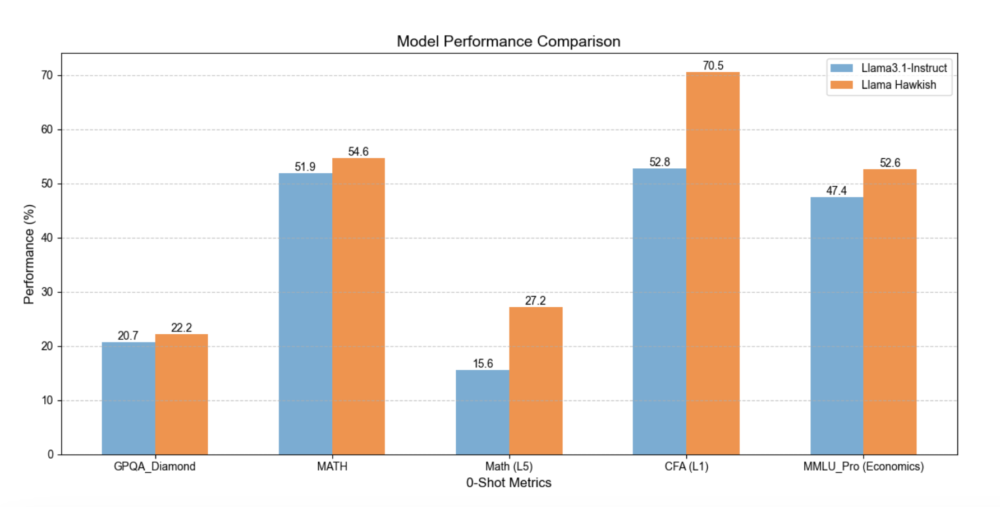

# Meet Hawkish 8B: A New Financial Domain Model that can Pass CFA Level 1 and Outperform Meta Llama-3.1-8B-Instruct in Math & Finance Benchmarks

> In the rapidly evolving world of finance, the demand for models that provide robust insights has never been greater. Traditional financial analysis requires an understanding of complex relationships, macroeconomic indicators, and financial nuances. Despite progress in AI, most language models struggle with the intricate aspects of financial data. They often lack the ability to fully […]

In the rapidly evolving world of finance, the demand for models that provide robust insights has never been greater. Traditional financial analysis requires an understanding of complex relationships, macroeconomic indicators, and financial nuances. Despite progress in AI, most language models struggle with the intricate aspects of financial data. They often lack the ability to fully comprehend sector-specific terminology, advanced mathematical constructs, and the depth of domain-specific knowledge needed for real-world scenarios.

An AI professional recently released a new financial domain model, **Hawkish 8B**, which is making waves in the [Reddit community ](https://www.reddit.com/r/LocalLLaMA/comments/1gcwa96/new_financial_domain_model_hawkish_8b_can_pass/?share_id=M-Zrw8HHd3bOjpnBtznXl&utm_content=1&utm_medium=ios_app&utm_name=ioscss&utm_source=share&utm_term=10)with its remarkable capabilities. Developed specifically to address financial and mathematical challenges, Hawkish 8B is capable of passing the CFA Level 1 examination—a significant milestone in the financial domain. Moreover, it outperforms Meta’s Llama-3.1-8B-Instruct in various finance and math benchmarks, showcasing its unique abilities. With an 8-billion parameter configuration, Hawkish 8B is designed to not only grasp general knowledge but also deeply understand finance-specific concepts, making it an invaluable tool for financial analysts, economists, and professionals seeking advanced AI support.

Hawkish 8B has been fine-tuned on 50 million high-quality tokens related to financial topics, including economics, fixed income, equities, corporate financing, derivatives, and portfolio management. The data was curated from over 250 million tokens gathered from publicly available sources and mixed with instruction sets on coding, general knowledge, NLP, and conversational dialogue to retain original knowledge. This specialized training, leveraging financial documents, market analysis, textbooks, and news, has significantly enhanced the model’s understanding of finance.

Hawkish 8B’s transformer architecture is optimized for financial reasoning and quantitative tasks, resulting in significant improvements in numerical reasoning, algebra, and finance-specific NLP tasks. It also features optimized tokenization to handle financial jargon and mathematical expressions, providing a considerable advantage over generic models.

Hawkish 8B directly addresses the needs of financial professionals and researchers. Its success is highlighted by its ability to pass the rigorous CFA Level 1 exam, which covers topics like quantitative methods, economics, and portfolio management. Recent benchmarks show Hawkish 8B surpassing Meta Llama-3.1-8B-Instruct by over 12% in specialized financial tests and nearly 15% in math-related questions. These results demonstrate its effectiveness in tackling financial challenges and its potential as a key tool for financial modeling, portfolio analysis, and decision-making. Financial practitioners can now leverage an AI that understands the nuances and complexities of market dynamics, offering insights with unparalleled accuracy.

Hawkish 8B represents a promising development in AI models focused on finance. By bridging the gap between advanced financial knowledge and AI analytical capabilities, Hawkish 8B sets a new benchmark for financial AI applications. With its ability to pass complex exams like CFA Level 1 and outperform other leading models in key benchmarks, Hawkish 8B signifies a major leap forward for AI-assisted financial analysis.

---

Check out the** [Model on Hugging Face](https://huggingface.co/mukaj/Llama-3.1-Hawkish-8B).** All credit for this research goes to the researchers of this project. Also, don’t forget to follow us on **[Twitter](https://twitter.com/Marktechpost)** and join our **[Telegram Channel](https://pxl.to/at72b5j)** and [**LinkedIn Gr**](https://www.linkedin.com/groups/13668564/)[**oup**](https://www.linkedin.com/groups/13668564/). **If you like our work, you will love our**[** newsletter..**](https://marktechpost-newsletter.beehiiv.com/subscribe) Don’t Forget to join our **[55k+ ML SubReddit](https://www.reddit.com/r/machinelearningnews/)**.

**[[Upcoming Live Webinar- Oct 29, 2024] ](https://go.predibase.com/predibase-inference-engine-102924-lp?utm_medium=3rdparty&utm_source=marktechpost)****[The Best Platform for Serving Fine-Tuned Models: Predibase Inference Engine (Promoted)](https://go.predibase.com/predibase-inference-engine-102924-lp?utm_medium=3rdparty&utm_source=marktechpost)**
