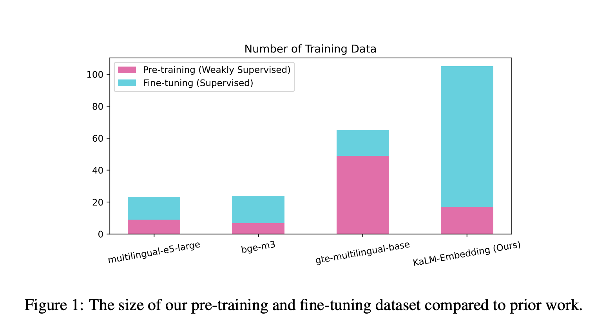

# Meet KaLM-Embedding: A Series of Multilingual Embedding Models Built on Qwen2-0.5B and Released Under MIT

> Multilingual applications and cross-lingual tasks are central to natural language processing (NLP) today, making robust embedding models essential. These models underpin systems like retrieval-augmented generation and other AI-driven solutions. However, existing models often struggle with noisy training data, limited domain diversity, and inefficiencies in managing multilingual datasets. These limitations affect performance and scalability. Researchers from […]

Multilingual applications and cross-lingual tasks are central to natural language processing (NLP) today, making robust embedding models essential. These models underpin systems like retrieval-augmented generation and other AI-driven solutions. However, existing models often struggle with noisy training data, limited domain diversity, and inefficiencies in managing multilingual datasets. These limitations affect performance and scalability. **Researchers from the Harbin Institute of Technology (Shenzhen) have addressed these challenges with KaLM-Embedding, a model that emphasizes data quality and innovative training methodologies.**

**KaLM-Embedding is a multilingual embedding model built on Qwen 2-0.5B and released under the MIT license**. Designed with compactness and efficiency in mind, it is particularly well-suited for real-world applications where computational resources are constrained.

The model’s data-centric design is a key strength. It incorporates 550,000 synthetic data samples generated using persona-based techniques to ensure diversity and relevance. Additionally, it employs ranking consistency filtering to remove noisy and false-negative samples, enhancing the quality and robustness of the training data.

### Technical Features and Advantages

KaLM-Embedding incorporates advanced methodologies to deliver strong multilingual text embeddings. A notable feature is Matryoshka Representation Learning, which supports flexible embedding dimensions. This adaptability allows embeddings to be optimized for different applications, ranging from 64 to 896 dimensions.

The training strategy consists of two stages: weakly supervised pre-training and supervised fine-tuning. Over 70 diverse datasets were utilized during fine-tuning, covering a range of languages and domains. Semi-homogeneous task batching further refined the training process by balancing the challenges posed by in-batch negatives with the risk of false negatives.

KaLM-Embedding also benefits from its foundation on Qwen 2-0.5B, a pre-trained autoregressive language model. This architecture enables effective adaptation to embedding tasks, offering an advantage over traditional BERT-like models.

### Performance and Benchmark Results

KaLM-Embedding’s performance was evaluated on the Massive Text Embedding Benchmark (MTEB). It achieved an average score of 64.53, setting a high standard for models with fewer than 1 billion parameters. Scores of 64.13 on Chinese-MTEB and 64.94 on English-MTEB highlight its multilingual capabilities. Despite limited fine-tuning data for some languages, the model demonstrated strong generalization abilities.

Ablation studies provided additional insights. Features like Matryoshka Representation Learning and ranking consistency filtering were shown to enhance performance. However, the studies also highlighted areas for improvement, such as refining low-dimensional embeddings to further boost effectiveness.

### Conclusion: A Step Forward in Multilingual Embeddings

KaLM-Embedding represents a significant advancement in multilingual embedding models. By addressing challenges such as noisy data and inflexible architectures, it achieves a balance between efficiency and performance. The open-source release under the MIT license invites researchers and practitioners to explore and build upon this work.

With its robust multilingual performance and innovative methodologies, KaLM-Embedding is well-positioned for diverse applications, from retrieval-augmented systems to cross-lingual tasks. As the need for multilingual NLP solutions continues to grow, KaLM-Embedding serves as a testament to the impact of high-quality data and thoughtful model design.

---

Check out **_the [Paper](https://arxiv.org/abs/2501.01028), [Models](https://huggingface.co/collections/HIT-TMG/kalm-embedding-67316afa4c56f4fc1f58764b), and [Code](https://github.com/HITsz-TMG/KaLM-Embedding)._** All credit for this research goes to the researchers of this project. Also, don’t forget to follow us on **[Twitter](https://x.com/intent/follow?screen_name=marktechpost)** and join our **[Telegram Channel](https://arxiv.org/abs/2406.09406)** and [**LinkedIn Gr**](https://www.linkedin.com/groups/13668564/)[**oup**](https://www.linkedin.com/groups/13668564/). Don’t Forget to join our **[60k+ ML SubReddit](https://www.reddit.com/r/machinelearningnews/)**.

**🚨 FREE UPCOMING AI WEBINAR (JAN 15, 2025): [Boost LLM Accuracy with Synthetic Data and Evaluation Intelligence](https://info.gretel.ai/boost-llm-accuracy-with-sd-and-evaluation-intelligence?utm_source=marktechpost&utm_medium=newsletter&utm_campaign=202501_gretel_galileo_webinar)**–**[Join this webinar to gain actionable insights into boosting LLM model performance and accuracy while safeguarding data privacy](https://info.gretel.ai/boost-llm-accuracy-with-sd-and-evaluation-intelligence?utm_source=marktechpost&utm_medium=newsletter&utm_campaign=202501_gretel_galileo_webinar).**
