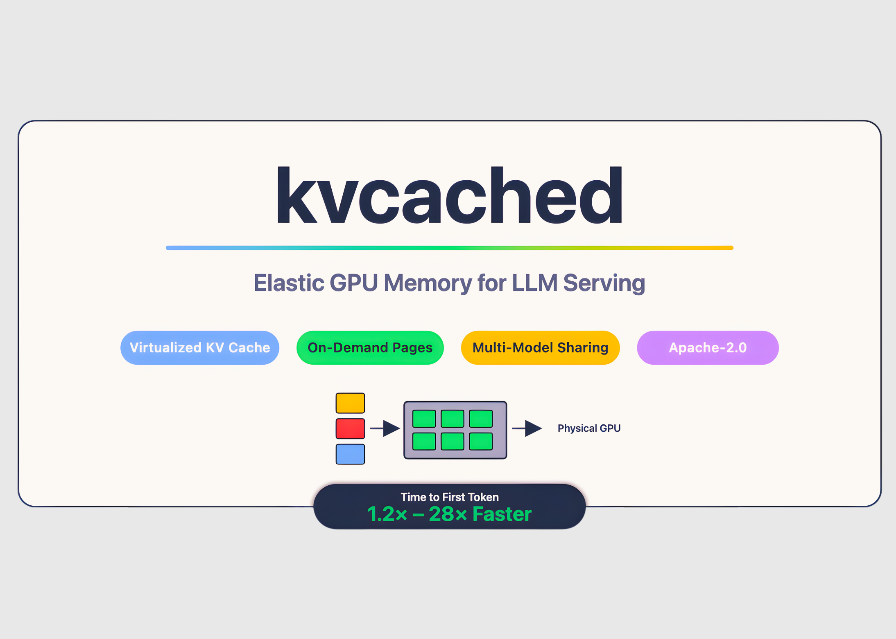

# Meet ‘kvcached’: A Machine Learning Library to Enable Virtualized, Elastic KV Cache for LLM Serving on Shared GPUs

> Large language model serving often wastes GPU memory because engines pre-reserve large static KV cache regions per model, even when requests are bursty or idle. Meet ‘kvcached‘, a library to enable virtualized, elastic KV cache for LLM serving on shared GPUs. kvcached has been developed by a research from Berkeley’s Sky Computing Lab (University of […]

Large language model serving often wastes GPU memory because engines pre-reserve large static KV cache regions per model, even when requests are bursty or idle. **Meet ‘[kvcached](https://github.com/ovg-project/kvcached?tab=readme-ov-file)**‘, a library to enable virtualized, elastic KV cache for LLM serving on shared GPUs. kvcached has been developed by a research from Berkeley’s Sky Computing Lab (University of California, Berkeley) in close collaboration with Rice University and UCLA, and with valuable input from collaborators and colleagues at NVIDIA, Intel Corporation, Stanford University. It introduces an OS-style virtual memory abstraction for the KV cache that lets serving engines reserve contiguous **virtual** space first, then back only the active portions with **physical** GPU pages on demand. This decoupling raises memory utilization, reduces cold starts, and enables multiple models to time share and space share a device without heavy engine rewrites.

*https://github.com/ovg-project/kvcached*

### What kvcached changes?

With kvcached, an engine creates a KV cache pool that is contiguous in the virtual address space. As tokens arrive, the library maps physical GPU pages lazily at a fine granularity using CUDA virtual memory APIs. When requests complete or models go idle, pages unmap and return to a shared pool, which other colocated models can immediately reuse. This preserves simple pointer arithmetic in kernels, and removes the need for per engine user level paging. The project targets **SGLang** and **vLLM** integration, and it is released under the Apache 2.0 license. Installation and a one command quick start are documented in the [Git repository](https://github.com/ovg-project/kvcached).

*https://yifanqiao.notion.site/Solve-the-GPU-Cost-Crisis-with-kvcached-289da9d1f4d68034b17bf2774201b141*

### How does it impact at scale?

Production workloads host many models with long tail traffic and spiky bursts. Static reservations leave memory stranded and slow down time to first token when models must be activated or swapped. The[ **Prism** research paper](https://www.arxiv.org/pdf/2505.04021) shows that multi-LLM serving requires **cross model memory coordination** at runtime, not just compute scheduling. Prism implements on demand mapping of physical to virtual pages and a two level scheduler, and reports **more than 2 times** cost savings and **3.3 times** higher TTFT SLO attainment versus prior systems on real traces. kvcached focuses on the memory coordination primitive, and provides a reusable component that brings this capability to mainstream engines.

*https://www.arxiv.org/pdf/2505.04021*

### Performance signals

The kvcached team reports **1.2 times to 28 times** faster **time to first token** in multi model serving, due to immediate reuse of freed pages and the removal of large static allocations. These numbers come from multi-LLM scenarios where activation latency and memory headroom dominate tail latency. The research team note kvcached’s compatibility with SGLang and vLLM, and describe elastic KV allocation as the core mechanism.

*https://yifanqiao.notion.site/Solve-the-GPU-Cost-Crisis-with-kvcached-289da9d1f4d68034b17bf2774201b141*

### How is it related to recent research?

Recent work has moved from fixed partitioning to virtual memory based methods for KV management. **[Prism](https://www.arxiv.org/pdf/2505.04021)** extends VMM based allocation to multi-LLM settings with cross model coordination and scheduling. Prior efforts like **vAttention** explore CUDA VMM for single model serving to avoid fragmentation without PagedAttention. The arc is clear, use virtual memory to keep KV contiguous in virtual space, then map physical pages elastically as the workload evolves. kvcached operationalizes this idea as a library, which simplifies adoption inside existing engines.

*https://www.arxiv.org/pdf/2505.04021*

### Practical Applications for Devs

**Colocation across models**: Engines can colocate several small or medium models on one device. When one model goes idle, its KV pages free quickly and another model can expand its working set without restart. This reduces head of line blocking during bursts and improves TTFT SLO attainment.

**Activation behavior**: Prism reports activation times of about **0.7 seconds** for an **8B** model and about **1.5 seconds** for a **70B** model with streaming activation. kvcached benefits from similar principles because virtual reservations allow engines to prepare address ranges in advance, then map pages as tokens arrive.

**Autoscaling for serverless LLM**: Fine grained page mapping makes it feasible to scale replicas more frequently and to run cold models in a warm state with minimal memory footprint. This enables tighter autoscaling loops and reduces the blast radius of hot spots.

**Offloading and future work.** Virtual memory opens the door to KV offload to host memory or NVMe when the access pattern allows it. [NVIDIA’s recent guide](https://developer.nvidia.com/blog/accelerate-large-scale-llm-inference-and-kv-cache-offload-with-cpu-gpu-memory-sharing/?) on managed memory for KV offload on GH200 class systems shows how unified address spaces can extend capacity at acceptable overheads. The kvcached maintainers also discuss offload and compaction directions in public threads. Verify throughput and latency in your own pipeline, since access locality and PCIe topology have strong effects.

*https://www.arxiv.org/pdf/2505.04021*

### Key Takeaways

- kvcached virtualizes the KV cache using GPU virtual memory, engines reserve contiguous virtual space and map physical pages on demand, enabling elastic allocation and reclamation under dynamic loads.

- It integrates with mainstream inference engines, specifically SGLang and vLLM, and is released under Apache 2.0, making adoption and modification straightforward for production serving stacks.

- Public benchmarks report 1.2 times to 28 times faster time to first token in multi model serving due to immediate reuse of freed KV pages and the removal of large static reservations.

- Prism shows that cross model memory coordination, implemented via on demand mapping and two level scheduling, delivers more than 2 times cost savings and 3.3 times higher TTFT SLO attainment on real traces, kvcached supplies the memory primitive that mainstream engines can reuse.

- For clusters that host many models with bursty, long tail traffic, virtualized KV cache allows safe colocation, faster activation, and tighter autoscaling, with reported activation around 0.7 seconds for an 8B model and 1.5 seconds for a 70B model in the Prism evaluation.

### Editorial Comments

kvcached is an effective approach toward GPU memory virtualization for LLM serving, not a full operating system, and that clarity matters. The library reserves virtual address space for the KV cache, then maps physical pages on demand, which enables elastic sharing across models with minimal engine changes. This aligns with evidence that cross model memory coordination is essential for multi model workloads and improves SLO attainment and cost under real traces. **Overall, kvcached advances GPU memory coordination for LLM serving, production value depends on per cluster validation.**

---

Check out the **[GitHub Repo](https://github.com/ovg-project/kvcached?tab=readme-ov-file), [Paper 1](https://www.arxiv.org/abs/2505.04021), [Paper 2](https://arxiv.org/abs/2508.08448) **and** [Technical details](https://yifanqiao.notion.site/Solve-the-GPU-Cost-Crisis-with-kvcached-289da9d1f4d68034b17bf2774201b141)**. Feel free to check out our **[GitHub Page for Tutorials, Codes and Notebooks](https://github.com/Marktechpost/AI-Tutorial-Codes-Included)**. Also, feel free to follow us on **[Twitter](https://x.com/intent/follow?screen_name=marktechpost)** and don’t forget to join our **[100k+ ML SubReddit](https://www.reddit.com/r/machinelearningnews/)** and Subscribe to **[our Newsletter](https://www.aidevsignals.com/)**. Wait! are you on telegram? **[now you can join us on telegram as well.](https://t.me/machinelearningresearchnews)**
