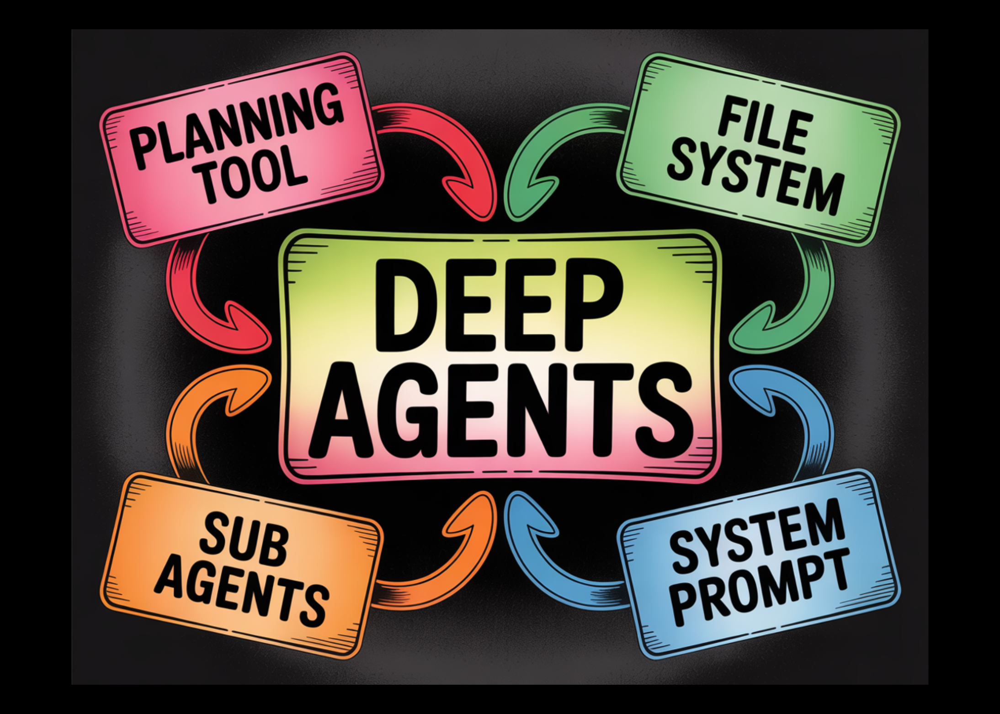

# Meet LangChain’s DeepAgents Library and a Practical Example to See How DeepAgents Actually Work in Action

> While a basic Large Language Model (LLM) agent—one that repeatedly calls external tools—is easy to create, these agents often struggle with long and complex tasks because they lack the ability to plan ahead and manage their work over time. They can be considered “shallow” in their execution. The deepagents library is designed to overcome this […]

While a basic Large Language Model (LLM) agent—one that repeatedly calls external tools—is easy to create, these agents often struggle with long and complex tasks because they lack the ability to plan ahead and manage their work over time. They can be considered “shallow” in their execution.

The [deepagents library](https://github.com/langchain-ai/deepagents) is designed to overcome this limitation by implementing a general architecture inspired by advanced applications like Deep Research and Claude Code.


**This architecture gives agents more depth by combining four key features:**

- **A Planning Tool:** Allows the agent to strategically break down a complex task into manageable steps before acting.

- **Sub-Agents**: Enables the main agent to delegate specialized parts of the task to smaller, focused agents.

- **Access to a File System**: Provides persistent memory for saving work-in-progress, notes, and final outputs, allowing the agent to continue where it left off.

- **A Detailed Prompt:** Gives the agent clear instructions, context, and constraints for its long-term objectives.

By providing these foundational components, deepagents makes it easier for developers to build powerful, general-purpose agents that can plan, manage state, and execute complex workflows effectively.

**In this article, we’ll take a look at a practical example to see how DeepAgents actually work in action.** Check out the **[FULL CODES here](https://github.com/Marktechpost/AI-Tutorial-Codes-Included/blob/main/AI%20Agents%20Codes/Langchain_Deepagents.ipynb)**.

## Core Capabilities of DeepAgents

1.** Planning and Task Breakdown**: DeepAgents come with a built-in write_todos tool that helps agents break large tasks into smaller, manageable steps. They can track their progress and adjust the plan as they learn new information.

2.** Context Management**: Using file tools like ls, read_file, write_file, and edit_file, agents can store information outside their short-term memory. This prevents context overflow and lets them handle larger or more detailed tasks smoothly.

3. **Sub-Agent Creation**: The built-in task tool allows an agent to create smaller, focused sub-agents. These sub-agents work on specific parts of a problem without cluttering the main agent’s context.

4. **Long-Term Memory**: With support from LangGraph’s Store, agents can remember information across sessions. This means they can recall past work, continue previous conversations, and build on earlier progress.


## Setting up dependencies

Copy CodeCopiedUse a different Browser
```
!pip install deepagents tavily-python langchain-google-genai langchain-openai
```

### Environment Variables

In this tutorial, we’ll use the OpenAI API key to power our Deep Agent. However, for reference, we’ll also show how you can use a Gemini model instead.

You’re free to choose any model provider you prefer — OpenAI, Gemini, Anthropic, or others — as DeepAgents works seamlessly with different backends. Check out the **[FULL CODES here](https://github.com/Marktechpost/AI-Tutorial-Codes-Included/blob/main/AI%20Agents%20Codes/Langchain_Deepagents.ipynb)**.

Copy CodeCopiedUse a different Browser
```
import os
from getpass import getpass
os.environ['TAVILY_API_KEY'] = getpass('Enter Tavily API Key: ')
os.environ['OPENAI_API_KEY'] = getpass('Enter OpenAI API Key: ')
os.environ['GOOGLE_API_KEY'] = getpass('Enter Google API Key: ')
```

**Importing the necessary libraries**

Copy CodeCopiedUse a different Browser
```
import os
from typing import Literal
from tavily import TavilyClient
from deepagents import create_deep_agent

tavily_client = TavilyClient()
```

### Tools

Just like regular tool-using agents, a Deep Agent can also be equipped with a set of tools to help it perform tasks.

In this example, we’ll give our agent access to a Tavily Search tool, which it can use to gather real-time information from the web. Check out the **[FULL CODES here](https://github.com/Marktechpost/AI-Tutorial-Codes-Included/blob/main/AI%20Agents%20Codes/Langchain_Deepagents.ipynb)**.

Copy CodeCopiedUse a different Browser
```
from typing import Literal
from langchain.chat_models import init_chat_model
from deepagents import create_deep_agent

def internet_search(
    query: str,
    max_results: int = 5,
    topic: Literal["general", "news", "finance"] = "general",
    include_raw_content: bool = False,
):
    """Run a web search"""
    search_docs = tavily_client.search(
        query,
        max_results=max_results,
        include_raw_content=include_raw_content,
        topic=topic,
    )
    return search_docs

```

## Sub-Agents

Subagents are one of the most powerful features of Deep Agents. They allow the main agent to delegate specific parts of a complex task to smaller, specialized agents — each with its own focus, tools, and instructions. This helps keep the main agent’s context clean and organized while still allowing for deep, focused work on individual subtasks.

**In our example, we defined two subagents:**

- **policy-research-agent **— a specialized researcher that conducts in-depth analysis on AI policies, regulations, and ethical frameworks worldwide. It uses the internet_search tool to gather real-time information and produces a well-structured, professional report.

- **policy-critique-agent** — an editorial agent responsible for reviewing the generated report for accuracy, completeness, and tone. It ensures that the research is balanced, factual, and aligned with regional legal frameworks.

Together, these subagents enable the main Deep Agent to perform research, analysis, and quality review in a structured, modular workflow. Check out the **[FULL CODES here](https://github.com/Marktechpost/AI-Tutorial-Codes-Included/blob/main/AI%20Agents%20Codes/Langchain_Deepagents.ipynb)**.

Copy CodeCopiedUse a different Browser
```
sub_research_prompt = """
You are a specialized AI policy researcher.
Conduct in-depth research on government policies, global regulations, and ethical frameworks related to artificial intelligence.

Your answer should:
- Provide key updates and trends
- Include relevant sources and laws (e.g., EU AI Act, U.S. Executive Orders)
- Compare global approaches when relevant
- Be written in clear, professional language

Only your FINAL message will be passed back to the main agent.
"""

research_sub_agent = {
    "name": "policy-research-agent",
    "description": "Used to research specific AI policy and regulation questions in depth.",
    "system_prompt": sub_research_prompt,
    "tools": [internet_search],
}

sub_critique_prompt = """
You are a policy editor reviewing a report on AI governance.
Check the report at `final_report.md` and the question at `question.txt`.

Focus on:
- Accuracy and completeness of legal information
- Proper citation of policy documents
- Balanced analysis of regional differences
- Clarity and neutrality of tone

Provide constructive feedback, but do NOT modify the report directly.
"""

critique_sub_agent = {
    "name": "policy-critique-agent",
    "description": "Critiques AI policy research reports for completeness, clarity, and accuracy.",
    "system_prompt": sub_critique_prompt,
}
```

## System Prompt

Deep Agents include a built-in system prompt that serves as their core set of instructions. This prompt is inspired by the system prompt used in Claude Code and is designed to be more general-purpose, providing guidance on how to use built-in tools like planning, file system operations, and subagent coordination.

However, while the default system prompt makes Deep Agents capable out of the box, it’s highly recommended to define a custom system prompt tailored to your specific use case. Prompt design plays a crucial role in shaping the agent’s reasoning, structure, and overall performance.

In our example, we defined a custom prompt called policy_research_instructions, which transforms the agent into an expert AI policy researcher. It clearly outlines a step-by-step workflow — saving the question, using the research subagent for analysis, writing the report, and optionally invoking the critique subagent for review. It also enforces best practices such as Markdown formatting, citation style, and professional tone to ensure the final report meets high-quality policy standards. Check out the **[FULL CODES here](https://github.com/Marktechpost/AI-Tutorial-Codes-Included/blob/main/AI%20Agents%20Codes/Langchain_Deepagents.ipynb)**.

Copy CodeCopiedUse a different Browser
```
policy_research_instructions = """
You are an expert AI policy researcher and analyst.
Your job is to investigate questions related to global AI regulation, ethics, and governance frameworks.

1️⃣ Save the user's question to `question.txt`
2️⃣ Use the `policy-research-agent` to perform in-depth research
3️⃣ Write a detailed report to `final_report.md`
4️⃣ Optionally, ask the `policy-critique-agent` to critique your draft
5️⃣ Revise if necessary, then output the final, comprehensive report

When writing the final report:
- Use Markdown with clear sections (## for each)
- Include citations in [Title](URL) format
- Add a ### Sources section at the end
- Write in professional, neutral tone suitable for policy briefings
"""
```

## Main Agent

Here we define our main Deep Agent using the create_deep_agent() function. We initialize the model with **OpenAI’s gpt-4o**, but as shown in the commented-out line, you can easily switch to **Google’s Gemini 2.5 Flash** model if you prefer. The agent is configured with the internet_search tool, our custom policy_research_instructions system prompt, and two subagents — one for in-depth research and another for critique.

By default, DeepAgents internally uses **Claude Sonnet 4.5** as its model if none is explicitly specified, but the library allows full flexibility to integrate OpenAI, Gemini, Anthropic, or other LLMs supported by LangChain. Check out the **[FULL CODES here](https://github.com/Marktechpost/AI-Tutorial-Codes-Included/blob/main/AI%20Agents%20Codes/Langchain_Deepagents.ipynb)**.

Copy CodeCopiedUse a different Browser
```
model = init_chat_model(model="openai:gpt-4o")
# model = init_chat_model(model="google_genai:gemini-2.5-flash")
agent = create_deep_agent(
    model=model,
    tools=[internet_search],
    system_prompt=policy_research_instructions,
    subagents=[research_sub_agent, critique_sub_agent],
)
```

## Invoking the Agent

Copy CodeCopiedUse a different Browser
```
query = "What are the latest updates on the EU AI Act and its global impact?"
result = agent.invoke({"messages": [{"role": "user", "content": query}]})
```

---

Check out the **[FULL CODES here](https://github.com/Marktechpost/AI-Tutorial-Codes-Included/blob/main/AI%20Agents%20Codes/Langchain_Deepagents.ipynb)**. Feel free to check out our **[GitHub Page for Tutorials, Codes and Notebooks](https://github.com/Marktechpost/AI-Tutorial-Codes-Included)**. Also, feel free to follow us on **[Twitter](https://x.com/intent/follow?screen_name=marktechpost)** and don’t forget to join our **[100k+ ML SubReddit](https://www.reddit.com/r/machinelearningnews/)** and Subscribe to **[our Newsletter](https://www.aidevsignals.com/)**. Wait! are you on telegram? **[now you can join us on telegram as well.](https://t.me/machinelearningresearchnews)**
