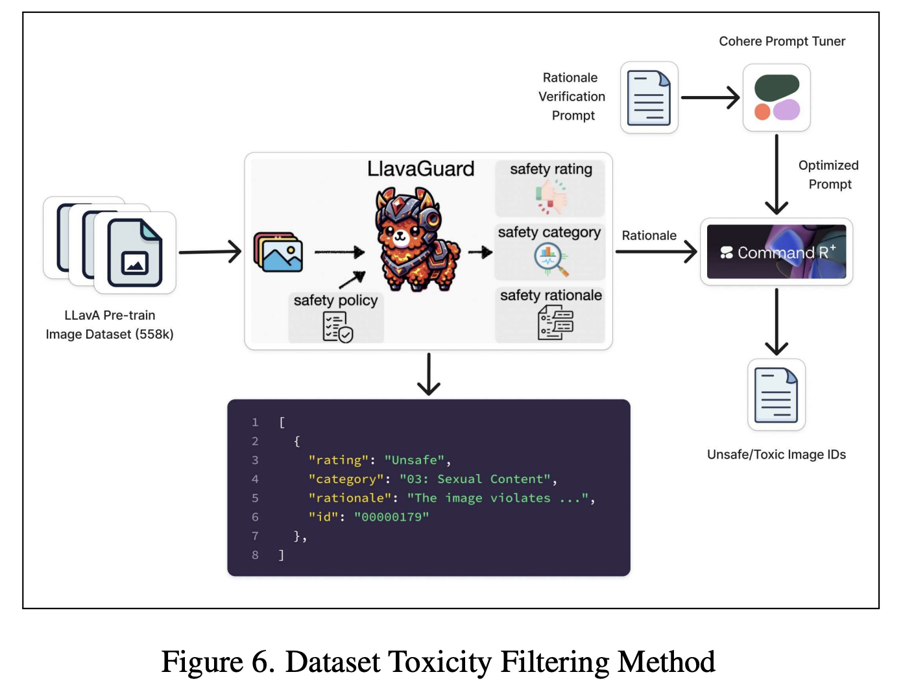

# Meet Maya: An 8B Open-Source Multilingual Multimodal Model with Toxicity-Free Datasets and Cultural Intelligence Across Eight Languages

> Vision-Language Models (VLMs) allow machines to understand and reason about the visual world through natural language. These models have applications in image captioning, visual question answering, and multimodal reasoning. However, most models are designed and trained predominantly for high-resource languages, leaving substantial gaps in accessibility and usability for speakers of low-resource languages. This gap highlights […]

Vision-Language Models (VLMs) allow machines to understand and reason about the visual world through natural language. These models have applications in image captioning, visual question answering, and multimodal reasoning. However, most models are designed and trained predominantly for high-resource languages, leaving substantial gaps in accessibility and usability for speakers of low-resource languages. This gap highlights the importance of developing multilingual systems that cater to a global audience while maintaining high performance across diverse linguistic and cultural contexts. **However, a concern in developing multilingual VLMs lies in the availability and quality of multilingual datasets.**

**Even if there are datasets, they have these limitations:**

- Existing pretraining datasets, such as COCO, Visual Genome, and LAION, are overwhelmingly focused on English, limiting their generalization ability across languages and cultures.

- Many datasets also contain toxic or biased content, perpetuating stereotypes and undermining the ethical deployment of AI systems.

**The limited representation of diverse languages, combined with the presence of culturally insensitive material, hampers the performance of VLMs** in underrepresented regions and raises concerns about fairness and inclusivity.

Researchers have turned to various methods of dataset expansion and quality improvement to address these limitations. For example, datasets like Multi30k and Crossmodal-3600 have attempted to provide multilingual support but must be expanded in scale and diversity. Semi-automated translations of image-text datasets have been used to extend language coverage in models such as PALO and X-LLaVA. However, these efforts often result in uneven distributions across languages and fail to address the toxicity present in the original data. The lack of systematic approaches to filtering harmful content further worsens the issue.

A team of researchers from Cisco Meraki, Cohere For AI Community, Indiana University Bloomington, Imperial College London, Georgia Institute of Technology, The Alan Turing Institute, Bangladesh University of Engineering and Technology, University of Pennsylvania, IIT Bombay, TU Darmstadt, Articul8 AI, Capital One, IIT Dhanbad, and MBZUAI introduced [**Maya**](https://huggingface.co/maya-multimodal), an 8B parameters open-source multilingual multimodal vision-language model that aims to overcome existing dataset quality and toxicity limitations. **The model leverages a new pretraining dataset containing 558,000 image-text pairs distributed equally across eight languages: English, Chinese, French, Spanish, Russian, Hindi, Japanese, and Arabic.** This dataset underwent rigorous toxicity filtering, with over 7,531 toxic images and captions removed using tools like LLaVAGuard and Toxic-BERT. Maya’s development also focused on balancing data distribution to prevent biases.

Maya’s architecture is built on the LLaVA framework and incorporates advanced techniques for image-text alignment and multilingual adaptation. **The model employs SigLIP, a vision encoder capable of handling variable input dimensions, and Aya-23, a multilingual language model trained across 23 languages.** A two-layer projection matrix bridges image features to language features, optimizing performance while maintaining computational efficiency. Pretraining was conducted on 8xH100 GPUs with a global batch size of 256; instruction fine-tuning utilized the PALO 150K dataset. This training process was designed to ensure high-quality outputs, with pretraining taking approximately 20 hours and fine-tuning requiring 48 hours.

Performance-wise, **on multilingual benchmarks such as LLaVA-Bench-In-The-Wild, Maya outperformed similar-size models like LLaVA-7B and PALO-7B in five out of eight languages**, including notable success in Arabic due to its robust translation and dataset design. Across English-only benchmarks, Maya maintained competitive accuracy, with marginal gains observed in tasks like text translation and numerical calculation for the toxicity-free variant. However, some complex reasoning tasks showed slight performance declines, indicating that removing diverse, potentially toxic content may impact certain capabilities.

**Some key takeaways and highlights from the Maya model research are summarized below:**

- Maya’s pretraining dataset includes 558,000 image-text pairs expanded to 4.4 million samples across eight languages. Rigorous toxicity filtering removed 7,531 toxic elements, ensuring cleaner data.

- The model supports eight languages, achieving balanced data distribution and cultural inclusivity through optimized translation and pretraining strategies.

- SigLIP for vision encoding and Aya-23 for multilingual language modeling enable high-quality image-text alignment and cross-linguistic comprehension.

- Maya outperformed comparable models in five languages and matched larger models in several benchmarks.

- Maya sets a precedent for ethical and fair AI practices by addressing toxicity and biases.

In conclusion, by introducing Maya, the research addresses limited multilingual and culturally sensitive datasets in VLMs. This model combines an innovative dataset of 558,000 image-text pairs across eight languages with rigorous toxicity filtering and balanced representation to ensure inclusivity and ethical deployment. Leveraging advanced architecture and multilingual adaptation techniques, Maya outperforms similar-size models in multiple languages, setting a new standard for multilingual AI.

---

Check out **the _[Paper](https://arxiv.org/abs/2412.07112) and [Model on Hugging Face](https://huggingface.co/maya-multimodal)_**. All credit for this research goes to the researchers of this project. Also, don’t forget to follow us on **[Twitter](https://twitter.com/Marktechpost)** and join our **[Telegram Channel](https://github.com/XGenerationLab/XiYan-SQL)** and [**LinkedIn Gr**](https://www.linkedin.com/groups/13668564/)[**oup**](https://www.linkedin.com/groups/13668564/). Don’t Forget to join our **[60k+ ML SubReddit](https://www.reddit.com/r/machinelearningnews/)**.

**🚨 [[Must Subscribe](https://www.airesearchinsights.com/subscribe)]: [Subscribe to our newsletter to get trending AI research and dev updates](https://www.airesearchinsights.com/subscribe)**
