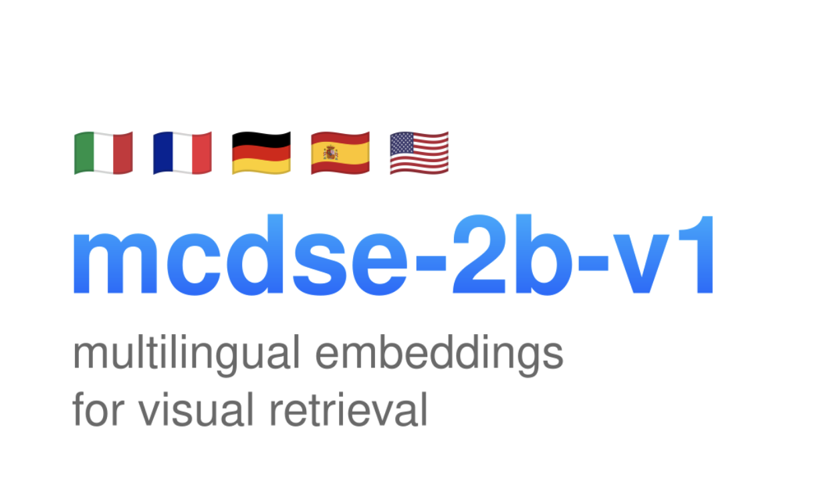

# Meet mcdse-2b-v1: A New Performant, Scalable and Efficient Multilingual Document Retrieval Model

> The rise of the information era has brought an overwhelming amount of data in varied formats. Documents, presentations, and images are generated at an astonishing rate across multiple languages and domains. However, retrieving useful information from these diverse sources presents a significant challenge. Conventional retrieval models, while effective for text-based queries, struggle with complex multimodal […]

The rise of the information era has brought an overwhelming amount of data in varied formats. Documents, presentations, and images are generated at an astonishing rate across multiple languages and domains. However, retrieving useful information from these diverse sources presents a significant challenge. Conventional retrieval models, while effective for text-based queries, struggle with complex multimodal content, such as screenshots or slide presentations. This poses particular challenges for businesses, researchers, and educators, who need to query and extract information from documents that combine text and visual elements. Addressing this challenge requires a model capable of efficiently handling such diverse content.

## Introducing mcdse-2b-v1: A New Approach to Document Retrieval

Meet **mcdse-2b-v1**, a new AI model that allows you to embed page or slide screenshots and query them using natural language. Unlike traditional retrieval systems, which depend solely on text for indexing and searching, **mcdse-2b-v1** enables users to work with screenshots or slides that contain a mixture of text, images, and diagrams. This opens up new possibilities for those who often deal with documents that are not purely text-based. With **mcdse-2b-v1**, you can take a screenshot of a slide presentation or an infographic-heavy document, embed it into the model, and perform natural language searches to obtain relevant information.

**mcdse-2b-v1** bridges the gap between traditional text-based queries and more complex visual data, making it ideal for industries that require frequent content analysis from presentation decks, reports, or other visual documentation. This capability makes the model invaluable in content-rich environments, where manually browsing through visual-heavy documents is time-consuming and impractical. Instead of struggling to find that one slide from a presentation or manually going through dense reports, users can leverage natural language to instantly search for embedded content, saving time and improving productivity.

## Technical Details and Benefits

mcdse-2b-v1 (🤗) builds upon MrLight/dse-qwen2-2b-mrl-v1 and is trained using the DSE approach. **mcdse-2b-v1** is a performant, scalable, and efficient multilingual document retrieval model that can seamlessly handle mixed-content sources. It provides an embedding mechanism that effectively captures both textual and visual components, allowing for robust retrieval operations across multimodal data types.

One of the most notable features of **mcdse-2b-v1** is its resource efficiency. For instance, it can embed 100 million pages in just 10 GB of space. This level of optimization makes it ideal for applications where data storage is at a premium, such as on-premises solutions or edge deployments. Additionally, the model can be shrunk by up to six times with minimal performance degradation, enabling it to work on devices with limited computational resources while still maintaining high retrieval accuracy.

Another benefit of **mcdse-2b-v1** is its compatibility with commonly used frameworks like Transformers or vLLM, making it accessible for a wide range of users. This flexibility allows the model to be easily integrated into existing machine learning workflows without extensive modifications, making it a convenient choice for developers and data scientists.

## Why mcdse-2b-v1 Matters

The significance of **mcdse-2b-v1** lies not only in its ability to retrieve information efficiently but also in how it democratizes access to complex document analysis. Traditional document retrieval methods require precise structuring and often overlook the rich visual elements present in modern-day documents. **mcdse-2b-v1** changes this by allowing users to access information embedded within diagrams, charts, and other non-textual components as easily as they would with a text-based query.

Early results have shown that **mcdse-2b-v1** consistently delivers high retrieval accuracy, even when compressed to one-sixth of its original size. This level of performance makes it practical for large-scale deployments without the typical computational expense. Additionally, its multilingual capability means it can serve a wide range of users globally, making it valuable in multinational organizations or academic settings where multiple languages are in use.

For those working on multimodal Retrieval-Augmented Generation (RAG), **mcdse-2b-v1** offers a scalable solution that provides high-performance embeddings for documents that include both text and visuals. This combination enhances the ability of downstream tasks, such as answering complex user queries or generating detailed reports from multimodal input.

## Conclusion

**mcdse-2b-v1** addresses the challenges of multimodal document retrieval by embedding page and slide screenshots with scalability, efficiency, and multilingual capabilities. It streamlines interactions with complex documents, freeing users from the tedious process of manual searches. Users gain a powerful retrieval model that effectively handles multimodal content, recognizing the complexities of real-world data. This model reshapes how we access and interact with knowledge embedded in both text and visuals, setting a new benchmark for document retrieval.

---

Check out the** [Model on Hugging Face](https://huggingface.co/marco/mcdse-2b-v1) and [Details](https://huggingface.co/blog/marco/announcing-mcdse-2b-v1).** All credit for this research goes to the researchers of this project. Also, don’t forget to follow us on **[Twitter](https://twitter.com/Marktechpost)** and join our **[Telegram Channel](https://pxl.to/at72b5j)** and [**LinkedIn Gr**](https://www.linkedin.com/groups/13668564/)[**oup**](https://www.linkedin.com/groups/13668564/). **If you like our work, you will love our**[** newsletter..**](https://marktechpost-newsletter.beehiiv.com/subscribe) Don’t Forget to join our **[55k+ ML SubReddit](https://www.reddit.com/r/machinelearningnews/)**.

**[[Upcoming Live Webinar- Oct 29, 2024] ](https://go.predibase.com/predibase-inference-engine-102924-lp?utm_medium=3rdparty&utm_source=marktechpost)****[The Best Platform for Serving Fine-Tuned Models: Predibase Inference Engine (Promoted)](https://go.predibase.com/predibase-inference-engine-102924-lp?utm_medium=3rdparty&utm_source=marktechpost)**
