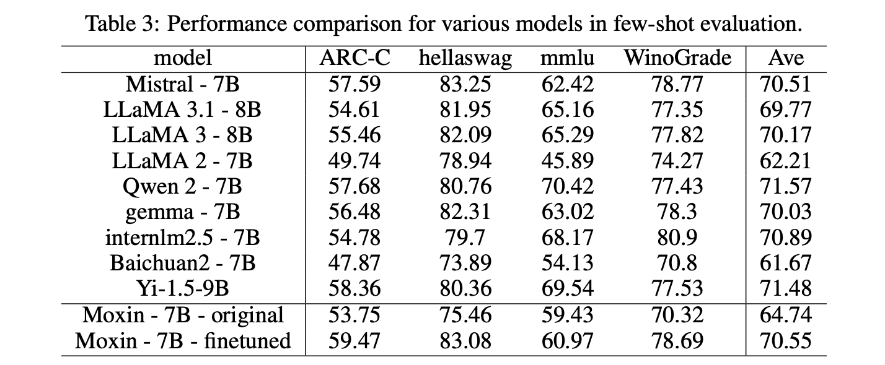

# Meet Moxin LLM 7B: A Fully Open-Source Language Model Developed in Accordance with the Model Openness Framework (MOF)

> The rapid development of Large Language Models (LLMs) has transformed natural language processing (NLP). Proprietary models like GPT-4 and Claude 3 have set high standards in terms of performance but often come with drawbacks such as high costs, limited accessibility, and opaque methodologies. Meanwhile, many so-called open-source models fail to fully embody the ideals of […]

The rapid development of Large Language Models (LLMs) has transformed natural language processing (NLP). Proprietary models like GPT-4 and Claude 3 have set high standards in terms of performance but often come with drawbacks such as high costs, limited accessibility, and opaque methodologies. Meanwhile, many so-called open-source models fail to fully embody the ideals of openness, withholding key elements like training data and fine-tuning processes and often applying restrictive licenses. These practices hinder innovation, reduce reproducibility, and complicate adoption across industries. Tackling these barriers is crucial for fostering trust, collaboration, and progress in the AI ecosystem.

### Introducing Moxin LLM 7B

Researchers from Northeastern University, Harvard University, Cornell University, Tulane University, University of Washington, Roboraction.ai, Futurewei Technologies, and AIBAO LLC release **Moxin LLM 7B** to address these challenges, guided by the principles of transparency and inclusivity. Developed under the Model Openness Framework (MOF), it provides comprehensive access to its pre-training code, datasets, configurations, and intermediate checkpoints. This fully open-source model is available in two versions—**Base and Chat**—and achieves the highest MOF classification, “open science.” With a 32k token context size and features like grouped-query attention (GQA) and sliding window attention (SWA), Moxin LLM 7B offers a robust yet accessible option for NLP and coding applications. It is a valuable tool for researchers, developers, and businesses seeking flexible and high-performing solutions.

### Technical Innovations and Key Benefits

Moxin LLM 7B builds on the architecture of Mistral, enhancing it with an expanded 36-block design. This extension integrates GQA to improve memory efficiency and SWA to effectively process long sequences. The inclusion of a rolling buffer cache optimizes memory usage, making the model ideal for handling extended contexts in real-world applications.

The model’s training process relies on carefully curated data sources, including SlimPajama and DCLM-BASELINE for text, and The Stack for coding. By leveraging Colossal-AI’s advanced parallelization techniques, the model was trained on over 2 trillion tokens through three phases, each progressively increasing context length and refining specific capabilities.

These design choices ensure several key benefits. First, the open-source nature of Moxin LLM 7B enables customization and adaptability across diverse domains. Second, its strong performance in zero-shot and few-shot evaluations demonstrates its capability to handle complex reasoning, coding, and multitask challenges. Finally, the model’s balance between computational efficiency and output quality makes it practical for both research and real-world use cases.

### Performance Insights

Moxin LLM 7B has undergone rigorous evaluation against comparable models. In zero-shot settings, it outperforms alternatives like LLaMA 2-7B and Gemma-7B on benchmarks including the AI2 Reasoning Challenge, HellaSwag, and PIQA. For example, the fine-tuned version achieves an impressive 82.24% on PIQA, marking a significant improvement over existing state-of-the-art models.

The model’s few-shot evaluation results further underscore its strengths, particularly in tasks requiring advanced reasoning and domain-specific knowledge. Assessments using MTBench highlight the capabilities of Moxin Chat 7B as an interactive assistant, achieving competitive scores that often rival those of larger, proprietary models.

### Conclusion

Moxin LLM 7B stands out as a significant contribution to the open-source LLM landscape. By fully embracing the principles of the Model Openness Framework, it addresses critical issues of transparency, reproducibility, and accessibility that often challenge other models. With its technical sophistication, robust performance, and commitment to openness, Moxin LLM 7B offers a compelling alternative to proprietary solutions. As the role of AI continues to grow across industries, models like Moxin LLM 7B lay the groundwork for a more collaborative, inclusive, and innovative future in natural language processing and beyond.

---

Check out the **_[Paper,](https://arxiv.org/abs/2412.06845)_** **_[GitHub Page](https://github.com/moxin-org/Moxin-LLM)_**, **_[Base Model](https://huggingface.co/moxin-org/moxin-llm-7b)_**, and **_[Chat Model](https://huggingface.co/moxin-org/moxin-chat-7b)_**. All credit for this research goes to the researchers of this project. Also, don’t forget to follow us on **[Twitter](https://twitter.com/Marktechpost)** and join our **[Telegram Channel](https://github.com/XGenerationLab/XiYan-SQL)** and [**LinkedIn Gr**](https://www.linkedin.com/groups/13668564/)[**oup**](https://www.linkedin.com/groups/13668564/). Don’t Forget to join our **[60k+ ML SubReddit](https://www.reddit.com/r/machinelearningnews/)**.

**[🚨 Trending: LG AI Research Releases EXAONE 3.5: Three Open-Source Bilingual Frontier AI-level Models Delivering Unmatched Instruction Following and Long Context Understanding for Global Leadership in Generative AI Excellence….](https://www.marktechpost.com/2024/12/11/lg-ai-research-releases-exaone-3-5-three-open-source-bilingual-frontier-ai-level-models-delivering-unmatched-instruction-following-and-long-context-understanding-for-global-leadership-in-generative-a/)**
