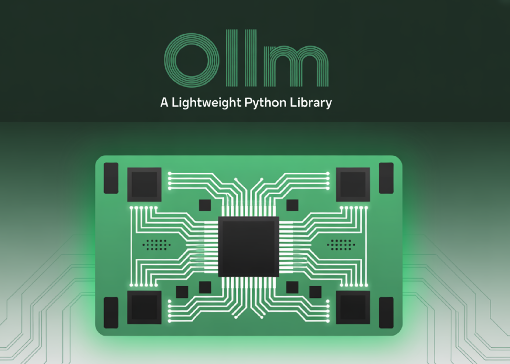

# Meet oLLM: A Lightweight Python Library that brings 100K-Context LLM Inference to 8 GB Consumer GPUs via SSD Offload—No Quantization Required

> oLLM is a lightweight Python library built on top of Huggingface Transformers and PyTorch and runs large-context Transformers on NVIDIA GPUs by aggressively offloading weights and KV-cache to fast local SSDs. The project targets offline, single-GPU workloads and explicitly avoids quantization, using FP16/BF16 weights with FlashAttention-2 and disk-backed KV caching to keep VRAM within 8–10 […]

**[oLLM ](https://github.com/Mega4alik/ollm)**is a lightweight Python library built on top of Huggingface Transformers and PyTorch and runs large-context Transformers on NVIDIA GPUs by aggressively offloading weights and KV-cache to fast local SSDs. The project targets offline, single-GPU workloads and explicitly avoids quantization, using FP16/BF16 weights with FlashAttention-2 and disk-backed KV [caching](https://www.marktechpost.com/2025/08/08/proxy-servers-explained-types-use-cases-trends-in-2025-technical-deep-dive/) to keep VRAM within 8–10 GB while handling up to ~100K tokens of context.

### But What’s new?

(1) KV cache read/writes that bypass `mmap` to reduce host RAM usage; (2) DiskCache support for Qwen3-Next-80B; (3) Llama-3 FlashAttention-2 for stability; and (4) GPT-OSS memory reductions via “flash-attention-like” kernels and chunked MLP. The table published by the maintainer reports end-to-end memory/I/O footprints on an RTX 3060 Ti (8 GB):

- **Qwen3-Next-80B (bf16, 160 GB weights, 50K ctx)** → ~7.5 GB VRAM + ~180 GB SSD; noted throughput “≈ 1 tok/2 s”.

- **GPT-OSS-20B (packed bf16, 10K ctx)** → ~7.3 GB VRAM + 15 GB SSD.

- **Llama-3.1-8B (fp16, 100K ctx)** → ~6.6 GB VRAM + 69 GB SSD.

### How it works

oLLM streams layer weights directly from SSD into the GPU, offloads the attention KV cache to SSD, and optionally offloads layers to CPU. It uses FlashAttention-2 with online softmax so the full attention matrix is never materialized, and chunks large MLP projections to bound peak memory. This shifts the bottleneck from VRAM to storage bandwidth and latency, which is why the oLLM project emphasizes NVMe-class SSDs and KvikIO/cuFile (GPUDirect Storage) for high-throughput file I/O.

### Supported models and GPUs

Out of the box the examples cover **Llama-3 (1B/3B/8B)**, **GPT-OSS-20B**, and **Qwen3-Next-80B**. The library targets NVIDIA Ampere (RTX 30xx, A-series), Ada (RTX 40xx, L4), and Hopper; Qwen3-Next requires a dev build of Transformers (≥ 4.57.0.dev). Notably, Qwen3-Next-80B is a sparse MoE (80B total, ~3B active) that vendors typically position for multi-A100/H100 deployments; oLLM’s claim is that you can _execute_ it offline on a single consumer GPU by paying the SSD penalty and accepting low throughput. This stands in contrast to vLLM docs, which suggest multi-GPU servers for the same model family.

### Installation and minimal usage

The project is MIT-licensed and available on PyPI (`pip install ollm`), with an additional `kvikio-cu{cuda_version}` dependency for high-speed disk I/O. For Qwen3-Next models, install Transformers from GitHub. A short example in the README shows `Inference(...).DiskCache(...)` wiring and `generate(...)` with a streaming text callback. (PyPI currently lists 0.4.1; the README references 0.4.2 changes.)

### Performance expectations and trade-offs

- **Throughput**: The maintainer reports ~0.5 tok/s for Qwen3-Next-80B at 50K context on an RTX 3060 Ti—usable for batch/offline analytics, not for interactive chat. SSD latency dominates.

- **Storage pressure**: Long contexts require very large KV caches; oLLM writes these to SSD to keep VRAM flat. This mirrors broader industry work on KV offloading (e.g., NVIDIA Dynamo/NIXL and community discussions), but the approach is still storage-bound and workload-specific.

- **Hardware reality check**: Running Qwen3-Next-80B “on consumer hardware” is _feasible_ with oLLM’s disk-centric design, but typical high-throughput inference for this model still expects multi-GPU servers. Treat oLLM as an execution path for large-context, offline passes rather than a drop-in replacement for production serving stacks like vLLM/TGI.

### Bottom line

oLLM pushes a clear design point: keep precision high, push memory to SSD, and make ultra-long contexts viable on a single 8 GB NVIDIA GPU. It won’t match data-center throughput, but for offline document/log analysis, compliance review, or large-context summarization, it’s a pragmatic way to execute 8B–20B models comfortably and even step up to MoE-80B if you can tolerate ~100–200 GB of fast local storage and sub-1 tok/s generation.

---

Check out the **[GITHUB REPO here](https://github.com/Mega4alik/ollm)**. Feel free to check out our **[GitHub Page for Tutorials, Codes and Notebooks](https://github.com/Marktechpost/AI-Tutorial-Codes-Included)**. Also, feel free to follow us on **[Twitter](https://x.com/intent/follow?screen_name=marktechpost)** and don’t forget to join our **[100k+ ML SubReddit](https://www.reddit.com/r/machinelearningnews/)** and Subscribe to **[our Newsletter](https://www.aidevsignals.com/)**.
