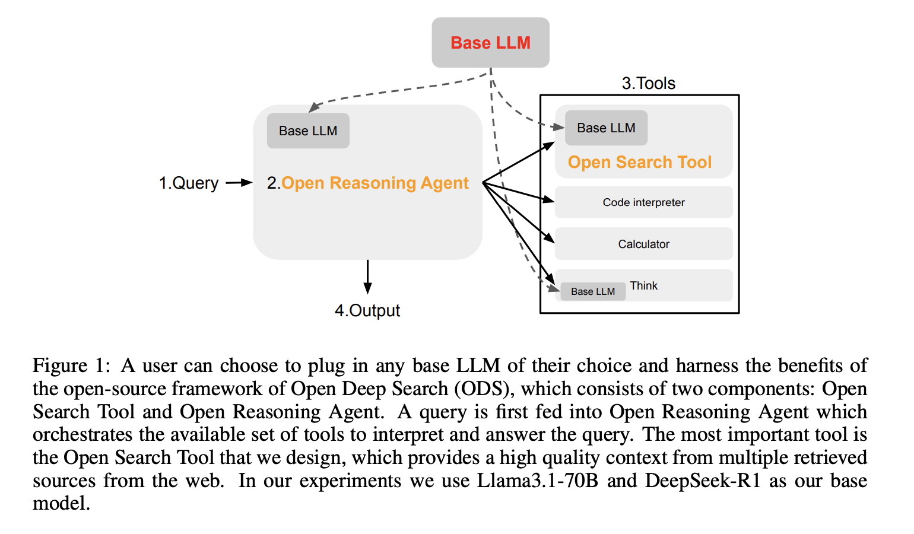

# Meet Open Deep Search (ODS): A Plug-and-Play Framework Democratizing Search with Open-source Reasoning Agents

> The rapid advancements in search engine technologies integrated with large language models (LLMs) have predominantly favored proprietary solutions such as Google’s GPT-4o Search Preview and Perplexity’s Sonar Reasoning Pro. While these proprietary systems offer strong performance, their closed-source nature poses significant challenges, particularly concerning transparency, innovation, and community collaboration. This exclusivity limits customization and hampers […]

The rapid advancements in search engine technologies integrated with large language models (LLMs) have predominantly favored proprietary solutions such as Google’s GPT-4o Search Preview and Perplexity’s Sonar Reasoning Pro. While these proprietary systems offer strong performance, their closed-source nature poses significant challenges, particularly concerning transparency, innovation, and community collaboration. This exclusivity limits customization and hampers broader academic and entrepreneurial engagement with search-enhanced AI.

In response to these limitations, researchers from the University of Washington, Princeton University, and UC Berkeley have introduced Open Deep Search (ODS)—an open-source search AI framework designed for seamless integration with any user-selected LLM in a modular manner. ODS comprises two central components: the Open Search Tool and the Open Reasoning Agent. Together, these components substantially improve the capabilities of the base LLM by enhancing content retrieval and reasoning accuracy.

The Open Search Tool distinguishes itself through an advanced retrieval pipeline, featuring an intelligent query rephrasing method that better captures user intent by generating multiple semantically related queries. This approach notably improves the accuracy and diversity of search results. Furthermore, the tool employs refined chunking and re-ranking techniques to systematically filter search results according to relevance. Complementing the retrieval component, the Open Reasoning Agent operates through two distinct methodologies: the Chain-of-thought ReAct agent and the Chain-of-code CodeAct agent. These agents interpret user queries, manage tool usage—including searches and calculations—and produce comprehensive, contextually accurate responses.

Empirical evaluations underscore the effectiveness of ODS. Integrated with DeepSeek-R1, an advanced open-source reasoning model, ODS-v2 achieves 88.3% accuracy on the SimpleQA benchmark and 75.3% on the FRAMES benchmark. This performance notably surpasses proprietary alternatives such as Perplexity’s Sonar Reasoning Pro, which scores 85.8% and 44.4% on these benchmarks, respectively. Compared with OpenAI’s GPT-4o Search Preview, ODS-v2 shows a significant advantage on the FRAMES benchmark, achieving a 9.7% higher accuracy. These results illustrate ODS’s capacity to deliver competitive, and in specific areas superior, performance relative to proprietary systems.

An important feature of ODS is its adaptive use of tools, as demonstrated by strategic decision-making regarding additional web searches. For straightforward queries, as observed in SimpleQA, ODS minimizes additional searches, demonstrating efficient resource utilization. Conversely, for complex multi-hop queries, as in the FRAMES benchmark, ODS appropriately increases its use of web searches, thus exemplifying intelligent resource management tailored to query complexity.

In conclusion, Open Deep Search represents a notable advancement towards democratizing search-enhanced AI by providing an open-source framework compatible with diverse LLMs. It encourages innovation and transparency within the AI research community and supports broader participation in the development of sophisticated search and reasoning capabilities. By effectively integrating advanced retrieval techniques with adaptive reasoning methodologies, ODS contributes meaningfully to open-source AI development, setting a robust standard for future exploration in search-integrated large language models.

---

Check out **_the [Paper ](https://arxiv.org/abs/2503.20201)and [GitHub Page](https://github.com/sentient-agi/OpenDeepSearch)._** All credit for this research goes to the researchers of this project. Also, feel free to follow us on **[Twitter](https://x.com/intent/follow?screen_name=marktechpost)** and don’t forget to join our **[85k+ ML SubReddit](https://www.reddit.com/r/machinelearningnews/)**.
